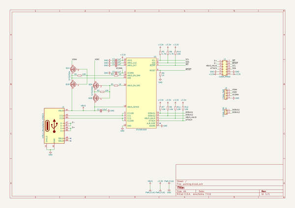

# stusb1600_breakout
 
## summary 
* id: adamjvr_stusb1600_breakout_stusb1600_breakout
* user: adamjvr
* name: stusb1600_breakout
* board: stusb1600_breakout
* repo: https://github.com/adamjvr/stusb1600_breakout
* src_file_repo_kicad_pcb: stusb1600_breakout.kicad_pcb
* src_file_repo_kicad_pcb_link: https://github.com/adamjvr/stusb1600_breakout/tree/master/stusb1600_breakout.kicad_pcb

* src_file_repo_sch: stusb1600_breakout.sch
* src_file_repo_sch_link: https://github.com/adamjvr/stusb1600_breakout/tree/master/stusb1600_breakout.sch
* full details link: https://github.com/oomlout/oomlout_oomp_project_bot_v_2/tree/main/projects/adamjvr_stusb1600_breakout_stusb1600_breakout/current_version/working  

## schematic  
  
[schematic (pdf)](working_schematic.pdf) 

## pcb  
 
  
  
  
[board (pdf)](working.pdf)  

## working_bom
| Id | Designator | Footprint | Quantity | Designation | Supplier and ref |  | None | 
| --- | --- | --- | --- | --- | --- | --- | --- | 
| 1 | C1 | C_0603_1608Metric | 1 | 10uF |  |  | [''] | 
| 2 | C2,C3,C4,C5 | C_0603_1608Metric | 4 | 1uF |  |  | [''] | 
| 3 | J3 | PinHeader_1x04_P2.54mm_Vertical | 1 | CONN_PWR |  |  | [''] | 
| 4 | Q1,Q2 | Vishay_PowerPAK_1212-8_Dual | 2 | Si7223DN |  |  | [''] | 
| 5 | R4,R6,R3 | R_0402_1005Metric | 3 | 1K |  |  | [''] | 
| 6 | R5,R8 | R_0402_1005Metric | 2 | 4.7K |  |  | [''] | 
| 7 | R10,R11,R12,R7,R1,R2,R9 | R_0402_1005Metric | 7 | 10K |  |  | [''] | 
| 8 | U1 | QFN-24-1EP_4x4mm_P0.5mm_EP2.7x2.7mm | 1 | STUSB1600 |  |  | [''] | 
| 9 | J2 | PMODHeader_2x06_P2.54mm_Horizontal | 1 | CONN_PMOD |  |  | [''] | 
| 10 | J1 | USB_C_Receptacle_GT-USB-7010 | 1 | USB_C_Receptacle_USB2.0 |  |  | [''] | 
| 11 | J4 | PinHeader_1x02_P2.54mm_Vertical | 1 | CONN_DBG |  |  | [''] | 

## bom_schematic
| Ref | Qnty | Value | Cmp name | Footprint | Description | Vendor | DNP | 
| --- | --- | --- | --- | --- | --- | --- | --- | 
| C1 | 1 | 10uF | C_Small | Capacitor_SMD:C_0603_1608Metric | Unpolarized capacitor, small symbol |  |  | 
| C2, C3, C4, C5 | 4 | 1uF | C_Small | Capacitor_SMD:C_0603_1608Metric | Unpolarized capacitor, small symbol |  |  | 
| J1 | 1 | USB_C_Receptacle_USB2.0 | USB_C_Receptacle_USB2.0-Connector | Connector_USB_Extra:USB_C_Receptacle_GT-USB-7010 |  |  |  | 
| J2 | 1 | CONN_PMOD | Conn_02x06_Top_Bottom | Connector_PinHeader_2.54mm_Extra:PMODHeader_2x06_P2.54mm_Horizontal | Generic connector, double row, 02x06, top/bottom pin numbering scheme (row 1: 1...pins_per_row, row2: pins_per_row+1 ... num_pins), script generated (kicad-library-utils/schlib/autogen/connector/) |  |  | 
| J3 | 1 | CONN_PWR | Conn_01x04 | Connector_PinHeader_2.54mm:PinHeader_1x04_P2.54mm_Vertical | Generic connector, single row, 01x04, script generated (kicad-library-utils/schlib/autogen/connector/) |  |  | 
| J4 | 1 | CONN_DBG | Conn_01x02 | Connector_PinHeader_2.54mm:PinHeader_1x02_P2.54mm_Vertical | Generic connector, single row, 01x02, script generated (kicad-library-utils/schlib/autogen/connector/) |  |  | 
| Q1, Q2 | 2 | Si7223DN | Si7223DN | Package_SO:Vishay_PowerPAK_1212-8_Dual |  |  |  | 
| R1, R2, R7, R9, R10, R11, R12 | 7 | 10K | R_Small | Resistor_SMD:R_0402_1005Metric | Resistor, small symbol |  |  | 
| R3, R4, R6 | 3 | 1K | R_Small | Resistor_SMD:R_0402_1005Metric | Resistor, small symbol |  |  | 
| R5, R8 | 2 | 4.7K | R_Small | Resistor_SMD:R_0402_1005Metric | Resistor, small symbol |  |  | 
| U1 | 1 | STUSB1600 | STUSB1600 | Package_DFN_QFN:QFN-24-1EP_4x4mm_P0.5mm_EP2.7x2.7mm |  |  |  | 

