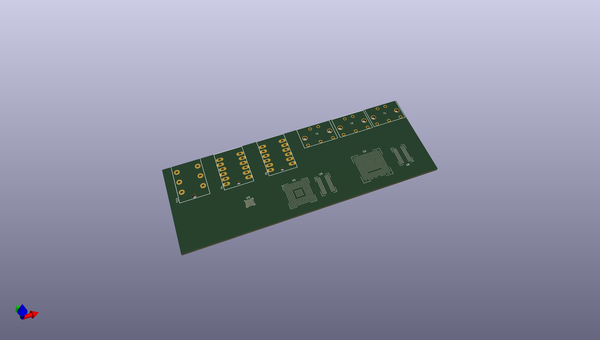
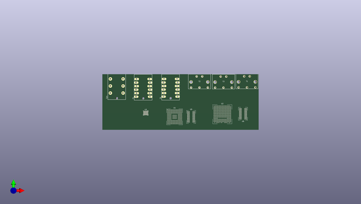
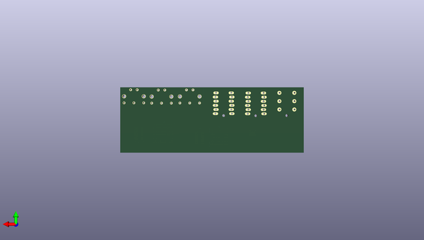

# x0chimilc0
 
## summary 
* id: adamjvr_x0chimilc0_x0chimilc0
* user: adamjvr
* name: x0chimilc0
* board: x0chimilc0
* repo: https://github.com/adamjvr/X0chimilc0
* src_file_repo_kicad_pcb: PCB/X0chimilc0.kicad_pcb
* src_file_repo_kicad_pcb_link: https://github.com/adamjvr/X0chimilc0/tree/master/PCB/X0chimilc0.kicad_pcb

* src_file_repo_sch: 
* src_file_repo_sch_link: https://github.com/adamjvr/X0chimilc0/tree/master/
* full details link: https://github.com/oomlout/oomlout_oomp_project_bot_v_2/tree/main/projects/adamjvr_x0chimilc0_x0chimilc0/current_version/working  

## pcb  
 
  
  
  
[board (pdf)](working.pdf)  

## working_bom
| Id | Designator | Footprint | Quantity | Designation | Supplier and ref |  | None | 
| --- | --- | --- | --- | --- | --- | --- | --- | 
| 1 | T1,T2,T3 | SDS-50J | 3 | SDS-50J |  |  | [''] | 
| 2 | U2 | 381caBGA_LATTICE | 1 | ECP5UM5G_85_CABGA381 |  |  | [''] | 
| 3 | U3 | WM8994ECS_R | 1 | WM8994ECS-R |  |  | [''] | 
| 4 | U1 | STM32H745XIH6 | 1 | STM32H745XIH6 |  |  | [''] | 
| 5 | U5,U6 | MT41K64M16TW_107_J_TR | 2 | MT41K64M16TW-107_J-TR |  |  | [''] | 
| 6 | T14 | ACJS-MHDR | 1 | ACJS-MHDR |  |  | [''] | 
| 7 | T4,T5 | ACJS-MHDC | 2 | ACJS-MHDC |  |  | [''] | 

