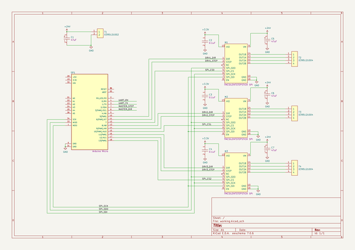
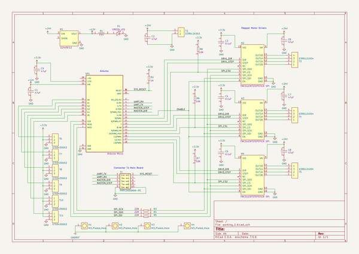
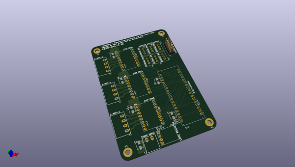
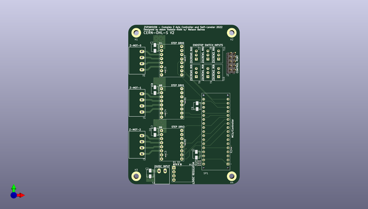
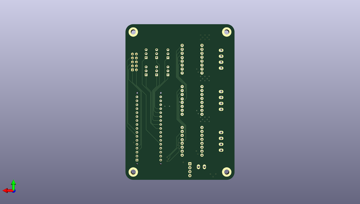

# zpansion
 
## summary 
* id: adamjvr_zpansion_zpansion
* user: adamjvr
* name: zpansion
* board: zpansion
* repo: https://github.com/adamjvr/ZPansion
* src_file_repo_kicad_pcb: PCB/ZPansion.kicad_pcb
* src_file_repo_kicad_pcb_link: https://github.com/adamjvr/ZPansion/tree/main/PCB/ZPansion.kicad_pcb
* src_file_repo_kicad_sch: PCB/ZPansion.kicad_sch
* src_file_repo_kicad_sch_link: https://github.com/adamjvr/ZPansion/tree/main/PCB/ZPansion.kicad_sch

* src_file_repo_sch: PCB/ZPansion.sch
* src_file_repo_sch_link: https://github.com/adamjvr/ZPansion/tree/main/PCB/ZPansion.sch
* full details link: https://github.com/oomlout/oomlout_oomp_project_bot_v_2/tree/main/projects/adamjvr_zpansion_zpansion/current_version/working  

## schematic  
  
[schematic (pdf)](working_schematic.pdf) 

  
[schematic 1 (pdf)](working_1_schematic.pdf) 

## pcb  
 
  
  
  
[board (pdf)](working.pdf)  

## working_bom
| Id | Designator | Footprint | Quantity | Designation | Supplier and ref |  | None | 
| --- | --- | --- | --- | --- | --- | --- | --- | 
| 1 | R6,R8,R7 | R0402 | 3 | RC0402FR-0710KL |  |  | [''] | 
| 2 | H4,H1,H3,H2 | M3_HOLE | 4 | M3_Plated_Hole |  |  | [''] | 
| 3 | D1 | LED0603 | 1 | LTST-C194KGKT |  |  | [''] | 
| 4 | C6,C8,C9,C7,C1,C2 | UCM1C470MCL1GS | 6 | UCM1C470MCL1GS |  |  | [''] | 
| 5 | R1 | R0603 | 1 | AT0603FRE0710KL |  |  | [''] | 
| 6 | R2 | R0402 | 1 | RC0402FR-071KL |  |  | [''] | 
| 7 | R5,R4,R3 | R0402 | 3 | RC0402FR-0722RL |  |  | [''] | 
| 8 | T10,T7,T8,T9,T11,T6 | Shrouded_Pin_Header_Straight_1x03_Pitch2.54mm | 6 | 0705430002 |  |  | [''] | 
| 9 | C3,C4,C5 | R0402 | 3 | C0402C104K9PACTU |  |  | [''] | 
| 10 | M3,M2,M4 | TMCSILENTSTEPSTICK_SPI | 3 | TMCSILENTSTEPSTICK |  |  | [''] | 
| 11 | T1 | PinHeader_2x05_P2.54mm_Vertical | 1 | PRPC005DAAN-RC |  |  | [''] | 
| 12 | T5,T4,T3 | 0395121004 | 3 | 0395121004 |  |  | [''] | 
| 13 | SP1 | ARDUINO_A000053 | 1 | Arduino_Micro |  |  | [''] | 
| 14 | T2 | 0395121002 | 1 | 0395121002 |  |  | [''] | 
| 15 | M1 | D24V5F12 | 1 | D24V5F12 |  |  | [''] | 

## bom_schematic
| Ref | Qnty | Value | Cmp name | Footprint | Description | Vendor | DNP | 
| --- | --- | --- | --- | --- | --- | --- | --- | 
| C1, C5, C6, C7 | 4 | UCM1C470MCL1GS | UCM1C470MCL1GS-AVR-KiCAD-Lib-Capacitors | AVR-KiCAD-Lib-Capacitors:UCM1C470MCL1GS |  | Digikey |  | 
| C2, C3, C4 | 3 | C0402C104K9PACTU | C0402C104K9PACTU-AVR-KiCAD-Lib-Capacitors | AVR-KiCAD-Lib-Resistors:R0402 |  | Digikey |  | 
| M1, M2, M3 | 3 | TMCSILENTSTEPSTICK | TMCSILENTSTEPSTICK-AVR-KiCAD-Lib-Modules | AVR-KiCAD-Lib-Modules:TMCSILENTSTEPSTICK_SPI |  | Digikey |  | 
| SP1 | 1 | Arduino_Micro | Arduino_Micro-AVR-KiCAD-Lib-Special | AVR-KiCAD-Lib-Special:ARDUINO_A000053 |  | Digikey |  | 
| T1 | 1 | 0395121002 | 0395121002-AVR-KiCAD-Lib-Connectors | AVR-KiCAD-Lib-Connectors:0395121002 |  | Digikey |  | 
| T2, T3, T4 | 3 | 0395121004 | 0395121004-AVR-KiCAD-Lib-Connectors | AVR-KiCAD-Lib-Connectors:0395121004 |  | Digikey |  | 

