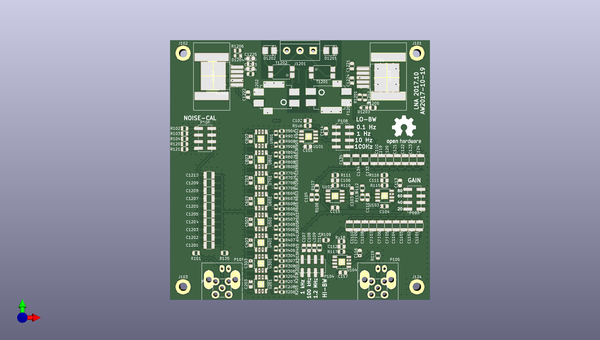

# ada4898_lna
 
## summary 
* id: aewallin_ada4898_lna_ada4898_lna
* user: aewallin
* name: ada4898_lna
* board: ada4898_lna
* repo: https://github.com/aewallin/ADA4898_LNA
* src_file_repo_kicad_pcb: ADA4898_LNA.kicad_pcb
* src_file_repo_kicad_pcb_link: https://github.com/aewallin/ADA4898_LNA/tree/main/ADA4898_LNA.kicad_pcb
* src_file_repo_kicad_sch: ADA4898_LNA.kicad_sch
* src_file_repo_kicad_sch_link: https://github.com/aewallin/ADA4898_LNA/tree/main/ADA4898_LNA.kicad_sch

* src_file_repo_sch: 
* src_file_repo_sch_link: https://github.com/aewallin/ADA4898_LNA/tree/main/
* full details link: https://github.com/oomlout/oomlout_oomp_project_bot_v_2/tree/main/projects/aewallin_ada4898_lna_ada4898_lna/current_version/working  

## schematic  
  
[schematic (pdf)](working_schematic.pdf) 

## pcb  
 
  
  
  
[board (pdf)](working.pdf)  

## working_bom
| Id | Designator | Footprint | Quantity | Designation | Supplier and ref |  | None | 
| --- | --- | --- | --- | --- | --- | --- | --- | 
| 1 | C102,C103,C104,C105,C106,C110,C111,C112,C203,C303,C403,C503,C603,C703,C803,C903,C101,C113,C114,C115,C116,C117,C1221,C1222,C1223,C1224,C1225,C204,C304,C404,C504,C604,C704,C804,C904 | C_0805 | 35 | C |  |  | [''] | 
| 2 | C107 | C_0805 | 1 | 150n |  |  | [''] | 
| 3 | C108 | C_0805 | 1 | 1n5 |  |  | [''] | 
| 4 | C109 | C_0805 | 1 | 120p |  |  | [''] | 
| 5 | R101 | R_0805 | 1 | 1M |  |  | [''] | 
| 6 | R105,R108,R113 | R_0805 | 3 | 10k |  |  | [''] | 
| 7 | R106,R114,R117,R118,R120,R1201,R1202,R1203,R1204,R1205,R1206 | R_0805 | 11 | R |  |  | [''] | 
| 8 | R107,R109,R112 | R_0805 | 3 | 1k |  |  | [''] | 
| 9 | R110,R115 | R_0805 | 2 | 499R |  |  | [''] | 
| 10 | R111,R116 | R_0805 | 2 | 49k9 |  |  | [''] | 
| 11 | R119 | R_0805 | 1 | 49R9 |  |  | [''] | 
| 12 | U101,U102,U103,U104 | SOIC-8-1EP_3.9x4.9mm_Pitch1.27mm | 4 | ADA4898-1 |  |  | [''] | 
| 13 | U201,U301,U401,U501,U601,U701,U801,U901 | SOIC-8-1EP_3.9x4.9mm_Pitch1.27mm | 8 | ADA4898-2 |  |  | [''] | 
| 14 | R203,R204,R205,R206,R207,R208,R303,R304,R305,R306,R307,R308,R403,R404,R405,R406,R407,R408,R503,R504,R505,R506,R507,R508,R603,R604,R605,R606,R607,R608,R703,R704,R705,R706,R707,R708,R803,R804,R805,R806,R807,R808,R903,R904,R905,R906,R907,R908 | R_0603 | 48 | R |  |  | [''] | 
| 15 | C1101,C1102,C1105,C1106,C1107,C1108,C1109,C1110,C1201,C1202,C1203,C1204,C1205,C1206,C1207,C1208,C1209,C1210,C1103,C1104,C118,C119,C120,C121,C122,C123,C124,C1111,C1112,C1113,C1114,C1115,C1116,C1117,C1118,C1119,C1120,C1211,C1212,C1213,C1214,C1215,C1216,C1217,C1218,C1219,C1220,C125,C126,C127,C128,C129,C130,C131 | C_1210 | 54 | C |  |  | [''] | 
| 16 | P102,P107 | CONNECTOR_SMA_Straight | 2 | SMA |  |  | [''] | 
| 17 | R102,R103 | R_0805 | 2 | 120R |  |  | [''] | 
| 18 | R104 | R_0805 | 1 | 600R |  |  | [''] | 
| 19 | R121 | R_0805 | 1 | 0R |  |  | [''] | 
| 20 | P103,P106 | Pin_Header_Straight_2x04_Pitch2.54mm_SMD | 2 | CONN_02X04 |  |  | [''] | 
| 21 | P104 | Pin_Header_Straight_2x04_Pitch2.54mm_SMD | 1 | HI-BW_SELECT |  |  | [''] | 
| 22 | J101,J102,J104,J103 | MountingHole_3.2mm_M3_DIN965_Pad | 4 | CONN_01X01 |  |  | [''] | 
| 23 | D1201,D1202 | DIODE_DO-214BA | 2 | D |  |  | [''] | 
| 24 | D1203,D1204 | D_0805 | 2 | LED |  |  | [''] | 
| 25 | F1201,F1202 | FILTER_BNX025 | 2 | BNX025_FILTER |  |  | [''] | 
| 26 | J1201 | CONNECTOR_01x03_200mil | 1 | CONN_01X03 |  |  | [''] | 
| 27 | J1202,J1203 | Heatsink_Fisher_TO263 | 2 | HEATSINK |  |  | [''] | 
| 28 | T1201,T1202 | CM-CHOKE | 2 | CM-CHOKE |  |  | [''] | 
| 29 | U1201 | TO-263-5_TabPin3 | 1 | LT1963A |  |  | [''] | 
| 30 | U1202 | TO-263-5_TabPin3 | 1 | LT3015 |  |  | [''] | 
| 31 | C133,C132 | C_1210 | 2 | 6u8 |  |  | [''] | 
| 32 | C134 | C_1210 | 1 | 1u5 |  |  | [''] | 
| 33 | C135 | C_1210 | 1 | 150n |  |  | [''] | 
| 34 | P108 | Pin_Header_Straight_2x04_Pitch2.54mm_SMD | 1 | LO-BW_SELECT |  |  | [''] | 
| 35 | VIA,VIA,VIA,VIA,VIA,VIA,VIA,VIA,VIA,VIA,VIA,VIA,VIA,VIA,VIA,VIA,VIA,VIA,VIA,VIA,VIA,VIA,VIA,VIA,VIA,VIA,VIA,VIA,VIA,VIA,VIA,VIA,VIA,VIA,VIA,VIA,VIA,VIA,VIA,VIA,VIA,VIA,VIA,VIA,VIA,VIA,VIA,VIA,VIA,VIA,VIA,VIA,VIA,VIA,VIA,VIA,VIA,VIA,VIA,VIA,VIA,VIA,VIA,VIA,VIA,VIA,VIA,VIA,VIA,VIA,VIA,VIA,VIA,VIA,VIA,VIA,VIA,VIA,VIA,VIA,VIA,VIA,VIA,VIA,VIA,VIA,VIA,VIA,VIA,VIA,VIA,VIA,VIA,VIA,VIA,VIA,VIA,VIA,VIA,VIA,VIA,VIA,VIA,VIA,VIA,VIA,VIA,VIA,VIA,VIA,VIA,VIA,VIA,VIA,VIA,VIA,VIA,VIA,VIA,VIA,VIA,VIA,VIA,VIA,VIA,VIA,VIA,VIA,VIA,VIA,VIA,VIA,VIA,VIA,VIA,VIA,VIA,VIA,VIA,VIA,VIA,VIA,VIA,VIA,VIA,VIA,VIA,VIA,VIA,VIA,VIA,VIA,VIA,VIA,VIA,VIA,VIA,VIA,VIA,VIA,VIA,VIA,VIA,VIA,VIA,VIA,VIA,VIA,VIA,VIA,VIA,VIA,VIA,VIA,VIA,VIA,VIA,VIA,VIA,VIA,VIA,VIA,VIA,VIA,VIA,VIA,VIA,VIA,VIA,VIA,VIA,VIA,VIA,VIA,VIA,VIA,VIA,VIA,VIA,VIA,VIA,VIA,VIA,VIA,VIA,VIA,VIA,VIA,VIA,VIA,VIA,VIA,VIA,VIA,VIA,VIA,VIA,VIA,VIA,VIA,VIA,VIA,VIA,VIA,VIA,VIA,VIA,VIA,VIA,VIA,VIA,VIA,VIA,VIA,VIA,VIA,VIA,VIA,VIA,VIA,VIA,VIA,VIA,VIA,VIA,VIA,VIA,VIA,VIA,VIA,VIA,VIA,VIA,VIA,VIA,VIA,VIA,VIA,VIA,VIA,VIA,VIA,VIA,VIA,VIA,VIA,VIA,VIA,VIA,VIA,VIA,VIA,VIA,VIA,VIA,VIA,VIA,VIA,VIA,VIA,VIA,VIA,VIA,VIA,VIA,VIA,VIA,VIA,VIA,VIA,VIA,VIA,VIA,VIA,VIA,VIA,VIA,VIA,VIA,VIA,VIA,VIA,VIA,VIA,VIA,VIA,VIA,VIA,VIA,VIA,VIA,VIA,VIA,VIA,VIA,VIA,VIA,VIA,VIA,VIA,VIA,VIA,VIA,VIA,VIA,VIA,VIA,VIA,VIA,VIA,VIA,VIA,VIA,VIA,VIA,VIA,VIA,VIA,VIA,VIA,VIA,VIA,VIA,VIA,VIA,VIA,VIA,VIA,VIA,VIA,VIA,VIA,VIA,VIA,VIA,VIA,VIA,VIA,VIA,VIA,VIA,VIA,VIA,VIA,VIA,VIA,VIA,VIA,VIA,VIA,VIA,VIA,VIA,VIA,VIA,VIA,VIA,VIA,VIA,VIA,VIA,VIA,VIA,VIA,VIA,VIA,VIA,VIA,VIA,VIA,VIA,VIA,VIA,VIA,VIA,VIA,VIA,VIA,VIA,VIA,VIA,VIA,VIA,VIA,VIA,VIA,VIA,VIA,VIA | VIA_0.4mmDrill_0.7mmPad | 409 | VIA_0.4mmDrill_0.7mmPad |  |  | [''] | 
| 36 | P101,P105 | BNC_2PIN | 2 | BNC |  |  | [''] | 

## bom_schematic
| Ref | Qnty | Value | Cmp name | Footprint | Description | Vendor | DNP | 
| --- | --- | --- | --- | --- | --- | --- | --- | 
| C101, C102, C103, C104, C105, C106, C110, C111, C112, C113, C114, C115, C116, C117 | 14 | C | C | Capacitors_SMD:C_0805 |  |  |  | 
| C107 | 1 | 150n | C | Capacitors_SMD:C_0805 |  |  |  | 
| C108 | 1 | 1n5 | C | Capacitors_SMD:C_0805 |  |  |  | 
| C109 | 1 | 120p | C | Capacitors_SMD:C_0805 |  |  |  | 
| C118, C119, C120, C121, C122, C123, C124, C125, C126, C127, C128, C129, C130, C131 | 14 | C | C | Capacitors_SMD:C_1210 |  |  |  | 
| C132, C133 | 2 | 6u8 | C | Capacitors_SMD:C_1210 |  |  |  | 
| C134 | 1 | 1u5 | C | Capacitors_SMD:C_1210 |  |  |  | 
| C135 | 1 | 150n | C | Capacitors_SMD:C_1210 |  |  |  | 
| J101, J102, J103, J104 | 4 | CONN_01X01 | CONN_01X01 | Mounting_Holes:MountingHole_3.2mm_M3_DIN965_Pad |  |  |  | 
| P101, P105 | 2 | BNC | BNC | awallinKiCadFootprints_git:BNC_2PIN |  |  |  | 
| P102, P107 | 2 | SMA | BNC | awallinKiCadFootprints:CONNECTOR_SMA_Straight |  |  |  | 
| P103, P106 | 2 | CONN_02X04 | CONN_02X04 | Pin_Headers:Pin_Header_Straight_2x04_Pitch2.54mm_SMD |  |  |  | 
| P104 | 1 | HI-BW_SELECT | CONN_02X04 | Pin_Headers:Pin_Header_Straight_2x04_Pitch2.54mm_SMD |  |  |  | 
| P108 | 1 | LO-BW_SELECT | CONN_02X04 | Pin_Headers:Pin_Header_Straight_2x04_Pitch2.54mm_SMD |  |  |  | 
| R101 | 1 | 1M | R | Resistors_SMD:R_0805 |  |  |  | 
| R102, R103 | 2 | 120R | R | Resistors_SMD:R_0805 |  |  |  | 
| R104 | 1 | 600R | R | Resistors_SMD:R_0805 |  |  |  | 
| R105, R108, R113, R114 | 4 | 10k | R | Resistors_SMD:R_0805 |  |  |  | 
| R106 | 1 | 1k1 | R | Resistors_SMD:R_0805 |  |  |  | 
| R107, R109, R112 | 3 | 1k | R | Resistors_SMD:R_0805 |  |  |  | 
| R110, R115 | 2 | 499R | R | Resistors_SMD:R_0805 |  |  |  | 
| R111, R119 | 2 | 49R9 | R | Resistors_SMD:R_0805 |  |  |  | 
| R116 | 1 | 54R9 | R | Resistors_SMD:R_0805 |  |  |  | 
| R117 | 1 | 590 | R | Resistors_SMD:R_0805 |  |  |  | 
| R118 | 1 | 499 | R | Resistors_SMD:R_0805 |  |  |  | 
| R120 | 1 | R | R | Resistors_SMD:R_0805 |  |  |  | 
| R121 | 1 | 0R | R | Resistors_SMD:R_0805 |  |  |  | 
| U101, U102, U103, U104 | 4 | ADA4898-1 | ADA4898-1-aw | Housings_SOIC:SOIC-8-1EP_3.9x4.9mm_Pitch1.27mm |  |  |  | 

## mounting_holes
| x | y | package | value | ref | size | 
| --- | --- | --- | --- | --- | --- | 
| 90.0 | 90.0 | MountingHole_3.2mm_M3_DIN965_Pad | CONN_01X01 | J101 | m3 | 
| 0.0 | 90.0 | MountingHole_3.2mm_M3_DIN965_Pad | CONN_01X01 | J102 | m3 | 
| 0.0 | 0.0 | MountingHole_3.2mm_M3_DIN965_Pad | CONN_01X01 | J103 | m3 | 
| 90.0 | 0.0 | MountingHole_3.2mm_M3_DIN965_Pad | CONN_01X01 | J104 | m3 | 

