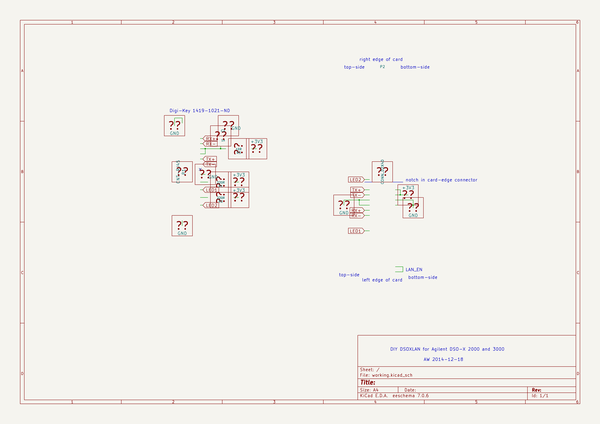
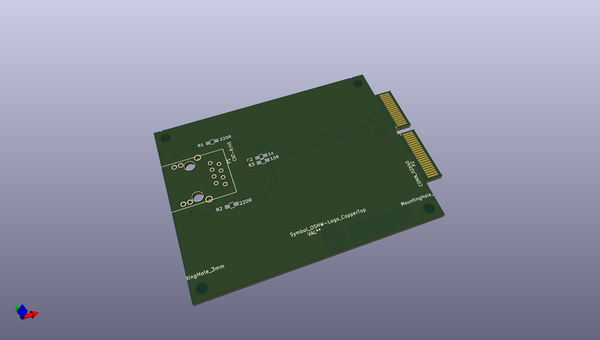
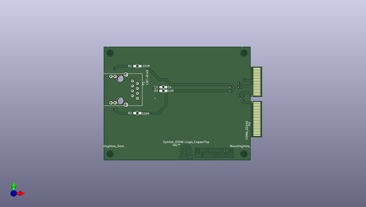
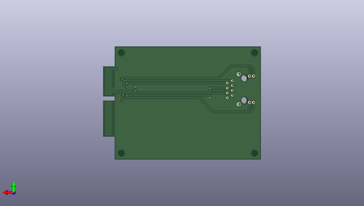

# dsoxlan
 
## summary 
* id: aewallin_dsoxlan_dsoxlan
* user: aewallin
* name: dsoxlan
* board: dsoxlan
* repo: https://github.com/aewallin/DSOXLAN
* src_file_repo_kicad_pcb: dsoxlan.kicad_pcb
* src_file_repo_kicad_pcb_link: https://github.com/aewallin/DSOXLAN/tree/master/dsoxlan.kicad_pcb

* src_file_repo_sch: dsoxlan.sch
* src_file_repo_sch_link: https://github.com/aewallin/DSOXLAN/tree/master/dsoxlan.sch
* full details link: https://github.com/oomlout/oomlout_oomp_project_bot_v_2/tree/main/projects/aewallin_dsoxlan_dsoxlan/current_version/working  

## schematic  
  
[schematic (pdf)](working_schematic.pdf) 

## pcb  
 
  
  
  
[board (pdf)](working.pdf)  

## working_bom
| Id | Designator | Footprint | Quantity | Designation | Supplier and ref |  | None | 
| --- | --- | --- | --- | --- | --- | --- | --- | 
| 1 | C2 | C_0805_HandSoldering | 1 | 1n |  |  | [''] | 
| 2 | P2 | cardedge_40x2 | 1 | CONN_02X40 |  |  | [''] | 
| 3 | R1,R2 | R_0805_HandSoldering | 2 | 220R |  |  | [''] | 
| 4 | R3 | R_0805_HandSoldering | 1 | 10R |  |  | [''] | 
| 5 | P1 | ETH-MAGJACK | 1 | CNT-RJ45 |  |  | [''] | 
| 6 | Symbol_OSHW-Logo_CopperTop | Symbol_OSHW-Logo_CopperTop | 1 | VAL** |  |  | [''] | 
| 7 | MountingHole_3mm,MountingHole_3mm,MountingHole_3mm,MountingHole_3mm | MountingHole_3mm | 4 | VAL** |  |  | [''] | 

## bom_schematic
no data

## mounting_holes
| x | y | package | value | ref | size | 
| --- | --- | --- | --- | --- | --- | 
| 0.0 | 0.0 | MountingHole_3mm | VAL** | MountingHole_3mm | m3 | 
| 0.0 | 51.82 | MountingHole_3mm | VAL** | MountingHole_3mm | m3 | 
| 68.58 | 51.82 | MountingHole_3mm | VAL** | MountingHole_3mm | m3 | 
| 68.58 | 0.0 | MountingHole_3mm | VAL** | MountingHole_3mm | m3 | 

