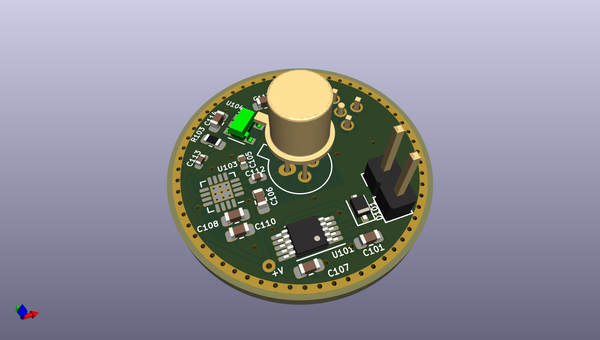
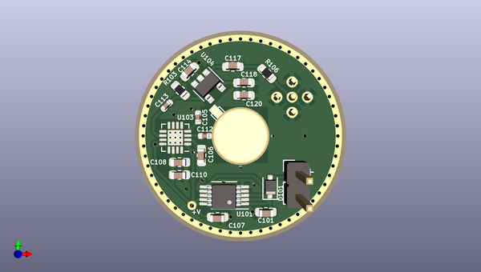
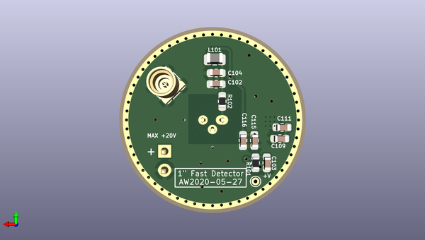

# one_inch_photodetector
 
## summary 
* id: aewallin_one_inch_photodetector_circular3_hmc799
* user: aewallin
* name: one_inch_photodetector
* board: circular3_hmc799
* repo: https://github.com/aewallin/One-Inch-Photodetector
* src_file_repo_kicad_pcb: HMC799/circular3_HMC799.kicad_pcb
* src_file_repo_kicad_pcb_link: https://github.com/aewallin/One-Inch-Photodetector/tree/master/HMC799/circular3_HMC799.kicad_pcb

* src_file_repo_sch: HMC799/circular3_HMC799.sch
* src_file_repo_sch_link: https://github.com/aewallin/One-Inch-Photodetector/tree/master/HMC799/circular3_HMC799.sch
* full details link: https://github.com/oomlout/oomlout_oomp_project_bot_v_2/tree/main/projects/aewallin_one_inch_photodetector_circular3_hmc799/current_version/working  

## schematic  
  
[schematic (pdf)](working_schematic.pdf) 

## pcb  
 
  
  
  
[board (pdf)](working.pdf)  

## working_bom
| Id | Designator | Footprint | Quantity | Designation | Supplier and ref |  | None | 
| --- | --- | --- | --- | --- | --- | --- | --- | 
| 1 | U101 | MSOP-10-1EP_3x3mm_P0.5mm_EP1.68x1.88mm | 1 | LT3042xMSE |  |  | [''] | 
| 2 | C101,C107,C110,C118,C102,C103,C109,C115 | C_0603_1608Metric | 8 | 4u7 |  |  | [''] | 
| 3 | C105,C113,C112 | C_0402_1005Metric | 3 | 22n |  |  | [''] | 
| 4 | C106 | C_0603_1608Metric | 1 | 10u |  |  | [''] | 
| 5 | C108,C120,C114,C117,C111,C116 | C_0603_1608Metric | 6 | 100n |  |  | [''] | 
| 6 | D101 | D_SOD-323F | 1 | D |  |  | [''] | 
| 7 | R106 | R_0603_1608Metric | 1 | 49R9 |  |  | [''] | 
| 8 | D102 | TO-18-3 | 1 | S5973 |  |  | [''] | 
| 9 | U103 | QFN-16-1EP_3x3mm_P0.5mm_EP1.75x1.75mm_ThermalVias9 | 1 | HMC799LP3E |  |  | [''] | 
| 10 | U104 | SOT-23-5 | 1 | BUF602xDBV |  |  | [''] | 
| 11 | J102 | PinHeader_1x02_P2.54mm_Vertical | 1 | Conn_01x02 |  |  | [''] | 
| 12 | R103 | R_0603_1608Metric | 1 | 2k |  |  | [''] | 
| 13 | C104 | C_0603_1608Metric | 1 | 10n |  |  | [''] | 
| 14 | J101 | MMCX_Molex_73415-1471_Vertical | 1 | Conn_Coaxial |  |  | [''] | 
| 15 | R101 | R_0603_1608Metric | 1 | 51k |  |  | [''] | 
| 16 | R102 | R_0603_1608Metric | 1 | 10k |  |  | [''] | 
| 17 | L101 | L_0805_2012Metric | 1 | L |  |  | [''] | 

## bom_schematic
no data

