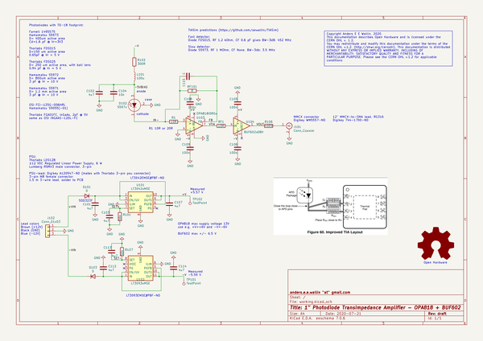
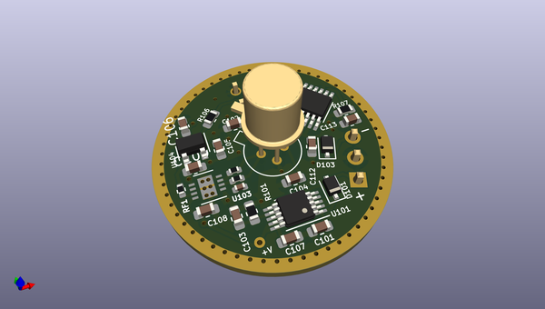
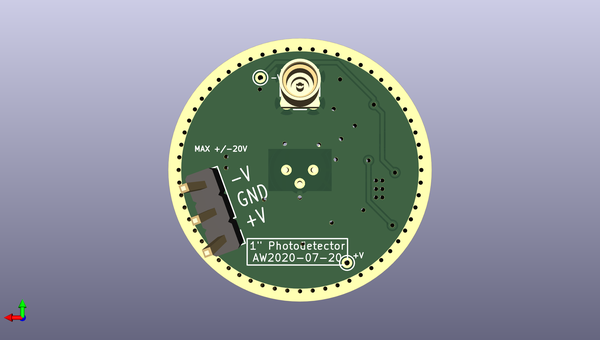

# one_inch_photodetector
 
## summary 
* id: aewallin_one_inch_photodetector_oip_opa818
* user: aewallin
* name: one_inch_photodetector
* board: oip_opa818
* repo: https://github.com/aewallin/One-Inch-Photodetector
* src_file_repo_kicad_pcb: OPA818/oip_opa818.kicad_pcb
* src_file_repo_kicad_pcb_link: https://github.com/aewallin/One-Inch-Photodetector/tree/master/OPA818/oip_opa818.kicad_pcb
* src_file_repo_kicad_sch: OPA818/oip_opa818.kicad_sch
* src_file_repo_kicad_sch_link: https://github.com/aewallin/One-Inch-Photodetector/tree/master/OPA818/oip_opa818.kicad_sch

* src_file_repo_sch: HMC799/circular3_HMC799.sch
* src_file_repo_sch_link: https://github.com/aewallin/One-Inch-Photodetector/tree/master/HMC799/circular3_HMC799.sch
* full details link: https://github.com/oomlout/oomlout_oomp_project_bot_v_2/tree/main/projects/aewallin_one_inch_photodetector_oip_opa818/current_version/working  

## schematic  
  
[schematic (pdf)](working_schematic.pdf) 

## pcb  
 
  
  
  
[board (pdf)](working.pdf)  

## working_bom
| Id | Designator | Footprint | Quantity | Designation | Supplier and ref |  | None | 
| --- | --- | --- | --- | --- | --- | --- | --- | 
| 1 | D102 | TO-18-3 | 1 | S597x |  |  | [''] | 
| 2 | U101 | MSOP-10-1EP_3x3mm_P0.5mm_EP1.68x1.88mm | 1 | LT3042xMSE |  |  | [''] | 
| 3 | U102 | MSOP-12-1EP_3x4mm_P0.65mm_EP1.65x2.85mm | 1 | LT3093xMSE |  |  | [''] | 
| 4 | C101,C102,C103,C107,C112,C113,C114 | C_0603_1608Metric | 7 | 4u7 |  |  | [''] | 
| 5 | C108,C105,C106,C109 | C_0603_1608Metric | 4 | 100n |  |  | [''] | 
| 6 | D103,D101 | D_SOD-323F | 2 | D |  |  | [''] | 
| 7 | L101 | L_0805_2012Metric | 1 | 100u |  |  | [''] | 
| 8 | R101,R107 | R_0603_1608Metric | 2 | 56k |  |  | [''] | 
| 9 | R102 | R_0603_1608Metric | 1 | 300R |  |  | [''] | 
| 10 | RF101 | R_0402_1005Metric | 1 | R |  |  | [''] | 
| 11 | R106 | R_0603_1608Metric | 1 | 49R9 |  |  | [''] | 
| 12 | C115 | C_0402_1005Metric | 1 | C |  |  | [''] | 
| 13 | R1,RF1 | R_0402_1005Metric | 2 | 10R |  |  | [''] | 
| 14 | U103 | WSON-8-1EP_3x3mm_P0.5mm_EP1.45x2.4mm | 1 | OPA818IDRGx |  |  | [''] | 
| 15 | U104 | SOT-23-5 | 1 | BUF602xDBV |  |  | [''] | 
| 16 | C104 | C_0603_1608Metric | 1 | 10n |  |  | [''] | 
| 17 | J101 | MMCX_Molex_73415-1471_Vertical | 1 | Conn_Coaxial |  |  | [''] | 
| 18 | TP101,TP102 | TestPoint_THTPad_D1.0mm_Drill0.5mm | 2 | TestPoint |  |  | [''] | 
| 19 | J102 | PinHeader_1x03_P2.54mm_Vertical | 1 | Conn_01x03 |  |  | [''] | 

## bom_schematic
| Ref | Qnty | Value | Cmp name | Footprint | Description | Vendor | DNP | 
| --- | --- | --- | --- | --- | --- | --- | --- | 
| C101, C102, C103, C107, C112, C113, C114 | 7 | 4u7 | C | Capacitor_SMD:C_0603_1608Metric | Unpolarized capacitor |  |  | 
| C104 | 1 | 10n | C | Capacitor_SMD:C_0603_1608Metric | Unpolarized capacitor |  |  | 
| C105, C106, C108, C109 | 4 | 100n | C | Capacitor_SMD:C_0603_1608Metric | Unpolarized capacitor |  |  | 
| C115 | 1 | C | C | Capacitor_SMD:C_0402_1005Metric | Unpolarized capacitor |  |  | 
| D101, D103 | 2 | D | D | Diode_SMD:D_SOD-323F | Diode |  |  | 
| D102 | 1 | S597x | S5973 | Package_TO_SOT_THT:TO-18-3 | Si PIN Photodiode, 1 GHz, TO-18-3 |  |  | 
| J101 | 1 | Conn_Coaxial | Conn_Coaxial | Connector_Coaxial:MMCX_Molex_73415-1471_Vertical | coaxial connector (BNC, SMA, SMB, SMC, Cinch/RCA, LEMO, ...) |  |  | 
| J102 | 1 | Conn_01x03 | Conn_01x03 | Connector_PinHeader_2.54mm:PinHeader_1x03_P2.54mm_Vertical | Generic connector, single row, 01x03, script generated (kicad-library-utils/schlib/autogen/connector/) |  |  | 
| L101 | 1 | 100u | L | Inductor_SMD:L_0805_2012Metric | Inductor |  |  | 
| R1 | 1 | 10R | R | Resistor_SMD:R_0402_1005Metric | Resistor |  |  | 
| R101, R107 | 2 | 56k | R | Resistor_SMD:R_0603_1608Metric | Resistor |  |  | 
| R102 | 1 | 300R | R | Resistor_SMD:R_0603_1608Metric | Resistor |  |  | 
| R106 | 1 | 49R9 | R | Resistor_SMD:R_0603_1608Metric | Resistor |  |  | 
| RF1 | 1 | 10R | R | Resistor_SMD:R_0402_1005Metric | Resistor |  |  | 
| RF101 | 1 | R | R | Resistor_SMD:R_0402_1005Metric | Resistor |  |  | 
| TP101, TP102 | 2 | TestPoint | TestPoint | TestPoint:TestPoint_THTPad_D1.0mm_Drill0.5mm | test point |  |  | 
| U101 | 1 | LT3042xMSE | LT3042xMSE | Package_SO:MSOP-10-1EP_3x3mm_P0.5mm_EP1.68x1.88mm | 200mA, Adjustable, Ultralow Noise, Ultrahigh PSRR RF Linear Regulator, MSOP-10 |  |  | 
| U102 | 1 | LT3093xMSE | LT3093xMSE | Package_SO:MSOP-12-1EP_3x4mm_P0.65mm_EP1.65x2.85mm | -200mA, Adjustable, Ultralow Noise, Ultrahigh PSRR RF Negative Linear Regulator, MSOP-12 |  |  | 
| U103 | 1 | OPA818IDRGx | OPA818IDRGx-aw-oip_opa818-rescue-oip_opa818-rescue-oip_opa818-rescue | awallinKiCadFootprints:WSON-8-1EP_3x3mm_P0.5mm_EP1.45x2.4mm |  |  |  | 
| U104 | 1 | BUF602xDBV | BUF602xDBV | Package_TO_SOT_SMD:SOT-23-5 | High-Speed, 1000 MHz, Closed-Loop Buffer, SOT23-5 |  |  | 

