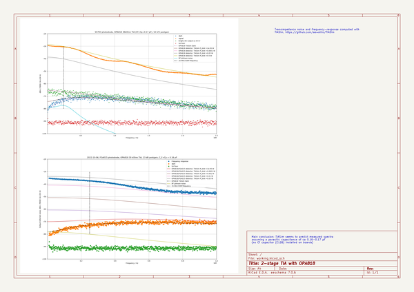

# photodetector_2stage_opa818
 
## summary 
* id: aewallin_photodetector_2stage_opa818_2stage_tia
* user: aewallin
* name: photodetector_2stage_opa818
* board: 2stage_tia
* repo: https://github.com/aewallin/Photodetector_2stage_OPA818
* src_file_repo_kicad_pcb: 2stage_tia.kicad_pcb
* src_file_repo_kicad_pcb_link: https://github.com/aewallin/Photodetector_2stage_OPA818/tree/master/2stage_tia.kicad_pcb
* src_file_repo_kicad_sch: 2stageTIA_measurementData.kicad_sch
* src_file_repo_kicad_sch_link: https://github.com/aewallin/Photodetector_2stage_OPA818/tree/master/2stageTIA_measurementData.kicad_sch

* src_file_repo_sch: 
* src_file_repo_sch_link: https://github.com/aewallin/Photodetector_2stage_OPA818/tree/master/
* full details link: https://github.com/oomlout/oomlout_oomp_project_bot_v_2/tree/main/projects/aewallin_photodetector_2stage_opa818_2stage_tia/current_version/working  

## schematic  
  
[schematic (pdf)](working_schematic.pdf) 

## pcb  
 
  
  
  
[board (pdf)](working.pdf)  

## working_bom
| Id | Designator | Footprint | Quantity | Designation | Supplier and ref |  | None | 
| --- | --- | --- | --- | --- | --- | --- | --- | 
| 1 | C101,C104,C105,C106,C107,C109,C110 | C_0603_1608Metric | 7 | 4u7 |  |  | [''] | 
| 2 | C102 | C_0603_1608Metric | 1 | 10n |  |  | [''] | 
| 3 | C111,C116,C117,C1 | C_0603_1608Metric | 4 | C |  |  | [''] | 
| 4 | C112,C113,C118,C119,C120,C121 | C_0603_1608Metric | 6 | 100n |  |  | [''] | 
| 5 | C114,C115,C122,C123,C124,C125 | C_0603_1608Metric | 6 | 6u8 |  |  | [''] | 
| 6 | D101,D102 | D_1206_3216Metric | 2 | D_ALT |  |  | [''] | 
| 7 | H101,H102 | MountingHole_3.2mm_M3_Pad_Via | 2 | MountingHole_Pad |  |  | [''] | 
| 8 | J101 | PinHeader_1x03_P2.54mm_Vertical | 1 | Conn_01x03_Female |  |  | [''] | 
| 9 | J102 | SMA_Amphenol_132289_EdgeMount | 1 | DC_OUT |  |  | [''] | 
| 10 | J103 | SMA_Amphenol_132289_EdgeMount | 1 | AC_OUT |  |  | [''] | 
| 11 | L101 | L_0805_2012Metric | 1 | 100u |  |  | [''] | 
| 12 | R101 | R_0603_1608Metric | 1 | 300R |  |  | [''] | 
| 13 | R102,R103 | R_0603_1608Metric | 2 | 60k |  |  | [''] | 
| 14 | R104,R107 | R_0603_1608Metric | 2 | 0R |  |  | [''] | 
| 15 | R106 | R_0402_1005Metric | 1 | 15k |  |  | [''] | 
| 16 | R108,R109,R111,R112,R116,R110 | R_0603_1608Metric | 6 | R |  |  | [''] | 
| 17 | R113 | R_0603_1608Metric | 1 | 3k |  |  | [''] | 
| 18 | R114 | R_0603_1608Metric | 1 | 30R |  |  | [''] | 
| 19 | R117 | R_0603_1608Metric | 1 | 50R |  |  | [''] | 
| 20 | U101 | MSOP-10-1EP_3x3mm_P0.5mm_EP1.68x1.88mm | 1 | LT3042xMSE |  |  | [''] | 
| 21 | U102 | MSOP-12-1EP_3x4mm_P0.65mm_EP1.65x2.85mm | 1 | LT3093xMSE |  |  | [''] | 
| 22 | U104 | SOT-23-6 | 1 | OPA847xDBV |  |  | [''] | 
| 23 | TP101,TP102 | TestPoint_2Pads_Pitch2.54mm_Drill0.8mm | 2 | TestPoint_2Pole |  |  | [''] | 
| 24 | C126 | C_0402_1005Metric | 1 | 1p |  |  | [''] | 
| 25 | U2,U1 | WSON-8-1EP_3x3mm_P0.5mm_EP1.45x2.4mm | 2 | OPA818xDRG |  |  | [''] | 
| 26 | R1 | R_0402_1005Metric | 1 | 10R |  |  | [''] | 
| 27 | D103 | TO-18-3 | 1 | S597x |  |  | [''] | 

## bom_schematic
no data

