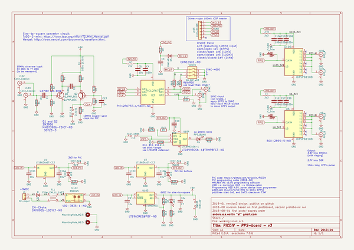
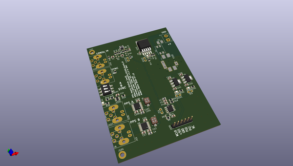
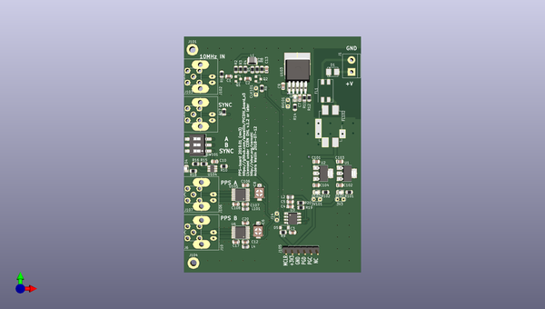
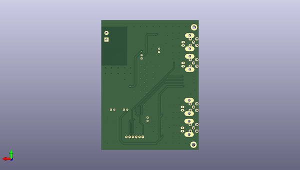

# picdiv_board_v3
 
## summary 
* id: aewallin_picdiv_board_v3_picdiv_board_v3
* user: aewallin
* name: picdiv_board_v3
* board: picdiv_board_v3
* repo: https://github.com/aewallin/PICDIV_Board_v3
* src_file_repo_kicad_pcb: picdiv_board_v3.kicad_pcb
* src_file_repo_kicad_pcb_link: https://github.com/aewallin/PICDIV_Board_v3/tree/master/picdiv_board_v3.kicad_pcb
* src_file_repo_kicad_sch: picdiv_board_v3.kicad_sch
* src_file_repo_kicad_sch_link: https://github.com/aewallin/PICDIV_Board_v3/tree/master/picdiv_board_v3.kicad_sch

* src_file_repo_sch: 
* src_file_repo_sch_link: https://github.com/aewallin/PICDIV_Board_v3/tree/master/
* full details link: https://github.com/oomlout/oomlout_oomp_project_bot_v_2/tree/main/projects/aewallin_picdiv_board_v3_picdiv_board_v3/current_version/working  

## schematic  
  
[schematic (pdf)](working_schematic.pdf) 

## pcb  
 
  
  
  
[board (pdf)](working.pdf)  

## working_bom
| Id | Designator | Footprint | Quantity | Designation | Supplier and ref |  | None | 
| --- | --- | --- | --- | --- | --- | --- | --- | 
| 1 | D1 | DIODE_DO-214BA | 1 | D |  |  | [''] | 
| 2 | J1 | TerminalBlock_bornier-2_P5.08mm | 1 | DC-Input |  |  | [''] | 
| 3 | Q1,Q2 | SOT-23 | 2 | Q_PNP_BEC |  |  | [''] | 
| 4 | D5 | D_SOD-123 | 1 | 1N4148 |  |  | [''] | 
| 5 | R12 | R_0805_2012Metric | 1 | 680R |  |  | [''] | 
| 6 | R14 | R_0805_2012Metric | 1 | 200R |  |  | [''] | 
| 7 | R15 | R_0805_2012Metric | 1 | 1M |  |  | [''] | 
| 8 | R16 | R_0805_2012Metric | 1 | 523k |  |  | [''] | 
| 9 | R17 | R_0805_2012Metric | 1 | 50R |  |  | [''] | 
| 10 | R18 | R_0805_2012Metric | 1 | 100R |  |  | [''] | 
| 11 | R19,R20 | R_0805_2012Metric | 2 | 10k |  |  | [''] | 
| 12 | R101,R102 | R_0805_2012Metric | 2 | 82R |  |  | [''] | 
| 13 | R9,R7,R2 | R_0805_2012Metric | 3 | 3k3 |  |  | [''] | 
| 14 | R8,R3 | R_0805_2012Metric | 2 | 6k8 |  |  | [''] | 
| 15 | R6 | R_0805_2012Metric | 1 | 270R |  |  | [''] | 
| 16 | R5,R4 | R_0805_2012Metric | 2 | 220R |  |  | [''] | 
| 17 | R1 | R_0805_2012Metric | 1 | 49R9 |  |  | [''] | 
| 18 | R11 | R_0805_2012Metric | 1 | 2k7 |  |  | [''] | 
| 19 | R10 | R_0805_2012Metric | 1 | 300k |  |  | [''] | 
| 20 | U104 | TSOT-23-6 | 1 | LTC6993xS6-1 |  |  | [''] | 
| 21 | U103 | TO-263-5_TabPin3 | 1 | LT1963AEQ |  |  | [''] | 
| 22 | U6,U105 | TSSOP-16_4.4x5mm_P0.65mm | 2 | IDT5PB1108 |  |  | [''] | 
| 23 | U3 | SOIC-8_3.9x4.9mm_P1.27mm | 1 | PIC12F675 |  |  | [''] | 
| 24 | D3,D101,D102 | LED_0805_2012Metric | 3 | LED |  |  | [''] | 
| 25 | D4 | LED_0805_2012Metric | 1 | PPS_BLINK |  |  | [''] | 
| 26 | L1 | L_1210_3225Metric | 1 | 100u (1210) |  |  | [''] | 
| 27 | L2,L4,L101 | L_0805_2012Metric | 3 | 2u2 |  |  | [''] | 
| 28 | J105 | PinHeader_1x06_P2.54mm_Vertical | 1 | Conn_01x06 |  |  | [''] | 
| 29 | J103 | SMA_Molex_73251-2200_Horizontal | 1 | Conn_Coaxial |  |  | [''] | 
| 30 | J107 | SMA_Molex_73251-2200_Horizontal | 1 | PPS_A |  |  | [''] | 
| 31 | J4 | SMA_Molex_73251-2200_Horizontal | 1 | SYNC |  |  | [''] | 
| 32 | J6 | SMA_Molex_73251-2200_Horizontal | 1 | PPS_B |  |  | [''] | 
| 33 | J10 | BNC_Amphenol_B6252HB-NPP3G-50_Horizontal | 1 | PPS_B |  |  | [''] | 
| 34 | J102 | BNC_Amphenol_B6252HB-NPP3G-50_Horizontal | 1 | Conn_Coaxial |  |  | [''] | 
| 35 | J8 | BNC_Amphenol_B6252HB-NPP3G-50_Horizontal | 1 | SYNC |  |  | [''] | 
| 36 | C2,C108,C107,C106,C20,C17,C12,C4 | C_0805_2012Metric | 8 | 100n |  |  | [''] | 
| 37 | C104,C103,C102,C101,C9,C7,C5 | C_0805_2012Metric | 7 | 10u |  |  | [''] | 
| 38 | C13,C1 | C_0805_2012Metric | 2 | 10n |  |  | [''] | 
| 39 | C10,C3 | C_0805_2012Metric | 2 | C |  |  | [''] | 
| 40 | SW101 | SW_DIP_SPSTx03_Slide_6.7x9.18mm_W8.61mm_P2.54mm_LowProfile | 1 | SW_DIP_x03 |  |  | [''] | 
| 41 | FL102 | Filter_Murata_BNX025_ThermalVias | 1 | BNX025 |  |  | [''] | 
| 42 | J106 | BNC_Amphenol_B6252HB-NPP3G-50_Horizontal | 1 | PPS_A |  |  | [''] | 
| 43 | C6,C8 | C_Trimmer_Murata_TZB4-A | 2 | C_Trim |  |  | [''] | 
| 44 | FL1 | Filter_Bourns_SRF0905_6.0x9.2mm | 1 | Filter_EMI_LL_1423 |  |  | [''] | 
| 45 | U1,U2 | SOT-223-3_TabPin2 | 2 | LT1963AxST-3.3 |  |  | [''] | 

## bom_schematic
| Ref | Qnty | Value | Cmp name | Footprint | Description | Vendor | DNP | 
| --- | --- | --- | --- | --- | --- | --- | --- | 
| 3V3, 3V101 | 2 | TEST_3V3 | TestPoint_2Pole | TestPoint:TestPoint_2Pads_Pitch2.54mm_Drill0.8mm | 2-polar test point |  |  | 
| 6V101 | 1 | TEST_6V | TestPoint_2Pole | TestPoint:TestPoint_2Pads_Pitch2.54mm_Drill0.8mm | 2-polar test point |  |  | 
| C1, C13 | 2 | 10n | C | Capacitor_SMD:C_0805_2012Metric | Unpolarized capacitor |  |  | 
| C2, C4, C12, C17, C20, C106, C107, C108 | 8 | 100n | C | Capacitor_SMD:C_0805_2012Metric | Unpolarized capacitor |  |  | 
| C3, C10 | 2 | C | C | Capacitor_SMD:C_0805_2012Metric | Unpolarized capacitor |  |  | 
| C5, C7, C9, C101, C102, C103, C104 | 7 | 10u | C | Capacitor_SMD:C_0805_2012Metric | Unpolarized capacitor |  |  | 
| C6, C8 | 2 | C_Trim | C_Trim | Capacitor_SMD:C_Trimmer_Murata_TZB4-A | Trimmable capacitor |  |  | 
| CLK101 | 1 | TEST_CLK | TestPoint_2Pole | TestPoint:TestPoint_2Pads_Pitch2.54mm_Drill0.8mm | 2-polar test point |  |  | 
| D1 | 1 | D | D | awallinKiCadFootprints:DIODE_DO-214BA | Diode |  |  | 
| D3, D101, D102 | 3 | LED | LED | LED_SMD:LED_0805_2012Metric | Light emitting diode |  |  | 
| D4 | 1 | PPS_BLINK | LED | LED_SMD:LED_0805_2012Metric | Light emitting diode |  |  | 
| D5 | 1 | 1N4148 | D | Diodes_SMD:D_SOD-123 | Diode |  |  | 
| FL1 | 1 | Filter_EMI_LL_1423 | Filter_EMI_LL_1423 | Filter:Filter_Bourns_SRF0905_6.0x9.2mm | EMI 2-inductor filter, pin-connections 1-4 and 2-3 |  |  | 
| FL102 | 1 | BNX025 | BNX025 | Filter:Filter_Murata_BNX025_ThermalVias | EMI Filter SMD, Murata BNX025 |  |  | 
| J1 | 1 | DC-Input | Conn_01x02 | Connectors_Terminal_Blocks:TerminalBlock_bornier-2_P5.08mm | Generic connector, single row, 01x02, script generated (kicad-library-utils/schlib/autogen/connector/) |  |  | 
| J4 | 1 | SYNC | Conn_Coaxial | Connector_Coaxial:SMA_Molex_73251-2200_Horizontal | coaxial connector (BNC, SMA, SMB, SMC, Cinch/RCA, LEMO, ...) |  |  | 
| J6 | 1 | PPS_B | Conn_Coaxial | Connector_Coaxial:SMA_Molex_73251-2200_Horizontal | coaxial connector (BNC, SMA, SMB, SMC, Cinch/RCA, LEMO, ...) |  |  | 
| J8 | 1 | SYNC | Conn_Coaxial | Connector_Coaxial:BNC_Amphenol_B6252HB-NPP3G-50_Horizontal | coaxial connector (BNC, SMA, SMB, SMC, Cinch/RCA, LEMO, ...) |  |  | 
| J10 | 1 | PPS_B | Conn_Coaxial | Connector_Coaxial:BNC_Amphenol_B6252HB-NPP3G-50_Horizontal | coaxial connector (BNC, SMA, SMB, SMC, Cinch/RCA, LEMO, ...) |  |  | 
| J14 | 1 | TEST_1PPS | TestPoint_2Pole | TestPoint:TestPoint_2Pads_Pitch2.54mm_Drill0.8mm | 2-polar test point |  |  | 
| J101, J104 | 2 | MountingHole_M2.5 | MountingHole_Pad | MountingHole:MountingHole_2.7mm_M2.5_DIN965_Pad | Mounting Hole with connection |  |  | 
| J102 | 1 | Conn_Coaxial | Conn_Coaxial | Connector_Coaxial:BNC_Amphenol_B6252HB-NPP3G-50_Horizontal | coaxial connector (BNC, SMA, SMB, SMC, Cinch/RCA, LEMO, ...) |  |  | 
| J103 | 1 | Conn_Coaxial | Conn_Coaxial | Connector_Coaxial:SMA_Molex_73251-2200_Horizontal | coaxial connector (BNC, SMA, SMB, SMC, Cinch/RCA, LEMO, ...) |  |  | 
| J105 | 1 | Conn_01x06 | Conn_01x06 | Connector_PinHeader_2.54mm:PinHeader_1x06_P2.54mm_Vertical | Generic connector, single row, 01x06, script generated (kicad-library-utils/schlib/autogen/connector/) |  |  | 
| J106 | 1 | PPS_A | Conn_Coaxial | Connector_Coaxial:BNC_Amphenol_B6252HB-NPP3G-50_Horizontal | coaxial connector (BNC, SMA, SMB, SMC, Cinch/RCA, LEMO, ...) |  |  | 
| J107 | 1 | PPS_A | Conn_Coaxial | Connector_Coaxial:SMA_Molex_73251-2200_Horizontal | coaxial connector (BNC, SMA, SMB, SMC, Cinch/RCA, LEMO, ...) |  |  | 
| L1 | 1 | 100u (1210) | L | Inductor_SMD:L_1210_3225Metric | Inductor |  |  | 
| L2, L4, L101 | 3 | 2u2 | L | Inductor_SMD:L_0805_2012Metric | Inductor |  |  | 
| Q1, Q2 | 2 | Q_PNP_BEC | Q_PNP_BEC | TO_SOT_Packages_SMD:SOT-23 | PNP transistor, base/emitter/collector |  |  | 
| R1 | 1 | 49R9 | R | Resistor_SMD:R_0805_2012Metric | Resistor |  |  | 
| R2, R7, R9 | 3 | 3k3 | R | Resistor_SMD:R_0805_2012Metric | Resistor |  |  | 
| R3, R8 | 2 | 6k8 | R | Resistor_SMD:R_0805_2012Metric | Resistor |  |  | 
| R4, R5 | 2 | 220R | R | Resistor_SMD:R_0805_2012Metric | Resistor |  |  | 
| R6 | 1 | 270R | R | Resistor_SMD:R_0805_2012Metric | Resistor |  |  | 
| R10 | 1 | 300k | R | Resistor_SMD:R_0805_2012Metric | Resistor |  |  | 
| R11 | 1 | 2k7 | R | Resistor_SMD:R_0805_2012Metric | Resistor |  |  | 
| R12 | 1 | 680R | R | Resistor_SMD:R_0805_2012Metric | Resistor |  |  | 
| R14 | 1 | 200R | R | Resistor_SMD:R_0805_2012Metric | Resistor |  |  | 
| R15 | 1 | 1M | R | Resistor_SMD:R_0805_2012Metric | Resistor |  |  | 
| R16 | 1 | 523k | R | Resistor_SMD:R_0805_2012Metric | Resistor |  |  | 
| R17 | 1 | 50R | R | Resistor_SMD:R_0805_2012Metric | Resistor |  |  | 
| R18 | 1 | 100R | R | Resistor_SMD:R_0805_2012Metric | Resistor |  |  | 
| R19, R20 | 2 | 10k | R | Resistor_SMD:R_0805_2012Metric | Resistor |  |  | 
| R101, R102 | 2 | 82R | R | Resistor_SMD:R_0805_2012Metric | Resistor |  |  | 
| SW101 | 1 | SW_DIP_x03 | SW_DIP_x03 | Button_Switch_SMD:SW_DIP_SPSTx03_Slide_6.7x9.18mm_W8.61mm_P2.54mm_LowProfile | 3x DIP Switch, Single Pole Single Throw (SPST) switch, small symbol |  |  | 
| U1, U2 | 2 | LT1963AxST-3.3 | LT1963AxST-3.3 | Package_TO_SOT_SMD:SOT-223-3_TabPin2 | 3.3V, 1.5A, Low Noise, Fast Transient Response LDO Regulator, SOT-223 |  |  | 
| U3 | 1 | PIC12F675 | PIC12F675-ISN | Package_SO:SOIC-8_3.9x4.9mm_P1.27mm | PIC12F675, 1024W Flash, 64B SRAM, 128B EEPROM, SO8 |  |  | 
| U6, U105 | 2 | IDT5PB1108 | 5PB1108PGxx | Package_SO:TSSOP-16_4.4x5mm_P0.65mm | 1:8 LVCMOS High-Performance Clock Buffer, 1.8V to 3.3V, TSSOP-16 |  |  | 
| U103 | 1 | LT1963AEQ | LT1963AEQ | Package_TO_SOT_SMD:TO-263-5_TabPin3 | 1.5A, Adjustable, Low Noise, Linear Voltage Regulator, TO-263-5 |  |  | 
| U104 | 1 | LTC6993xS6-1 | LTC6993xS6-1 | Package_TO_SOT_SMD:TSOT-23-6 | TimerBlox Monostable Pulse Generator (One Shot), Rising-edge input, non-retriggerable, TSOT-23-6 |  |  | 

