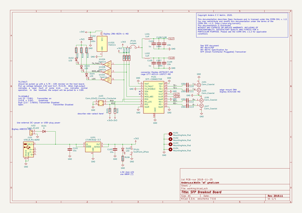
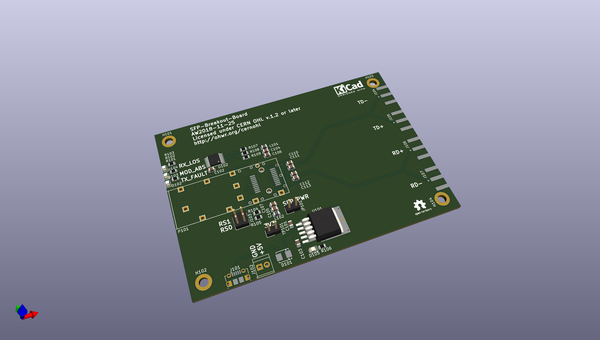
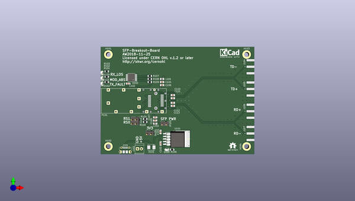
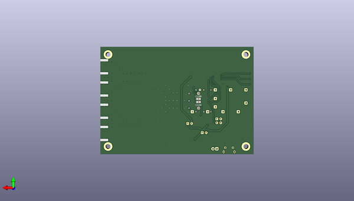

# sfp_breakout_board
 
## summary 
* id: aewallin_sfp_breakout_board_sfp_breakout
* user: aewallin
* name: sfp_breakout_board
* board: sfp_breakout
* repo: https://github.com/aewallin/SFP-Breakout-Board
* src_file_repo_kicad_pcb: SFP_breakout.kicad_pcb
* src_file_repo_kicad_pcb_link: https://github.com/aewallin/SFP-Breakout-Board/tree/master/SFP_breakout.kicad_pcb
* src_file_repo_kicad_sch: SFP_breakout.kicad_sch
* src_file_repo_kicad_sch_link: https://github.com/aewallin/SFP-Breakout-Board/tree/master/SFP_breakout.kicad_sch

* src_file_repo_sch: 
* src_file_repo_sch_link: https://github.com/aewallin/SFP-Breakout-Board/tree/master/
* full details link: https://github.com/oomlout/oomlout_oomp_project_bot_v_2/tree/main/projects/aewallin_sfp_breakout_board_sfp_breakout/current_version/working  

## schematic  
  
[schematic (pdf)](working_schematic.pdf) 

## pcb  
 
  
  
  
[board (pdf)](working.pdf)  

## working_bom
| Id | Designator | Footprint | Quantity | Designation | Supplier and ref |  | None | 
| --- | --- | --- | --- | --- | --- | --- | --- | 
| 1 | C101,C102,C103,C104,C105,C106,C107,C110,C111,C112,C113,C108,C109 | C_0805_2012Metric | 13 | C |  |  | [''] | 
| 2 | D101 | DIODE_DO-214BA | 1 | D |  |  | [''] | 
| 3 | D102,D103,D104,D105 | LED_0805_2012Metric | 4 | LED |  |  | [''] | 
| 4 | J101 | USB_Micro-B_Molex-105017-0001 | 1 | USB_B_Micro |  |  | [''] | 
| 5 | J102 | TerminalBlock_TE_282834-2_1x02_P2.54mm_Horizontal | 1 | Conn_01x02 |  |  | [''] | 
| 6 | J103 | PinHeader_2x02_P2.54mm_Vertical | 1 | Conn_02x02_Counter_Clockwise |  |  | [''] | 
| 7 | J104,J105,J106,J107 | SMA_Amphenol_132289_EdgeMount | 4 | Conn_Coaxial |  |  | [''] | 
| 8 | L101,L102 | L_0805_2012Metric | 2 | L |  |  | [''] | 
| 9 | P101 | Connector_SFP_and_Cage | 1 | SFP-CONNECTOR |  |  | [''] | 
| 10 | R101,R102,R103,R106 | R_0805_2012Metric | 4 | R |  |  | [''] | 
| 11 | R104,R105,R107,R108,R109 | R_0805_2012Metric | 5 | 7k |  |  | [''] | 
| 12 | U102 | TSSOP-14_4.4x5mm_P0.65mm | 1 | 74HC14 |  |  | [''] | 
| 13 | JP101 | PinHeader_1x02_P2.54mm_Vertical | 1 | Jumper |  |  | [''] | 
| 14 | TP101 | PinHeader_1x02_P2.54mm_Vertical | 1 | TestPoint_2Pole |  |  | [''] | 
| 15 | U101 | TO-263-5_TabPin3 | 1 | LT1963AxQ-3.3 |  |  | [''] | 

## bom_schematic
| Ref | Qnty | Value | Cmp name | Footprint | Description | Vendor | DNP | 
| --- | --- | --- | --- | --- | --- | --- | --- | 
| C101, C103 | 2 | 10u | C | Capacitor_SMD:C_0805_2012Metric | Unpolarized capacitor |  |  | 
| C102, C106, C107, C110, C111, C112, C113 | 7 | 100n | C | Capacitor_SMD:C_0805_2012Metric | Unpolarized capacitor |  |  | 
| C104, C105 | 2 | 1u | C | Capacitor_SMD:C_0805_2012Metric | Unpolarized capacitor |  |  | 
| C108, C109 | 2 | 10n | C | Capacitor_SMD:C_0805_2012Metric | Unpolarized capacitor |  |  | 
| D101 | 1 | D | D | awallinKiCadFootprints:DIODE_DO-214BA | Diode |  |  | 
| D102, D103, D104, D105 | 4 | LED | LED | LED_SMD:LED_0805_2012Metric | Light emitting diode |  |  | 
| H101, H102, H103, H104 | 4 | MountingHole_Pad | MountingHole_Pad | MountingHole:MountingHole_3.2mm_M3_DIN965_Pad | Mounting Hole with connection |  |  | 
| J101 | 1 | USB_B_Micro | USB_B_Micro-Connector | Connector_USB:USB_Micro-B_Molex-105017-0001 |  |  |  | 
| J102 | 1 | Conn_01x02 | Conn_01x02 | TerminalBlock_TE-Connectivity:TerminalBlock_TE_282834-2_1x02_P2.54mm_Horizontal | Generic connector, single row, 01x02, script generated (kicad-library-utils/schlib/autogen/connector/) |  |  | 
| J103 | 1 | Conn_02x02_Counter_Clockwise | Conn_02x02_Counter_Clockwise | Connector_PinHeader_2.54mm:PinHeader_2x02_P2.54mm_Vertical | Generic connector, double row, 02x02, counter clockwise pin numbering scheme (similar to DIP package numbering), script generated (kicad-library-utils/schlib/autogen/connector/) |  |  | 
| J104, J105, J106, J107 | 4 | Conn_Coaxial | Conn_Coaxial | Connector_Coaxial:SMA_Amphenol_132289_EdgeMount | coaxial connector (BNC, SMA, SMB, SMC, Cinch/RCA, LEMO, ...) |  |  | 
| JP101 | 1 | Jumper | Jumper-Device | Connector_PinHeader_2.54mm:PinHeader_1x02_P2.54mm_Vertical |  |  |  | 
| L101, L102 | 2 | 1uH | L | Inductor_SMD:L_0805_2012Metric | Inductor |  |  | 
| P101 | 1 | SFP-CONNECTOR | SFP-CONNECTOR-awallin | awallinKiCadFootprints:Connector_SFP_and_Cage |  |  |  | 
| R101, R102, R103, R106 | 4 | 680R | R | Resistor_SMD:R_0805_2012Metric | Resistor |  |  | 
| R104, R105, R107, R108, R109 | 5 | 6k8 | R | Resistor_SMD:R_0805_2012Metric | Resistor |  |  | 
| TP101 | 1 | TestPoint_2Pole | TestPoint_2Pole | Connector_PinHeader_2.54mm:PinHeader_1x02_P2.54mm_Vertical | 2-polar test point |  |  | 
| U101 | 1 | LT1963AxQ-3.3 | LT1963AxQ-3.3 | Package_TO_SOT_SMD:TO-263-5_TabPin3 | 3.3V, 1.5A, Low Noise, Fast Transient Response LDO Regulator, TO-263-5 |  |  | 
| U102 | 1 | 74HC14 | 74HC14 | Package_SO:TSSOP-14_4.4x5mm_P0.65mm | Hex inverter schmitt trigger |  |  | 

