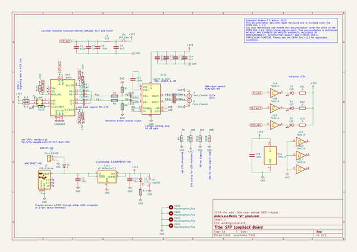
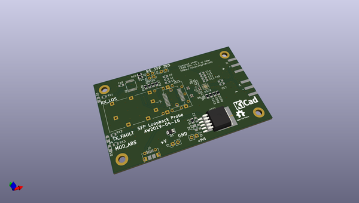
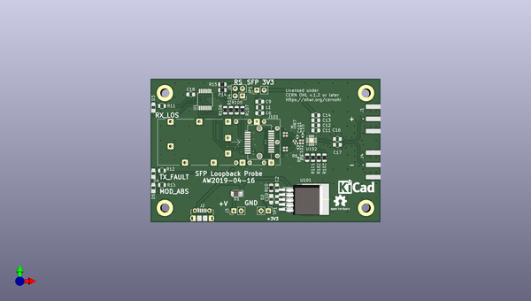
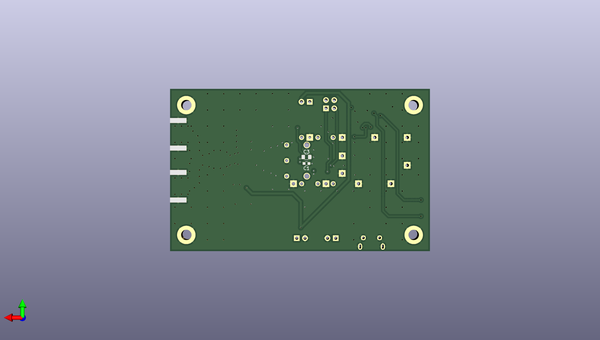

# sfp_loopback_board
 
## summary 
* id: aewallin_sfp_loopback_board_sfp_loopback
* user: aewallin
* name: sfp_loopback_board
* board: sfp_loopback
* repo: https://github.com/aewallin/SFP-Loopback-Board
* src_file_repo_kicad_pcb: sfp_loopback.kicad_pcb
* src_file_repo_kicad_pcb_link: https://github.com/aewallin/SFP-Loopback-Board/tree/master/sfp_loopback.kicad_pcb

* src_file_repo_sch: sfp_loopback.sch
* src_file_repo_sch_link: https://github.com/aewallin/SFP-Loopback-Board/tree/master/sfp_loopback.sch
* full details link: https://github.com/oomlout/oomlout_oomp_project_bot_v_2/tree/main/projects/aewallin_sfp_loopback_board_sfp_loopback/current_version/working  

## schematic  
  
[schematic (pdf)](working_schematic.pdf) 

## pcb  
 
  
  
  
[board (pdf)](working.pdf)  

## working_bom
| Id | Designator | Footprint | Quantity | Designation | Supplier and ref |  | None | 
| --- | --- | --- | --- | --- | --- | --- | --- | 
| 1 | C2,C10 | C_0805 | 2 | 10u |  |  | [''] | 
| 2 | C6,C13,C16,C17,C18 | C_0805 | 5 | 100n |  |  | [''] | 
| 3 | C9,C14 | C_0805 | 2 | 4u7 |  |  | [''] | 
| 4 | C11 | C_0805 | 1 | 100p |  |  | [''] | 
| 5 | C12,C3 | C_0805 | 2 | 1n |  |  | [''] | 
| 6 | D1 | D_1206_3216Metric | 1 | D |  |  | [''] | 
| 7 | D2,D3,D4,D5 | LED_0805 | 4 | LED |  |  | [''] | 
| 8 | J2 | USB_Micro-B_Molex-105017-0001 | 1 | USB_B_Micro |  |  | [''] | 
| 9 | J3 | Pin_Header_Straight_1x02_Pitch2.54mm | 1 | Conn_01x02 |  |  | [''] | 
| 10 | L1 | L_0805 | 1 | 2u2 |  |  | [''] | 
| 11 | R9 | R_0805_2012Metric | 1 | 62k |  |  | [''] | 
| 12 | R10 | R_0805_2012Metric | 1 | 100R |  |  | [''] | 
| 13 | TP1 | Pin_Header_Straight_1x02_Pitch2.54mm | 1 | Test3V3 |  |  | [''] | 
| 14 | JP1 | Pin_Header_Straight_1x02_Pitch2.54mm | 1 | SFP_ENA |  |  | [''] | 
| 15 | R5,R6 | R_0402 | 2 | 500R |  |  | [''] | 
| 16 | R7,R8 | R_0402 | 2 | 49R9 |  |  | [''] | 
| 17 | C15 | C_0402 | 1 | 100n |  |  | [''] | 
| 18 | R11,R12,R13 | R_0805 | 3 | R |  |  | [''] | 
| 19 | U1 | TSSOP-14_4.4x5mm_Pitch0.65mm | 1 | 74HC14 |  |  | [''] | 
| 20 | J5 | Pin_Header_Straight_2x02_Pitch2.54mm | 1 | RS_JMP |  |  | [''] | 
| 21 | R14,R15,R104,R106,R107 | R_0805_2012Metric | 5 | 4k7 |  |  | [''] | 
| 22 | J1,J4 | SMA_Amphenol_132289_EdgeMount | 2 | Conn_Coaxial |  |  | [''] | 
| 23 | R101 | R_0805_2012Metric | 1 | 10k |  |  | [''] | 
| 24 | R102,R105 | R_0805_2012Metric | 2 | 0R |  |  | [''] | 
| 25 | R103 | R_0805_2012Metric | 1 | DNI |  |  | [''] | 
| 26 | C101,C102 | C_0402_1005Metric | 2 | 100n |  |  | [''] | 
| 27 | U101 | TO-263-5_TabPin3 | 1 | LT1963AxQ-3.3 |  |  | [''] | 
| 28 | U102 | VQFN-16-1EP_3x3mm_P0.5mm_EP1.68x1.68mm | 1 | ONET1191PRGT |  |  | [''] | 
| 29 | C103,C104,C105,C106 | C_0402_1005Metric | 4 | C_Small |  |  | [''] | 
| 30 | J101 | Connector_SFP_and_Cage | 1 | SFP+ |  |  | [''] | 
| 31 | C1 | C_0603 | 1 | 100p |  |  | [''] | 

## bom_schematic
| Ref | Qnty | Value | Cmp name | Footprint | Description | Vendor | DNP | 
| --- | --- | --- | --- | --- | --- | --- | --- | 
| C1 | 1 | 100p | C | Capacitors_SMD:C_0603 | Unpolarized capacitor |  |  | 
| C2, C10 | 2 | 10u | C | Capacitors_SMD:C_0805 | Unpolarized capacitor |  |  | 
| C3, C12 | 2 | 1n | C | Capacitors_SMD:C_0805 | Unpolarized capacitor |  |  | 
| C6, C13, C16, C17, C18 | 5 | 100n | C | Capacitors_SMD:C_0805 | Unpolarized capacitor |  |  | 
| C9, C14 | 2 | 4u7 | C | Capacitors_SMD:C_0805 | Unpolarized capacitor |  |  | 
| C11 | 1 | 100p | C | Capacitors_SMD:C_0805 | Unpolarized capacitor |  |  | 
| C15 | 1 | 100n | C | Capacitors_SMD:C_0402 | Unpolarized capacitor |  |  | 
| C101, C102 | 2 | 100n | C_Small | Capacitor_SMD:C_0402_1005Metric | Unpolarized capacitor, small symbol |  |  | 
| C103, C104, C105, C106 | 4 | C_Small | C_Small | Capacitor_SMD:C_0402_1005Metric | Unpolarized capacitor, small symbol |  |  | 
| D1 | 1 | D | D | Diode_SMD:D_1206_3216Metric | Diode |  |  | 
| D2, D3, D4, D5 | 4 | LED | LED | LEDs:LED_0805 | Light emitting diode |  |  | 
| H101, H102, H103, H104 | 4 | MountingHole_Pad | MountingHole_Pad | MountingHole:MountingHole_3.2mm_M3_DIN965_Pad | Mounting Hole with connection |  |  | 
| J1, J4 | 2 | Conn_Coaxial | Conn_Coaxial | Connector_Coaxial:SMA_Amphenol_132289_EdgeMount | coaxial connector (BNC, SMA, SMB, SMC, Cinch/RCA, LEMO, ...) |  |  | 
| J2 | 1 | USB_B_Micro | USB_B_Micro-Connector | Connectors_USB:USB_Micro-B_Molex-105017-0001 |  |  |  | 
| J3 | 1 | Conn_01x02 | Conn_01x02 | Pin_Headers:Pin_Header_Straight_1x02_Pitch2.54mm | Generic connector, single row, 01x02, script generated (kicad-library-utils/schlib/autogen/connector/) |  |  | 
| J5 | 1 | RS_JMP | Conn_02x02_Counter_Clockwise | Pin_Headers:Pin_Header_Straight_2x02_Pitch2.54mm | Generic connector, double row, 02x02, counter clockwise pin numbering scheme (similar to DIP package numbering), script generated (kicad-library-utils/schlib/autogen/connector/) |  |  | 
| J101 | 1 | SFP+ | SFP+ | Connector:Connector_SFP_and_Cage | Connector for Small Form Factor Pluggable (SFP+) module, 10 Gbit/s, serial-to-serial data-agnostic optical transceiver |  |  | 
| JP1 | 1 | SFP_ENA | Jumper_NC_Small-Device | Pin_Headers:Pin_Header_Straight_1x02_Pitch2.54mm |  |  |  | 
| L1 | 1 | 2u2 | L | Inductors_SMD:L_0805 | Inductor |  |  | 
| R5, R6 | 2 | 500R | R | Resistors_SMD:R_0402 | Resistor |  |  | 
| R7, R8 | 2 | 49R9 | R | Resistors_SMD:R_0402 | Resistor |  |  | 
| R9 | 1 | 62k | R | Resistor_SMD:R_0805_2012Metric | Resistor |  |  | 
| R10 | 1 | 100R | R | Resistor_SMD:R_0805_2012Metric | Resistor |  |  | 
| R11, R12, R13 | 3 | R | R | Resistors_SMD:R_0805 | Resistor |  |  | 
| R14, R15, R104, R106, R107 | 5 | 4k7 | R | Resistor_SMD:R_0805_2012Metric | Resistor |  |  | 
| R101 | 1 | 10k | R | Resistor_SMD:R_0805_2012Metric | Resistor |  |  | 
| R102, R105 | 2 | 0R | R | Resistor_SMD:R_0805_2012Metric | Resistor |  |  | 
| R103 | 1 | DNI | R | Resistor_SMD:R_0805_2012Metric | Resistor |  |  | 
| TP1 | 1 | Test3V3 | TestPoint_2Pole | Pin_Headers:Pin_Header_Straight_1x02_Pitch2.54mm | 2-polar test point |  |  | 
| U1 | 1 | 74HC14 | 74HC14 | Housings_SSOP:TSSOP-14_4.4x5mm_Pitch0.65mm | Hex inverter schmitt trigger |  |  | 
| U101 | 1 | LT1963AxQ-3.3 | LT1963AxQ-3.3 | Package_TO_SOT_SMD:TO-263-5_TabPin3 | 3.3V, 1.5A, Low Noise, Fast Transient Response LDO Regulator, TO-263-5 |  |  | 
| U102 | 1 | ONET1191PRGT | ONET1191PRGT | Package_DFN_QFN:VQFN-16-1EP_3x3mm_P0.5mm_EP1.68x1.68mm | 11.3-Gbps Limiting Amplifier, VQFN-16 |  |  | 

