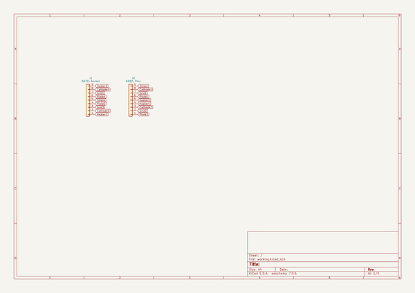

# 5670_6922_adapter
 
## summary 
* id: ai03_2725_5670_6922_adapter_5670_6922_adapter
* user: ai03_2725
* name: 5670_6922_adapter
* board: 5670_6922_adapter
* repo: https://github.com/ai03-2725/5670-6922-adapter
* src_file_repo_kicad_pcb: 5670-6922-adapter.kicad_pcb
* src_file_repo_kicad_pcb_link: https://github.com/ai03-2725/5670-6922-adapter/tree/master/5670-6922-adapter.kicad_pcb

* src_file_repo_sch: 5670-6922-adapter.sch
* src_file_repo_sch_link: https://github.com/ai03-2725/5670-6922-adapter/tree/master/5670-6922-adapter.sch
* full details link: https://github.com/oomlout/oomlout_oomp_project_bot_v_2/tree/main/projects/ai03_2725_5670_6922_adapter_5670_6922_adapter/current_version/working  

## schematic  
  
[schematic (pdf)](working_schematic.pdf) 

## pcb  
 
  
  
  
[board (pdf)](working.pdf)  

## working_bom
| Id | Designator | Footprint | Quantity | Designation | Supplier and ref |  | None | 
| --- | --- | --- | --- | --- | --- | --- | --- | 
| 1 | J1 | VALVE-ECC-83-2 | 1 | 5670-Socket |  |  | [''] | 
| 2 | J2 | VALVE-ECC-83-1 | 1 | 6922-Pins |  |  | [''] | 

## bom_schematic
| Ref | Qnty | Value | Cmp name | Footprint | Description | Vendor | DNP | 
| --- | --- | --- | --- | --- | --- | --- | --- | 
| J1 | 1 | 5670-Socket | Conn_01x09 | locallib:VALVE-ECC-83-2 | Generic connector, single row, 01x09, script generated (kicad-library-utils/schlib/autogen/connector/) |  |  | 
| J2 | 1 | 6922-Pins | Conn_01x09 | locallib:VALVE-ECC-83-1 | Generic connector, single row, 01x09, script generated (kicad-library-utils/schlib/autogen/connector/) |  |  | 

