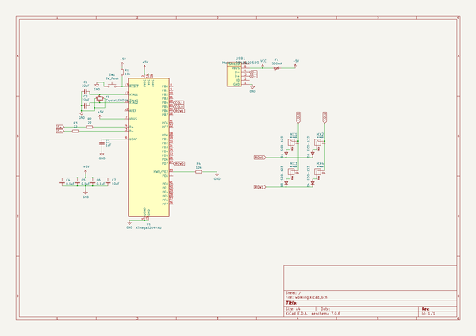

# ai03_keyboard_pcb_guide
 
## summary 
* id: ai03_2725_ai03_keyboard_pcb_guide_ai03_pcb_guide
* user: ai03_2725
* name: ai03_keyboard_pcb_guide
* board: ai03_pcb_guide
* repo: https://github.com/ai03-2725/ai03-keyboard-pcb-guide
* src_file_repo_kicad_pcb: ai03-pcb-guide.kicad_pcb
* src_file_repo_kicad_pcb_link: https://github.com/ai03-2725/ai03-keyboard-pcb-guide/tree/master/ai03-pcb-guide.kicad_pcb

* src_file_repo_sch: ai03-pcb-guide.sch
* src_file_repo_sch_link: https://github.com/ai03-2725/ai03-keyboard-pcb-guide/tree/master/ai03-pcb-guide.sch
* full details link: https://github.com/oomlout/oomlout_oomp_project_bot_v_2/tree/main/projects/ai03_2725_ai03_keyboard_pcb_guide_ai03_pcb_guide/current_version/working  

## schematic  
  
[schematic (pdf)](working_schematic.pdf) 

## pcb  
 
  
  
  
[board (pdf)](working.pdf)  

## working_bom
| Id | Designator | Footprint | Quantity | Designation | Supplier and ref |  | None | 
| --- | --- | --- | --- | --- | --- | --- | --- | 
| 1 | MX1,MX2,MX3,MX4 | MX-1U | 4 | MX-NoLED |  |  | [''] | 
| 2 | D1,D2,D3,D4 | D_SOD-123 | 4 | SOD-123 |  |  | [''] | 
| 3 | F1 | Fuse_SMD1206_Reflow | 1 | 500mA |  |  | [''] | 
| 4 | R2,R3 | R_0805 | 2 | 22 |  |  | [''] | 
| 5 | R4,R1 | R_0805 | 2 | 10k |  |  | [''] | 
| 6 | C7 | C_0805 | 1 | 10uF |  |  | [''] | 
| 7 | C5,C4,C6 | C_0805 | 3 | 0.1uF |  |  | [''] | 
| 8 | C1,C2 | C_0805 | 2 | 22pF |  |  | [''] | 
| 9 | C3 | C_0805 | 1 | 1uF |  |  | [''] | 
| 10 | USB1 | Molex-0548190589-Assembly | 1 | Molex-0548190589 |  |  | [''] | 
| 11 | SW1 | SKQG-1155865 | 1 | SW_Push |  |  | [''] | 
| 12 | U1 | TQFP-44_10x10mm_Pitch0.8mm | 1 | ATmega32U4-AU |  |  | [''] | 
| 13 | Y1 | Crystal_SMD_3225-4pin_3.2x2.5mm | 1 | Crystal_GND24_Small |  |  | [''] | 

## bom_schematic
| Ref | Qnty | Value | Cmp name | Footprint | Description | Vendor | DNP | 
| --- | --- | --- | --- | --- | --- | --- | --- | 
| C1, C2 | 2 | 22pF | C_Small | Capacitors_SMD:C_0805 | Unpolarized capacitor, small symbol |  |  | 
| C3 | 1 | 1uF | C_Small | Capacitors_SMD:C_0805 | Unpolarized capacitor, small symbol |  |  | 
| C4, C5, C6 | 3 | 0.1uF | C_Small | Capacitors_SMD:C_0805 | Unpolarized capacitor, small symbol |  |  | 
| C7 | 1 | 10uF | C_Small | Capacitors_SMD:C_0805 | Unpolarized capacitor, small symbol |  |  | 
| D1, D2, D3, D4 | 4 | SOD-123 | D_Small | Diodes_SMD:D_SOD-123 | Diode, small symbol |  |  | 
| F1 | 1 | 500mA | Polyfuse_Small | Fuse_Holders_and_Fuses:Fuse_SMD1206_Reflow | Resettable fuse, polymeric positive temperature coefficient, small symbol |  |  | 
| MX1, MX2, MX3, MX4 | 4 | MX-NoLED | MX-NoLED-MX_Alps_Hybrid | MX_Alps_Hybrid:MX-1U |  |  |  | 
| R1, R4 | 2 | 10k | R_Small | Resistors_SMD:R_0805 | Resistor, small symbol |  |  | 
| R2, R3 | 2 | 22 | R_Small | Resistors_SMD:R_0805 | Resistor, small symbol |  |  | 
| SW1 | 1 | SW_Push | SW_Push | random-keyboard-parts:SKQG-1155865 | Push button switch, generic, two pins |  |  | 
| U1 | 1 | ATmega32U4-AU | ATmega32U4-AU-MCU_Microchip_ATmega | Housings_QFP:TQFP-44_10x10mm_Pitch0.8mm |  |  |  | 
| USB1 | 1 | Molex-0548190589 | Molex-0548190589-random-keyboard-parts | random-keyboard-parts:Molex-0548190589-Assembly |  |  |  | 
| Y1 | 1 | Crystal_GND24_Small | Crystal_GND24_Small | Crystals:Crystal_SMD_3225-4pin_3.2x2.5mm | Four pin crystal, GND on pins 2 and 4, small symbol |  |  | 

