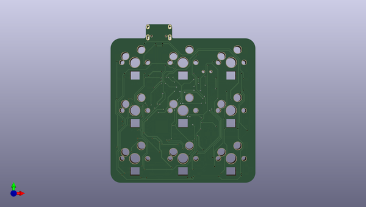

# aurora
 
## summary 
* id: ai03_2725_aurora_aurora
* user: ai03_2725
* name: aurora
* board: aurora
* repo: https://github.com/ai03-2725/Aurora
* src_file_repo_kicad_pcb: Aurora.kicad_pcb
* src_file_repo_kicad_pcb_link: https://github.com/ai03-2725/Aurora/tree/master/Aurora.kicad_pcb

* src_file_repo_sch: Aurora.sch
* src_file_repo_sch_link: https://github.com/ai03-2725/Aurora/tree/master/Aurora.sch
* full details link: https://github.com/oomlout/oomlout_oomp_project_bot_v_2/tree/main/projects/ai03_2725_aurora_aurora/current_version/working  

## schematic  
  
[schematic (pdf)](working_schematic.pdf) 

## pcb  
 
  
  
  
[board (pdf)](working.pdf)  

## working_bom
| Id | Designator | Footprint | Quantity | Designation | Supplier and ref |  | None | 
| --- | --- | --- | --- | --- | --- | --- | --- | 
| 1 | MX1,MX2,MX3,MX4,MX5,MX6,MX8,MX9,MX7 | MXOnly-1U-Hotswap | 9 | MX-1U |  |  | [''] | 
| 2 | C19,C20,C21,C22,C2 | C_0603 | 5 | 0.1uF |  |  | [''] | 
| 3 | C23,C24 | C_0603 | 2 | 4.7uF |  |  | [''] | 
| 4 | C25,C26 | C_0603 | 2 | 1uF |  |  | [''] | 
| 5 | D2,D3,D5,D6,D7,D8,D9,D1,D4 | D_SOD-123 | 9 | SOD-123 |  |  | [''] | 
| 6 | LED1,LED2,LED3,LED4,LED5,LED6,LED7,LED8,LED9 | RGB-6028 | 9 | RGB-6028 |  |  | [''] | 
| 7 | R1 | R_0805 | 1 | 20k |  |  | [''] | 
| 8 | R2 | R_0805 | 1 | 10k |  |  | [''] | 
| 9 | R73,R74 | R_0805 | 2 | 5.1k |  |  | [''] | 
| 10 | SW3 | SW_SPDT_PCM12 | 1 | SW_SPDT |  |  | [''] | 
| 11 | U3 | QFN-48-1EP_7x7mm_Pitch0.5mm | 1 | STM32F072CBUx |  |  | [''] | 
| 12 | U4 | SOT-23 | 1 | MCP1700-3002E_SOT23 |  |  | [''] | 
| 13 | SW2 | SW_SPST_SKQG | 1 | SW_Push |  |  | [''] | 
| 14 | F1 | Fuse_SMD1206_Reflow | 1 | 500mA |  |  | [''] | 
| 15 | U1 | QFN-28-1EP_4x4mm_Pitch0.4mm | 1 | IS31FL3731-QFLS2 |  |  | [''] | 
| 16 | C1 | CP_Tantalum_Case-A_EIA-3216-18_Reflow | 1 | 10uF |  |  | [''] | 
| 17 | U2 | SOT143B | 1 | PRTR5V0U2X |  |  | [''] | 
| 18 | R3,R4 | R_0805 | 2 | 2k |  |  | [''] | 
| 19 | USB1 | HRO-TYPE-C-31-M-12-Assembly | 1 | HRO-TYPE-C-31-M-12 |  |  | [''] | 

## bom_schematic
| Ref | Qnty | Value | Cmp name | Footprint | Description | Vendor | DNP | 
| --- | --- | --- | --- | --- | --- | --- | --- | 
| C1 | 1 | 10uF | CP1_Small-Device | Capacitors_Tantalum_SMD:CP_Tantalum_Case-A_EIA-3216-18_Reflow |  |  |  | 
| C2, C19, C20, C21, C22 | 5 | 0.1uF | C_Small | Capacitors_SMD:C_0603 | Unpolarized capacitor, small symbol |  |  | 
| C23, C24 | 2 | 4.7uF | C_Small | Capacitors_SMD:C_0603 | Unpolarized capacitor, small symbol |  |  | 
| C25, C26 | 2 | 1uF | C_Small | Capacitors_SMD:C_0603 | Unpolarized capacitor, small symbol |  |  | 
| D1, D2, D3, D4, D5, D6, D7, D8, D9 | 9 | SOD-123 | D_Small | Diodes_SMD:D_SOD-123 | Diode, small symbol |  |  | 
| F1 | 1 | 500mA | Polyfuse_Small | Fuse_Holders_and_Fuses:Fuse_SMD1206_Reflow | Resettable fuse, polymeric positive temperature coefficient, small symbol |  |  | 
| LED1, LED2, LED3, LED4, LED5, LED6, LED7, LED8, LED9 | 9 | RGB-6028 | RGB-6028-random-keyboard-parts | random-keyboard-parts:RGB-6028 |  |  |  | 
| MX1, MX2, MX3, MX4, MX5, MX6, MX7, MX8, MX9 | 9 | MX-1U | MX-1U-MX_Alps_Hybrids | MX_Alps_Hybrid:MXOnly-1U-Hotswap |  |  |  | 
| R1 | 1 | 20k | R_Small | Resistors_SMD:R_0805 | Resistor, small symbol |  |  | 
| R2 | 1 | 10k | R_Small | Resistors_SMD:R_0805 | Resistor, small symbol |  |  | 
| R3, R4 | 2 | 2k | R_Small | Resistors_SMD:R_0805 | Resistor, small symbol |  |  | 
| R73, R74 | 2 | 5.1k | R_Small | Resistors_SMD:R_0805 | Resistor, small symbol |  |  | 
| SW2 | 1 | SW_Push | SW_Push | Buttons_Switches_SMD:SW_SPST_SKQG | Push button switch, generic, two pins |  |  | 
| SW3 | 1 | SW_SPDT | SW_SPDT | Buttons_Switches_SMD:SW_SPDT_PCM12 | Switch, single pole double throw |  |  | 
| U1 | 1 | IS31FL3731-QFLS2 | IS31FL3731-QFLS2-random-keyboard-parts | Housings_DFN_QFN:QFN-28-1EP_4x4mm_Pitch0.4mm |  |  |  | 
| U2 | 1 | PRTR5V0U2X | PRTR5V0U2X | random-keyboard-parts:SOT143B |  |  |  | 
| U3 | 1 | STM32F072CBUx | STM32F072CBUx-MCU_ST_STM32F0 | Housings_DFN_QFN:QFN-48-1EP_7x7mm_Pitch0.5mm |  |  |  | 
| U4 | 1 | MCP1700-3002E_SOT23 | MCP1700-3002E_SOT23-Regulator_Linear | TO_SOT_Packages_SMD:SOT-23 |  |  |  | 
| USB1 | 1 | HRO-TYPE-C-31-M-12 | HRO-TYPE-C-31-M-12-Type-C | Type-C:HRO-TYPE-C-31-M-12-Assembly |  |  |  | 

