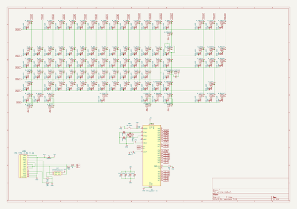
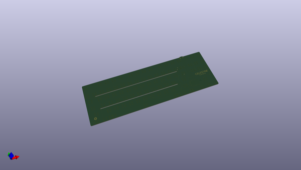
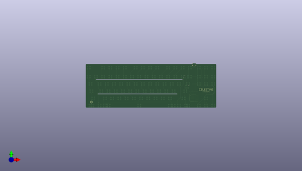
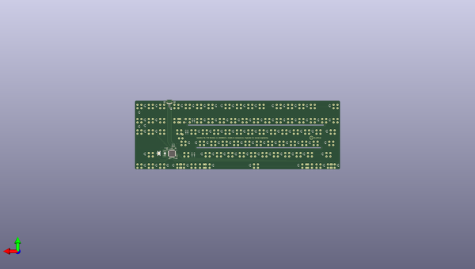

# celestine
 
## summary 
* id: ai03_2725_celestine_celestine
* user: ai03_2725
* name: celestine
* board: celestine
* repo: https://github.com/ai03-2725/Celestine
* src_file_repo_kicad_pcb: Celestine-PCB/Celestine.kicad_pcb
* src_file_repo_kicad_pcb_link: https://github.com/ai03-2725/Celestine/tree/master/Celestine-PCB/Celestine.kicad_pcb

* src_file_repo_sch: Celestine-PCB/Celestine.sch
* src_file_repo_sch_link: https://github.com/ai03-2725/Celestine/tree/master/Celestine-PCB/Celestine.sch
* full details link: https://github.com/oomlout/oomlout_oomp_project_bot_v_2/tree/main/projects/ai03_2725_celestine_celestine/current_version/working  

## schematic  
  
[schematic (pdf)](working_schematic.pdf) 

## pcb  
 
  
  
  
[board (pdf)](working.pdf)  

## working_bom
| Id | Designator | Footprint | Quantity | Designation | Supplier and ref |  | None | 
| --- | --- | --- | --- | --- | --- | --- | --- | 
| 1 | K_.1,K_,1,K_#1,K_#2,K_#3,K_#4,K_#5,K_#6,K_#7,K_#8,K_#9,K_#10,K_'1,K_-1,K_/1,K_;1,K_=1,K_[1,K_]1,K_A1,K_B1,K_C1,K_D1,K_E1,K_ESC1,K_F1,K_G1,K_H1,K_I1,K_J1,K_K1,K_L1,K_M1,K_N1,K_O1,K_P1,K_Q1,K_R1,K_S1,K_SBACK1,K_T1,K_U1,K_V1,K_W1,K_X1,K_Y1,K_Z1,K_`1,K_FN1,K_FN2,K_FN3,K_FN4,K_FN5,K_FN6,K_FN7,K_FN8,K_FN9,K_FN10,K_FN11,K_FN12,K_RWIN1,K_WIN1,K_DEL1,K_DOWN1,K_END1,K_HOME1,K_INS1,K_LEFT1,K_PAUSE1,K_PGDN1,K_PGUP1,K_PRTSC1,K_RIGHT1,K_SLCK1,K_UP1 | Hitek725-1U | 75 | MX-1U |  |  | [''] | 
| 2 | K_\1,K_ALT1,K_ALT2,K_TAB1,K_CTRL2,K_RALT1,K_RALT2,K_RCTRL2 | Hitek725-1.5U | 8 | MX-1.5U |  |  | [''] | 
| 3 | K_CAPS1 | Hitek725-1.75U | 1 | MX-1.75U |  |  | [''] | 
| 4 | K_ENTER1,K_SHIFT1 | Hitek725-2.25U | 2 | MX-2.25U |  |  | [''] | 
| 5 | K_RSHIFT1 | Hitek725-2.75U | 1 | MX-2.75U |  |  | [''] | 
| 6 | K_SPACE1 | Hitek725-7U | 1 | MX-7U |  |  | [''] | 
| 7 | K_CTRL1,K_RCTRL1 | Hitek725-2U | 2 | MX-2U |  |  | [''] | 
| 8 | K_ENTER2 | Hitek725-BigAssEnter-DudPad | 1 | MX-BAE |  |  | [''] | 
| 9 | G***,G*** | ai-ring-6mm-Combined | 2 | LOGO |  |  | [''] | 
| 10 | K_BACK1 | Hitek725-2U-DudPad | 1 | MX-2U |  |  | [''] | 
| 11 | K_SBACK2 | Hitek725-1U-DudPad | 1 | MX-1U |  |  | [''] | 
| 12 | G*** | Celestine | 1 | LOGO |  |  | [''] | 
| 13 | C2 | C_0603 | 1 | 10uF |  |  | [''] | 
| 14 | C3,C4,C5 | C_0603 | 3 | 0.1uF |  |  | [''] | 
| 15 | C6 | C_0603 | 1 | 1uF |  |  | [''] | 
| 16 | C7,C8 | C_0603 | 2 | 22pF |  |  | [''] | 
| 17 | D1,D2,D3,D4,D5,D6,D7,D8,D9,D10,D11,D12,D13,D14,D16,D17,D18,D19,D20,D21,D22,D23,D24,D25,D26,D27,D28,D29,D31,D32,D33,D34,D35,D36,D37,D38,D39,D40,D41,D42,D43,D45,D46,D47,D48,D49,D50,D51,D52,D53,D54,D55,D56,D61,D64,D65,D67,D68,D30,D58,D60,D62,D63,D66,D69,D70,D71,D72,D73,D74,D75,D76,D77,D78,D79,D80,D81,D82,D83,D84,D85,D86,D87,D88,D89,D59,D15 | D_SOD-123 | 87 | SOD-123 |  |  | [''] | 
| 18 | F1 | Fuse_SMD1206_Reflow | 1 | 500mA |  |  | [''] | 
| 19 | R67,R68 | R_0805 | 2 | 22 |  |  | [''] | 
| 20 | R70 | R_0805 | 1 | 10k |  |  | [''] | 
| 21 | R71 | R_0805 | 1 | 1k |  |  | [''] | 
| 22 | R73,R74 | R_0805 | 2 | 5.1k |  |  | [''] | 
| 23 | SW1 | SKQG-1155865 | 1 | SW_Push |  |  | [''] | 
| 24 | USB1 | HRO-TYPE-C-31-M-12-Assembly | 1 | HRO-TYPE-C-31-M-12 |  |  | [''] | 
| 25 | Y1 | Crystal_SMD_3225-4pin_3.2x2.5mm | 1 | 16Mhz |  |  | [''] | 
| 26 | U1 | TQFP-44_10x10mm_Pitch0.8mm | 1 | ATmega32U4-AU |  |  | [''] | 
| 27 | U2 | SOT143B | 1 | PRTR5V0U2X |  |  | [''] | 

## bom_schematic
| Ref | Qnty | Value | Cmp name | Footprint | Description | Vendor | DNP | 
| --- | --- | --- | --- | --- | --- | --- | --- | 
| C2 | 1 | 10uF | C_Small | Capacitors_SMD:C_0603 | Unpolarized capacitor, small symbol |  |  | 
| C3, C4, C5 | 3 | 0.1uF | C_Small | Capacitors_SMD:C_0603 | Unpolarized capacitor, small symbol |  |  | 
| C6 | 1 | 1uF | C_Small | Capacitors_SMD:C_0603 | Unpolarized capacitor, small symbol |  |  | 
| C7, C8 | 2 | 22pF | C_Small | Capacitors_SMD:C_0603 | Unpolarized capacitor, small symbol |  |  | 
| D1, D2, D3, D4, D5, D6, D7, D8, D9, D10, D11, D12, D13, D14, D15, D16, D17, D18, D19, D20, D21, D22, D23, D24, D25, D26, D27, D28, D29, D30, D31, D32, D33, D34, D35, D36, D37, D38, D39, D40, D41, D42, D43, D45, D46, D47, D48, D49, D50, D51, D52, D53, D54, D55, D56, D58, D59, D60, D61, D62, D63, D64, D65, D66, D67, D68, D69, D70, D71, D72, D73, D74, D75, D76, D77, D78, D79, D80, D81, D82, D83, D84, D85, D86, D87, D88, D89 | 87 | SOD-123 | D_Small | Diodes_SMD:D_SOD-123 | Diode, small symbol |  |  | 
| F1 | 1 | 500mA | Polyfuse_Small | Fuse_Holders_and_Fuses:Fuse_SMD1206_Reflow | Resettable fuse, polymeric positive temperature coefficient, small symbol |  |  | 
| K_#1, K_#2, K_#3, K_#4, K_#5, K_#6, K_#7, K_#8, K_#9, K_#10 | 10 | MX-1U | MX-1U-MX_Alps_Hybrids | hitek725:Hitek725-1U |  |  |  | 
| K_'1 | 1 | MX-1U | MX-1U-MX_Alps_Hybrids | hitek725:Hitek725-1U |  |  |  | 
| K_,1 | 1 | MX-1U | MX-1U-MX_Alps_Hybrids | hitek725:Hitek725-1U |  |  |  | 
| K_-1 | 1 | MX-1U | MX-1U-MX_Alps_Hybrids | hitek725:Hitek725-1U |  |  |  | 
| K_.1 | 1 | MX-1U | MX-1U-MX_Alps_Hybrids | hitek725:Hitek725-1U |  |  |  | 
| K_/1 | 1 | MX-1U | MX-1U-MX_Alps_Hybrids | hitek725:Hitek725-1U |  |  |  | 
| K_;1 | 1 | MX-1U | MX-1U-MX_Alps_Hybrids | hitek725:Hitek725-1U |  |  |  | 
| K_=1 | 1 | MX-1U | MX-1U-MX_Alps_Hybrids | hitek725:Hitek725-1U |  |  |  | 
| K_[1 | 1 | MX-1U | MX-1U-MX_Alps_Hybrids | hitek725:Hitek725-1U |  |  |  | 
| K_\1 | 1 | MX-1.5U | MX-1U-MX_Alps_Hybrids | hitek725:Hitek725-1.5U |  |  |  | 
| K_]1 | 1 | MX-1U | MX-1U-MX_Alps_Hybrids | hitek725:Hitek725-1U |  |  |  | 
| K_`1 | 1 | MX-1U | MX-1U-MX_Alps_Hybrids | hitek725:Hitek725-1U |  |  |  | 
| K_A1 | 1 | MX-1U | MX-1U-MX_Alps_Hybrids | hitek725:Hitek725-1U |  |  |  | 
| K_ALT1, K_ALT2 | 2 | MX-1.5U | MX-1U-MX_Alps_Hybrids | hitek725:Hitek725-1.5U |  |  |  | 
| K_B1 | 1 | MX-1U | MX-1U-MX_Alps_Hybrids | hitek725:Hitek725-1U |  |  |  | 
| K_BACK1 | 1 | MX-2U | MX-1U-MX_Alps_Hybrids | hitek725:Hitek725-2U-DudPad |  |  |  | 
| K_C1 | 1 | MX-1U | MX-1U-MX_Alps_Hybrids | hitek725:Hitek725-1U |  |  |  | 
| K_CAPS1 | 1 | MX-1.75U | MX-1U-MX_Alps_Hybrids | hitek725:Hitek725-1.75U |  |  |  | 
| K_CTRL1 | 1 | MX-2U | MX-1U-MX_Alps_Hybrids | hitek725:Hitek725-2U |  |  |  | 
| K_CTRL2 | 1 | MX-1.5U | MX-1U-MX_Alps_Hybrids | hitek725:Hitek725-1.5U |  |  |  | 
| K_D1 | 1 | MX-1U | MX-1U-MX_Alps_Hybrids | hitek725:Hitek725-1U |  |  |  | 
| K_DEL1 | 1 | MX-1U | MX-1U-MX_Alps_Hybrids | hitek725:Hitek725-1U |  |  |  | 
| K_DOWN1 | 1 | MX-1U | MX-1U-MX_Alps_Hybrids | hitek725:Hitek725-1U |  |  |  | 
| K_E1 | 1 | MX-1U | MX-1U-MX_Alps_Hybrids | hitek725:Hitek725-1U |  |  |  | 
| K_END1 | 1 | MX-1U | MX-1U-MX_Alps_Hybrids | hitek725:Hitek725-1U |  |  |  | 
| K_ENTER1 | 1 | MX-2.25U | MX-1U-MX_Alps_Hybrids | hitek725:Hitek725-2.25U |  |  |  | 
| K_ENTER2 | 1 | MX-BAE | MX-1U-MX_Alps_Hybrids | hitek725:Hitek725-BigAssEnter-DudPad |  |  |  | 
| K_ESC1 | 1 | MX-1U | MX-1U-MX_Alps_Hybrids | hitek725:Hitek725-1U |  |  |  | 
| K_F1 | 1 | MX-1U | MX-1U-MX_Alps_Hybrids | hitek725:Hitek725-1U |  |  |  | 
| K_FN1, K_FN2, K_FN3, K_FN4, K_FN5, K_FN6, K_FN7, K_FN8, K_FN9, K_FN10, K_FN11, K_FN12 | 12 | MX-1U | MX-1U-MX_Alps_Hybrids | hitek725:Hitek725-1U |  |  |  | 
| K_G1 | 1 | MX-1U | MX-1U-MX_Alps_Hybrids | hitek725:Hitek725-1U |  |  |  | 
| K_H1 | 1 | MX-1U | MX-1U-MX_Alps_Hybrids | hitek725:Hitek725-1U |  |  |  | 
| K_HOME1 | 1 | MX-1U | MX-1U-MX_Alps_Hybrids | hitek725:Hitek725-1U |  |  |  | 
| K_I1 | 1 | MX-1U | MX-1U-MX_Alps_Hybrids | hitek725:Hitek725-1U |  |  |  | 
| K_INS1 | 1 | MX-1U | MX-1U-MX_Alps_Hybrids | hitek725:Hitek725-1U |  |  |  | 
| K_J1 | 1 | MX-1U | MX-1U-MX_Alps_Hybrids | hitek725:Hitek725-1U |  |  |  | 
| K_K1 | 1 | MX-1U | MX-1U-MX_Alps_Hybrids | hitek725:Hitek725-1U |  |  |  | 
| K_L1 | 1 | MX-1U | MX-1U-MX_Alps_Hybrids | hitek725:Hitek725-1U |  |  |  | 
| K_LEFT1 | 1 | MX-1U | MX-1U-MX_Alps_Hybrids | hitek725:Hitek725-1U |  |  |  | 
| K_M1 | 1 | MX-1U | MX-1U-MX_Alps_Hybrids | hitek725:Hitek725-1U |  |  |  | 
| K_N1 | 1 | MX-1U | MX-1U-MX_Alps_Hybrids | hitek725:Hitek725-1U |  |  |  | 
| K_O1 | 1 | MX-1U | MX-1U-MX_Alps_Hybrids | hitek725:Hitek725-1U |  |  |  | 
| K_P1 | 1 | MX-1U | MX-1U-MX_Alps_Hybrids | hitek725:Hitek725-1U |  |  |  | 
| K_PAUSE1 | 1 | MX-1U | MX-1U-MX_Alps_Hybrids | hitek725:Hitek725-1U |  |  |  | 
| K_PGDN1 | 1 | MX-1U | MX-1U-MX_Alps_Hybrids | hitek725:Hitek725-1U |  |  |  | 
| K_PGUP1 | 1 | MX-1U | MX-1U-MX_Alps_Hybrids | hitek725:Hitek725-1U |  |  |  | 
| K_PRTSC1 | 1 | MX-1U | MX-1U-MX_Alps_Hybrids | hitek725:Hitek725-1U |  |  |  | 
| K_Q1 | 1 | MX-1U | MX-1U-MX_Alps_Hybrids | hitek725:Hitek725-1U |  |  |  | 
| K_R1 | 1 | MX-1U | MX-1U-MX_Alps_Hybrids | hitek725:Hitek725-1U |  |  |  | 
| K_RALT1, K_RALT2 | 2 | MX-1.5U | MX-1U-MX_Alps_Hybrids | hitek725:Hitek725-1.5U |  |  |  | 
| K_RCTRL1 | 1 | MX-2U | MX-1U-MX_Alps_Hybrids | hitek725:Hitek725-2U |  |  |  | 
| K_RCTRL2 | 1 | MX-1.5U | MX-1U-MX_Alps_Hybrids | hitek725:Hitek725-1.5U |  |  |  | 
| K_RIGHT1 | 1 | MX-1U | MX-1U-MX_Alps_Hybrids | hitek725:Hitek725-1U |  |  |  | 
| K_RSHIFT1 | 1 | MX-2.75U | MX-1U-MX_Alps_Hybrids | hitek725:Hitek725-2.75U |  |  |  | 
| K_RWIN1 | 1 | MX-1U | MX-1U-MX_Alps_Hybrids | hitek725:Hitek725-1U |  |  |  | 
| K_S1 | 1 | MX-1U | MX-1U-MX_Alps_Hybrids | hitek725:Hitek725-1U |  |  |  | 
| K_SBACK1 | 1 | MX-1U | MX-1U-MX_Alps_Hybrids | hitek725:Hitek725-1U |  |  |  | 
| K_SBACK2 | 1 | MX-1U | MX-1U-MX_Alps_Hybrids | hitek725:Hitek725-1U-DudPad |  |  |  | 
| K_SHIFT1 | 1 | MX-2.25U | MX-1U-MX_Alps_Hybrids | hitek725:Hitek725-2.25U |  |  |  | 
| K_SLCK1 | 1 | MX-1U | MX-1U-MX_Alps_Hybrids | hitek725:Hitek725-1U |  |  |  | 
| K_SPACE1 | 1 | MX-7U | MX-1U-MX_Alps_Hybrids | hitek725:Hitek725-7U |  |  |  | 
| K_T1 | 1 | MX-1U | MX-1U-MX_Alps_Hybrids | hitek725:Hitek725-1U |  |  |  | 
| K_TAB1 | 1 | MX-1.5U | MX-1U-MX_Alps_Hybrids | hitek725:Hitek725-1.5U |  |  |  | 
| K_U1 | 1 | MX-1U | MX-1U-MX_Alps_Hybrids | hitek725:Hitek725-1U |  |  |  | 
| K_UP1 | 1 | MX-1U | MX-1U-MX_Alps_Hybrids | hitek725:Hitek725-1U |  |  |  | 
| K_V1 | 1 | MX-1U | MX-1U-MX_Alps_Hybrids | hitek725:Hitek725-1U |  |  |  | 
| K_W1 | 1 | MX-1U | MX-1U-MX_Alps_Hybrids | hitek725:Hitek725-1U |  |  |  | 
| K_WIN1 | 1 | MX-1U | MX-1U-MX_Alps_Hybrids | hitek725:Hitek725-1U |  |  |  | 
| K_X1 | 1 | MX-1U | MX-1U-MX_Alps_Hybrids | hitek725:Hitek725-1U |  |  |  | 
| K_Y1 | 1 | MX-1U | MX-1U-MX_Alps_Hybrids | hitek725:Hitek725-1U |  |  |  | 
| K_Z1 | 1 | MX-1U | MX-1U-MX_Alps_Hybrids | hitek725:Hitek725-1U |  |  |  | 
| R67, R68 | 2 | 22 | R_Small | Resistors_SMD:R_0805 | Resistor, small symbol |  |  | 
| R70 | 1 | 10k | R_Small | Resistors_SMD:R_0805 | Resistor, small symbol |  |  | 
| R71 | 1 | 1k | R_Small | Resistors_SMD:R_0805 | Resistor, small symbol |  |  | 
| R73, R74 | 2 | 5.1k | R_Small | Resistors_SMD:R_0805 | Resistor, small symbol |  |  | 
| SW1 | 1 | SW_Push | SW_Push | random-keyboard-parts:SKQG-1155865 | Push button switch, generic, two pins |  |  | 
| U1 | 1 | ATmega32U4-AU | ATmega32U4-AU-MCU_Microchip_ATmega | Housings_QFP:TQFP-44_10x10mm_Pitch0.8mm |  |  |  | 
| U2 | 1 | PRTR5V0U2X | PRTR5V0U2X-random-keyboard-parts | random-keyboard-parts:SOT143B |  |  |  | 
| USB1 | 1 | HRO-TYPE-C-31-M-12 | HRO-TYPE-C-31-M-12-Type-C | Type-C:HRO-TYPE-C-31-M-12-Assembly |  |  |  | 
| Y1 | 1 | 16Mhz | Crystal_GND24 | Crystals:Crystal_SMD_3225-4pin_3.2x2.5mm | Four pin crystal, GND on pins 2 and 4 |  |  | 

