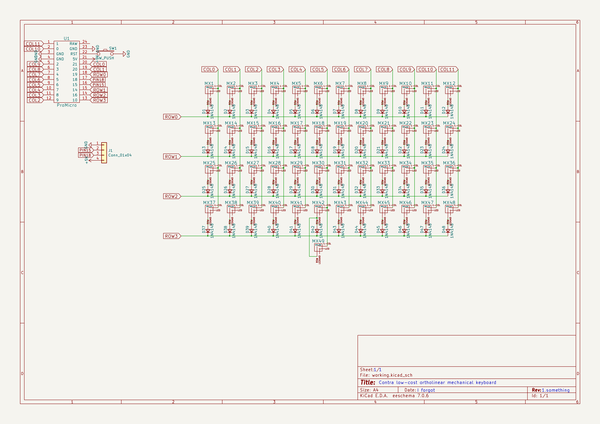
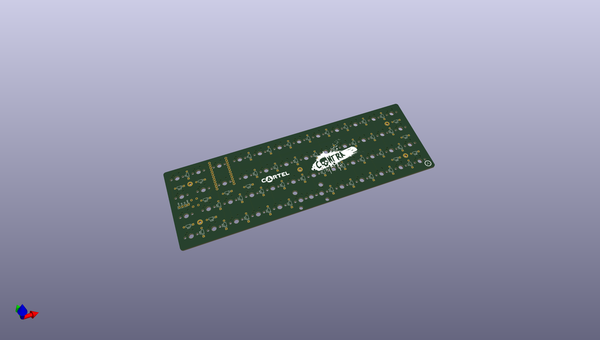
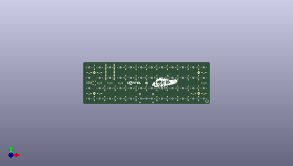
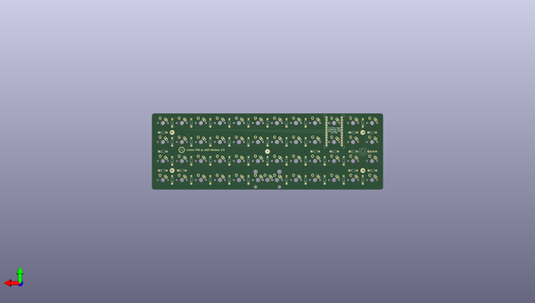

# contra
 
## summary 
* id: ai03_2725_contra_contra
* user: ai03_2725
* name: contra
* board: contra
* repo: https://github.com/ai03-2725/Contra
* src_file_repo_kicad_pcb: Contra.kicad_pcb
* src_file_repo_kicad_pcb_link: https://github.com/ai03-2725/Contra/tree/master/Contra.kicad_pcb

* src_file_repo_sch: Contra.sch
* src_file_repo_sch_link: https://github.com/ai03-2725/Contra/tree/master/Contra.sch
* full details link: https://github.com/oomlout/oomlout_oomp_project_bot_v_2/tree/main/projects/ai03_2725_contra_contra/current_version/working  

## schematic  
  
[schematic (pdf)](working_schematic.pdf) 

## pcb  
 
  
  
  
[board (pdf)](working.pdf)  

## working_bom
| Id | Designator | Footprint | Quantity | Designation | Supplier and ref |  | None | 
| --- | --- | --- | --- | --- | --- | --- | --- | 
| 1 | MX1,MX2,MX3,MX4,MX5,MX6,MX7,MX8,MX9,MX10,MX11,MX12,MX13,MX14,MX15,MX16,MX17,MX18,MX19,MX20,MX21,MX22,MX23,MX24,MX25,MX26,MX27,MX28,MX29,MX30,MX31,MX32,MX33,MX34,MX35,MX36,MX37,MX38,MX39,MX40,MX41,MX42,MX43,MX44,MX45,MX46,MX47,MX48 | MX-1U-NoLED | 48 | MX-1U |  |  | [''] | 
| 2 | MX49 | MX-2U-ReversedStabilizers-NoLED | 1 | MX-2U |  |  | [''] | 
| 3 | G*** | cartel | 1 | LOGO |  |  | [''] | 
| 4 | G*** | contra | 1 | LOGO |  |  | [''] | 
| 5 | D1,D2,D3,D4,D5,D6,D7,D8,D9,D10,D11,D12,D13,D14,D15,D16,D17,D18,D19,D20,D21,D22,D23,D24,D25,D26,D27,D28,D29,D30,D31,D32,D33,D34,D35,D36,D37,D38,D39,D40,D41,D42,D43,D44,D45,D46,D47,D48 | D_DO-35_SOD27_P7.62mm_Horizontal-DoubleSided | 48 | 1N4148 |  |  | [''] | 
| 6 | J1 | Pin_Header_Straight_1x04_Pitch2.54mm | 1 | Conn_01x04 |  |  | [''] | 
| 7 | G*** | ai-ring-6mm | 1 | LOGO |  |  | [''] | 
| 8 | U1 | pro_micro | 1 | ProMicro |  |  | [''] | 
| 9 | SW1 | PushButton_6x6mm_TH_Pretty | 1 | SW_PUSH |  |  | [''] | 
| 10 | G*** | ai-ring-6mm-FancyAss | 1 | LOGO |  |  | [''] | 
| 11 | G*** | ai-ring-6mm-FancyAss-Mask | 1 | LOGO |  |  | [''] | 

## bom_schematic
| Ref | Qnty | Value | Cmp name | Footprint | Description | Vendor | DNP | 
| --- | --- | --- | --- | --- | --- | --- | --- | 
| D1, D2, D3, D4, D5, D6, D7, D8, D9, D10, D11, D12, D13, D14, D15, D16, D17, D18, D19, D20, D21, D22, D23, D24, D25, D26, D27, D28, D29, D30, D31, D32, D33, D34, D35, D36, D37, D38, D39, D40, D41, D42, D43, D44, D45, D46, D47, D48 | 48 | 1N4148 | D_Small | locallib:D_DO-35_SOD27_P7.62mm_Horizontal-DoubleSided | Diode, small symbol |  |  | 
| J1 | 1 | Conn_01x04 | Conn_01x04 | Pin_Headers:Pin_Header_Straight_1x04_Pitch2.54mm | Generic connector, single row, 01x04, script generated (kicad-library-utils/schlib/autogen/connector/) |  |  | 
| MX1, MX2, MX3, MX4, MX5, MX6, MX7, MX8, MX9, MX10, MX11, MX12, MX13, MX14, MX15, MX16, MX17, MX18, MX19, MX20, MX21, MX22, MX23, MX24, MX25, MX26, MX27, MX28, MX29, MX30, MX31, MX32, MX33, MX34, MX35, MX36, MX37, MX38, MX39, MX40, MX41, MX42, MX43, MX44, MX45, MX46, MX47, MX48 | 48 | MX-1U | MX-1U-MX_Alps_Hybrids | MX_Alps_Hybrid:MX-1U-NoLED |  |  |  | 
| MX49 | 1 | MX-2U | MX-2U-MX_Alps_Hybrids | MX_Alps_Hybrid:MX-2U-ReversedStabilizers-NoLED |  |  |  | 
| SW1 | 1 | SW_PUSH | SW_PUSH-keyboard_parts | Molex-0548190589:PushButton_6x6mm_TH_Pretty |  |  |  | 
| U1 | 1 | ProMicro | ProMicro | locallib:pro_micro |  |  |  | 

