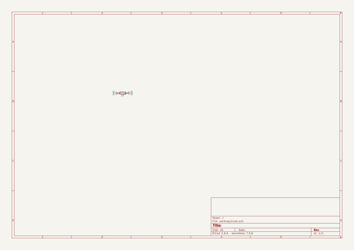
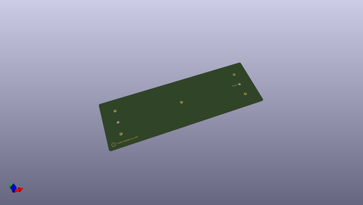
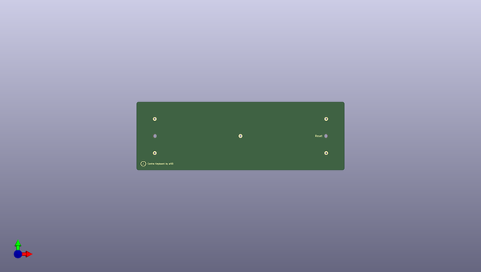
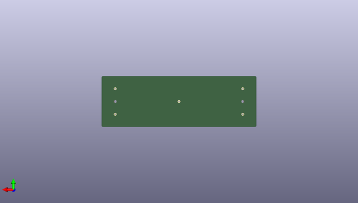

# contraplates
 
## summary 
* id: ai03_2725_contraplates_contrabottomplate
* user: ai03_2725
* name: contraplates
* board: contrabottomplate
* repo: https://github.com/ai03-2725/ContraPlates
* src_file_repo_kicad_pcb: BottomPlate/ContraBottomPlate.kicad_pcb
* src_file_repo_kicad_pcb_link: https://github.com/ai03-2725/ContraPlates/tree/master/BottomPlate/ContraBottomPlate.kicad_pcb

* src_file_repo_sch: BottomPlate/ContraBottomPlate.sch
* src_file_repo_sch_link: https://github.com/ai03-2725/ContraPlates/tree/master/BottomPlate/ContraBottomPlate.sch
* full details link: https://github.com/oomlout/oomlout_oomp_project_bot_v_2/tree/main/projects/ai03_2725_contraplates_contrabottomplate/current_version/working  

## schematic  
  
[schematic (pdf)](working_schematic.pdf) 

## pcb  
 
  
  
  
[board (pdf)](working.pdf)  

## working_bom
| Id | Designator | Footprint | Quantity | Designation | Supplier and ref |  | None | 
| --- | --- | --- | --- | --- | --- | --- | --- | 
| 1 | p1 | pad | 1 | gndingpad |  |  | [''] | 
| 2 | REF**,REF**,REF**,REF**,REF**,REF**,REF** | mountinghole | 7 | mountinghole |  |  | [''] | 
| 3 | G*** | ai-ring-6mm-FancyAss | 1 | LOGO |  |  | [''] | 
| 4 | G*** | ai-ring-6mm-FancyAss-Mask | 1 | LOGO |  |  | [''] | 

## bom_schematic
| Ref | Qnty | Value | Cmp name | Footprint | Description | Vendor | DNP | 
| --- | --- | --- | --- | --- | --- | --- | --- | 
| p1 | 1 | gndingpad | R | locallib:pad | Resistor |  |  | 

## mounting_holes
| x | y | package | value | ref | size | 
| --- | --- | --- | --- | --- | --- | 
| 95.25 | 19.05 | mountinghole | mountinghole | REF** | m3 | 
| 0.0 | 38.1 | mountinghole | mountinghole | REF** | m3 | 
| 0.0 | 0.0 | mountinghole | mountinghole | REF** | m3 | 
| 190.5 | 38.1 | mountinghole | mountinghole | REF** | m3 | 
| 190.5 | 0.0 | mountinghole | mountinghole | REF** | m3 | 
| 0.0 | 19.05 | mountinghole | mountinghole | REF** | m3 | 
| 190.5 | 19.05 | mountinghole | mountinghole | REF** | m3 | 

