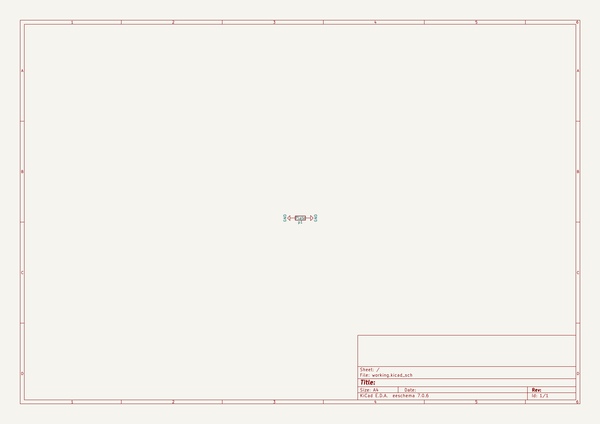
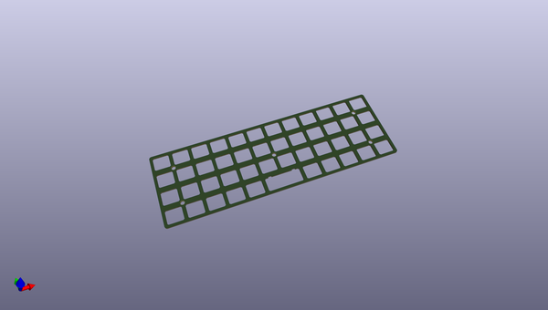
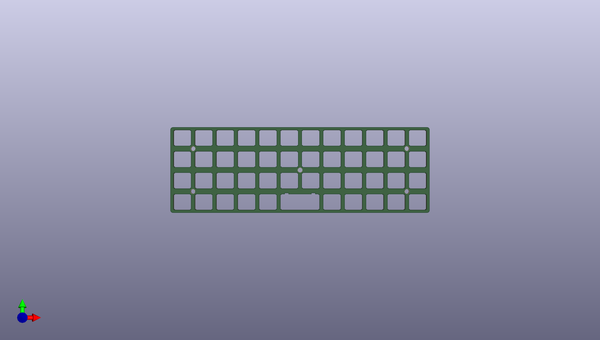
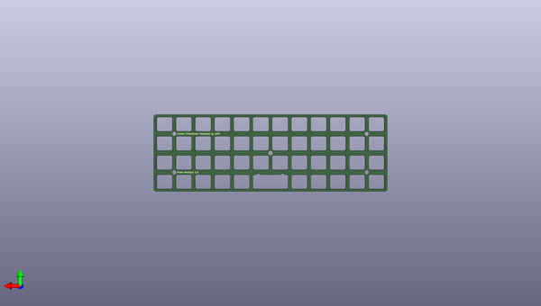

# contraplates
 
## summary 
* id: ai03_2725_contraplates_contratopplate
* user: ai03_2725
* name: contraplates
* board: contratopplate
* repo: https://github.com/ai03-2725/ContraPlates
* src_file_repo_kicad_pcb: TopPlate/ContraTopPlate.kicad_pcb
* src_file_repo_kicad_pcb_link: https://github.com/ai03-2725/ContraPlates/tree/master/TopPlate/ContraTopPlate.kicad_pcb

* src_file_repo_sch: TopPlate/ContraTopPlate.sch
* src_file_repo_sch_link: https://github.com/ai03-2725/ContraPlates/tree/master/TopPlate/ContraTopPlate.sch
* full details link: https://github.com/oomlout/oomlout_oomp_project_bot_v_2/tree/main/projects/ai03_2725_contraplates_contratopplate/current_version/working  

## schematic  
  
[schematic (pdf)](working_schematic.pdf) 

## pcb  
 
  
  
  
[board (pdf)](working.pdf)  

## working_bom
| Id | Designator | Footprint | Quantity | Designation | Supplier and ref |  | None | 
| --- | --- | --- | --- | --- | --- | --- | --- | 
| 1 | REF**,REF**,REF**,REF**,REF** | hole4mm | 5 | hole |  |  | [''] | 
| 2 | p1 | Outline | 1 | Plate |  |  | [''] | 

## bom_schematic
| Ref | Qnty | Value | Cmp name | Footprint | Description | Vendor | DNP | 
| --- | --- | --- | --- | --- | --- | --- | --- | 
| p1 | 1 | Plate | R | locallib:Outline | Resistor |  |  | 

