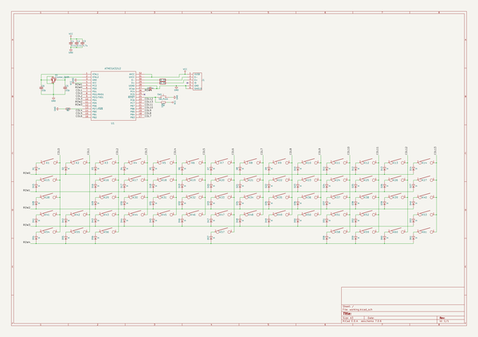

# cyclops
 
## summary 
* id: ai03_2725_cyclops_cyclops
* user: ai03_2725
* name: cyclops
* board: cyclops
* repo: https://github.com/ai03-2725/Cyclops
* src_file_repo_kicad_pcb: cyclops.kicad_pcb
* src_file_repo_kicad_pcb_link: https://github.com/ai03-2725/Cyclops/tree/master/cyclops.kicad_pcb

* src_file_repo_sch: cyclops.sch
* src_file_repo_sch_link: https://github.com/ai03-2725/Cyclops/tree/master/cyclops.sch
* full details link: https://github.com/oomlout/oomlout_oomp_project_bot_v_2/tree/main/projects/ai03_2725_cyclops_cyclops/current_version/working  

## schematic  
  
[schematic (pdf)](working_schematic.pdf) 

## pcb  
 
  
  
  
[board (pdf)](working.pdf)  

## working_bom
| Id | Designator | Footprint | Quantity | Designation | Supplier and ref |  | None | 
| --- | --- | --- | --- | --- | --- | --- | --- | 
| 1 | K2 | ALPS-1U | 1 | 1 |  |  | [''] | 
| 2 | K3,K4,K5,K6,K7,K8,K9,K10,K11,K12,K13,K16,K17,K18,K19,K20,K21,K22,K23,K24,K25,K26,K27,K29,K30,K31,K32,K33,K34,K35,K36,K37,K38,K39,K40,K42,K43,K44,K45,K46,K47,K48,K49,K50,K51,K52 | ALPS-1U | 46 | KEYSW |  |  | [''] | 
| 3 | K14 | ALPS-1.75U | 1 | backspace |  |  | [''] | 
| 4 | K15 | ALPS-1.75U | 1 | tab |  |  | [''] | 
| 5 | K28 | ALPS-2U | 1 | Lock |  |  | [''] | 
| 6 | K41 | ALPS-1.5U | 1 | Shift |  |  | [''] | 
| 7 | K53 | ALPS-2.5U | 1 | Shift |  |  | [''] | 
| 8 | K54 | ALPS-1.5U | 1 | Ctrl |  |  | [''] | 
| 9 | K55,K59 | ALPS-1.25U | 2 | alt |  |  | [''] | 
| 10 | K56 | ALPS-1.5U | 1 | opt |  |  | [''] | 
| 11 | K57 | ALPS-6.5U | 1 | space |  |  | [''] | 
| 12 | K58 | ALPS-1.5U | 1 | cmd |  |  | [''] | 
| 13 | K60 | ALPS-1.5U | 1 | ctrl |  |  | [''] | 
| 14 | K61 | ALPS-ISO | 1 | enter |  |  | [''] | 
| 15 | C1,C2 | C_0805_HandSoldering | 2 | 0.1u |  |  | [''] | 
| 16 | C3 | C_0805_HandSoldering | 1 | 4.7u |  |  | [''] | 
| 17 | C4 | C_0805_HandSoldering | 1 | 1u |  |  | [''] | 
| 18 | C5,C6 | C_0805_HandSoldering | 2 | 22p |  |  | [''] | 
| 19 | D1,D2,D3,D4,D5,D6,D7,D8,D9,D10,D11,D12,D13,D14,D15,D16,D17,D18,D19,D20,D21,D22,D23,D24,D25,D26,D27,D28,D29,D30,D31,D32,D33,D34,D35,D36,D37,D38,D39,D40,D41,D42,D43,D44,D45,D46,D47,D48,D49,D50,D51,D52,D53,D54,D55,D56,D57,D58,D59,D60,D61 | D_SOD-323_HandSoldering | 61 | D |  |  | [''] | 
| 20 | K1 | ALPS-1.25U | 1 | ESC |  |  | [''] | 
| 21 | R1,R2 | R_0805_HandSoldering | 2 | 22 |  |  | [''] | 
| 22 | R3,R4 | R_0805_HandSoldering | 2 | 10K |  |  | [''] | 
| 23 | SW1 | SW_SPST_EVPBF | 1 | SW_Push |  |  | [''] | 
| 24 | U1 | QFP32 | 1 | ATMEGA32U2 |  |  | [''] | 
| 25 | J1 | USB_miniB_hirose_5S8 | 1 | USB_mini_micro_B |  |  | [''] | 
| 26 | X1 | Crystal_SMD_3225-4pin_3.2x2.5mm_HandSoldering | 1 | Crystal_3225 |  |  | [''] | 

## bom_schematic
| Ref | Qnty | Value | Cmp name | Footprint | Description | Vendor | DNP | 
| --- | --- | --- | --- | --- | --- | --- | --- | 
| C1, C2 | 2 | 0.1u | C_Small | Capacitors_SMD:C_0805_HandSoldering |  |  |  | 
| C3 | 1 | 4.7u | C_Small | Capacitors_SMD:C_0805_HandSoldering |  |  |  | 
| C4 | 1 | 1u | C_Small | Capacitors_SMD:C_0805_HandSoldering |  |  |  | 
| C5, C6 | 2 | 22p | C_Small | Capacitors_SMD:C_0805_HandSoldering |  |  |  | 
| D1, D2, D3, D4, D5, D6, D7, D8, D9, D10, D11, D12, D13, D14, D15, D16, D17, D18, D19, D20, D21, D22, D23, D24, D25, D26, D27, D28, D29, D30, D31, D32, D33, D34, D35, D36, D37, D38, D39, D40, D41, D42, D43, D44, D45, D46, D47, D48, D49, D50, D51, D52, D53, D54, D55, D56, D57, D58, D59, D60, D61 | 61 | D | D | Diodes_SMD:D_SOD-323_HandSoldering |  |  |  | 
| J1 | 1 | USB_mini_micro_B | USB_mini_micro_B | keyboard_parts:USB_miniB_hirose_5S8 |  |  |  | 
| K1 | 1 | ESC | KEYSW | MX_Alps_Hybrid:ALPS-1.25U |  |  |  | 
| K2 | 1 | 1 | KEYSW | MX_Alps_Hybrid:ALPS-1U |  |  |  | 
| K3, K4, K5, K6, K7, K8, K9, K10, K11, K12, K13, K16, K17, K18, K19, K20, K21, K22, K23, K24, K25, K26, K27, K29, K30, K31, K32, K33, K34, K35, K36, K37, K38, K39, K40, K42, K43, K44, K45, K46, K47, K48, K49, K50, K51, K52 | 46 | KEYSW | KEYSW | MX_Alps_Hybrid:ALPS-1U |  |  |  | 
| K14 | 1 | backspace | KEYSW | MX_Alps_Hybrid:ALPS-1.75U |  |  |  | 
| K15 | 1 | tab | KEYSW | MX_Alps_Hybrid:ALPS-1.75U |  |  |  | 
| K28 | 1 | Lock | KEYSW | MX_Alps_Hybrid:ALPS-2U |  |  |  | 
| K41 | 1 | Shift | KEYSW | MX_Alps_Hybrid:ALPS-1.5U |  |  |  | 
| K53 | 1 | Shift | KEYSW | MX_Alps_Hybrid:ALPS-2.5U |  |  |  | 
| K54 | 1 | Ctrl | KEYSW | MX_Alps_Hybrid:ALPS-1.5U |  |  |  | 
| K55, K59 | 2 | alt | KEYSW | MX_Alps_Hybrid:ALPS-1.25U |  |  |  | 
| K56 | 1 | opt | KEYSW | MX_Alps_Hybrid:ALPS-1.5U |  |  |  | 
| K57 | 1 | space | KEYSW | MX_Alps_Hybrid:ALPS-6.5U |  |  |  | 
| K58 | 1 | cmd | KEYSW | MX_Alps_Hybrid:ALPS-1.5U |  |  |  | 
| K60 | 1 | ctrl | KEYSW | MX_Alps_Hybrid:ALPS-1.5U |  |  |  | 
| K61 | 1 | enter | KEYSW | MX_Alps_Hybrid:ALPS-ISO |  |  |  | 
| R1, R2 | 2 | 22 | R | Resistors_SMD:R_0805_HandSoldering |  |  |  | 
| R3, R4 | 2 | 10K | R_Small | Resistors_SMD:R_0805_HandSoldering |  |  |  | 
| SW1 | 1 | SW_Push | SW_Push | Buttons_Switches_SMD:SW_SPST_EVPBF |  |  |  | 
| U1 | 1 | ATMEGA32U2 | ATMEGA32U2 | keyboard_parts:QFP32 |  |  |  | 
| X1 | 1 | Crystal_3225 | Crystal_GND24_Small | Crystals:Crystal_SMD_3225-4pin_3.2x2.5mm_HandSoldering |  |  |  | 

