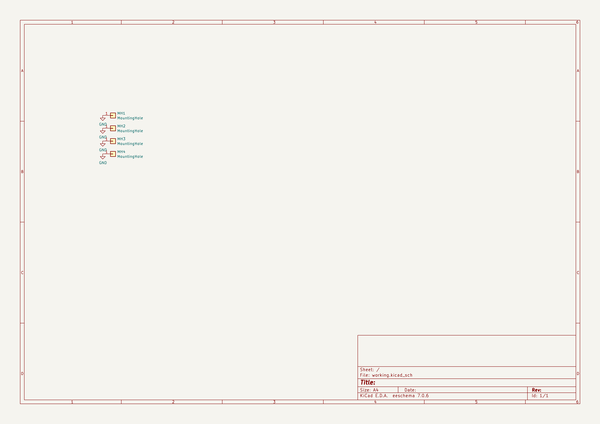
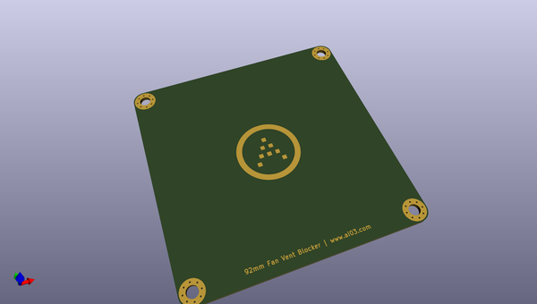
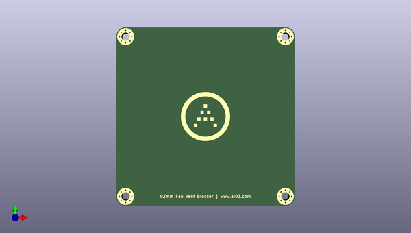
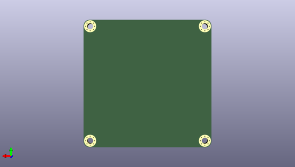

# fan_vent_blocker
 
## summary 
* id: ai03_2725_fan_vent_blocker_fan_vent_blocker
* user: ai03_2725
* name: fan_vent_blocker
* board: fan_vent_blocker
* repo: https://github.com/ai03-2725/fan-vent-blocker
* src_file_repo_kicad_pcb: 92mm/fan-vent-blocker.kicad_pcb
* src_file_repo_kicad_pcb_link: https://github.com/ai03-2725/fan-vent-blocker/tree/master/92mm/fan-vent-blocker.kicad_pcb

* src_file_repo_sch: 92mm/fan-vent-blocker.sch
* src_file_repo_sch_link: https://github.com/ai03-2725/fan-vent-blocker/tree/master/92mm/fan-vent-blocker.sch
* full details link: https://github.com/oomlout/oomlout_oomp_project_bot_v_2/tree/main/projects/ai03_2725_fan_vent_blocker_fan_vent_blocker/current_version/working  

## schematic  
  
[schematic (pdf)](working_schematic.pdf) 

## pcb  
 
  
  
  
[board (pdf)](working.pdf)  

## working_bom
| Id | Designator | Footprint | Quantity | Designation | Supplier and ref |  | None | 
| --- | --- | --- | --- | --- | --- | --- | --- | 
| 1 | G*** | ai-ring-25mm-mask | 1 | LOGO |  |  | [''] | 

## bom_schematic
| Ref | Qnty | Value | Cmp name | Footprint | Description | Vendor | DNP | 
| --- | --- | --- | --- | --- | --- | --- | --- | 
| MH1, MH2, MH3, MH4 | 4 | MountingHole | Conn_01x01 | locallib:MountingHole_5.5mm_Pad_Via | Generic connector, single row, 01x01, script generated (kicad-library-utils/schlib/autogen/connector/) |  |  | 

