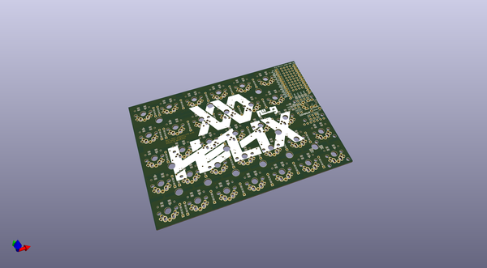

# helix
 
## summary 
* id: ai03_2725_helix_helix
* user: ai03_2725
* name: helix
* board: helix
* repo: https://github.com/ai03-2725/helix
* src_file_repo_kicad_pcb: PCB/beta/helix.kicad_pcb
* src_file_repo_kicad_pcb_link: https://github.com/ai03-2725/helix/tree/master/PCB/beta/helix.kicad_pcb

* src_file_repo_sch: PCB/beta/helix.sch
* src_file_repo_sch_link: https://github.com/ai03-2725/helix/tree/master/PCB/beta/helix.sch
* full details link: https://github.com/oomlout/oomlout_oomp_project_bot_v_2/tree/main/projects/ai03_2725_helix_helix/current_version/working  

## schematic  
  
[schematic (pdf)](working_schematic.pdf) 

## pcb  
 
  
  
  
[board (pdf)](working.pdf)  

## working_bom
| Id | Designator | Footprint | Quantity | Designation | Supplier and ref |  | None | 
| --- | --- | --- | --- | --- | --- | --- | --- | 
| 1 | D1,D2,D3,D4,D5,D6,D7,D8,D9,D10,D11,D12,D13,D14,D15,D16,D17,D18,D19,D20,D21,D22,D23,D24,D25,D26,D27,D28,D29,D30,D31,D32 | D3_TH_SMD | 32 | D |  |  | [''] | 
| 2 | JP4,JP11 | Jumper | 2 | GND |  |  | [''] | 
| 3 | JP5,JP10 | Jumper | 2 | VCC |  |  | [''] | 
| 4 | JP6,JP9 | Jumper | 2 | SCL |  |  | [''] | 
| 5 | JP7,JP8 | Jumper | 2 | SDA |  |  | [''] | 
| 6 | P1,P2 | 1PIN_0.1 | 2 | CONN_01X01 |  |  | [''] | 
| 7 | P3 | MY_SIL-4 | 1 | OLED |  |  | [''] | 
| 8 | P5 | MY_SIL-2x3 | 1 | ICSP |  |  | [''] | 
| 9 | SW33 | SW_3.5x6.0_TH | 1 | Reset |  |  | [''] | 
| 10 | U2 | SK6812MINI_rev | 1 | SK6812mini |  |  | [''] | 
| 11 | U3,U4,U5,U6,U7,U8,U9,U10,U11,U12,U13,U14,U15,U16,U17,U18,U19,U20,U21,U22,U23,U24,U25,U26,U27,U28,U29,U30,U31,U32,U33 | SK6812MINI_rev | 31 | SK6812mini |  |  | [''] | 
| 12 | SW1,SW2,SW3,SW4,SW5,SW6,SW7,SW8,SW9,SW10,SW11,SW12,SW13,SW14,SW15,SW16,SW17,SW18,SW19,SW20,SW21,SW22,SW23,SW24,SW25,SW26,SW27,SW28,SW29,SW30,SW31,SW32 | MX_ALPS_PG1350_noLed | 32 | SW_PUSH |  |  | [''] | 
| 13 | 1PIN,1PIN,1PIN,1PIN,1PIN,1PIN,1PIN,1PIN,1PIN,1PIN,1PIN,1PIN,1PIN,1PIN,1PIN,1PIN,1PIN,1PIN,1PIN,1PIN,1PIN,1PIN,1PIN,1PIN,1PIN,1PIN,1PIN,1PIN,1PIN,1PIN,1PIN,1PIN,1PIN,1PIN,1PIN,1PIN,1PIN,1PIN,1PIN,1PIN,1PIN,1PIN,1PIN,1PIN,1PIN,1PIN,1PIN | 1PIN_0.1 | 47 | Val** |  |  | [''] | 
| 14 | HOLE_3M,HOLE_3M,HOLE_3M,HOLE_3M,HOLE_3M,HOLE_3M,HOLE_3M,HOLE_3M,HOLE_3M,HOLE_3M,HOLE_3M,HOLE_3M | HOLE_M2_TH | 12 | VAL** |  |  | [''] | 
| 15 | HOLE_M2,HOLE_M2,HOLE_M2,HOLE_M2,HOLE_M2,HOLE_M2,HOLE_M2,HOLE_M2 | HOLE_M2 | 8 | VAL** |  |  | [''] | 
| 16 | R1 | R2 | 1 | R |  |  | [''] | 
| 17 | U1,U1 | ProMicro_rev | 2 | ProMicro |  |  | [''] | 
| 18 | R2 | R2 | 1 | R |  |  | [''] | 
| 19 | JP2,JP3 | Jumper | 2 | JP2 |  |  | [''] | 
| 20 | J1 | MJ-4PP-9_rev2 | 1 | MJ-4PP-9 |  |  | [''] | 
| 21 | JP1 | JPC2 | 1 | JPC2 |  |  | [''] | 
| 22 | G***,G***,G***,G*** | LOGO | 4 | LOGO |  |  | [''] | 
| 23 | ,,,,,,,,,,,,,,,,,,,,,,,,,,,,,,,,, | via | 34 |  |  |  | [''] | 
| 24 | P4 | StripLED_rev | 1 | LED |  |  | [''] | 

## bom_schematic
| Ref | Qnty | Value | Cmp name | Footprint | Description | Vendor | DNP | 
| --- | --- | --- | --- | --- | --- | --- | --- | 
| D1, D2, D3, D4, D5, D6, D7, D8, D9, D10, D11, D12, D13, D14, D15, D16, D17, D18, D19, D20, D21, D22, D23, D24, D25, D26, D27, D28, D29, D30, D31, D32 | 32 | D | D | MYLIB:D3_TH_SMD |  |  |  | 
| J1 | 1 | MJ-4PP-9 | MJ-4PP-9 | MYLIB_REV:MJ-4PP-9_rev2 |  |  |  | 
| JP1 | 1 | JPC2 | JPC2 | MYLIB:JPC2 |  |  |  | 
| JP2, JP3 | 2 | JP2 | JP2 | MYLIB:Jumper |  |  |  | 
| JP4, JP11 | 2 | GND | JP2 | MYLIB:Jumper |  |  |  | 
| JP5, JP10 | 2 | VCC | JP2 | MYLIB:Jumper |  |  |  | 
| JP6, JP9 | 2 | SCL | JP2 | MYLIB:Jumper |  |  |  | 
| JP7, JP8 | 2 | SDA | JP2 | MYLIB:Jumper |  |  |  | 
| P1, P2 | 2 | CONN_01X01 | CONN_01X01 | MYLIB:1PIN_0.1 |  |  |  | 
| P3 | 1 | OLED | CONN_01X04 | MYLIB:MY_SIL-4 |  |  |  | 
| P4 | 1 | LED | CONN_01X03 | MYLIB_REV:StripLED_rev |  |  |  | 
| P5 | 1 | ICSP | CONN_01X06 | MYLIB:MY_SIL-2x3 |  |  |  | 
| R1, R2 | 2 | R | R | MYLIB:R2 |  |  |  | 
| SW1, SW2, SW3, SW4, SW5, SW6, SW7, SW8, SW9, SW10, SW11, SW12, SW13, SW14, SW15, SW16, SW17, SW18, SW19, SW20, SW21, SW22, SW23, SW24, SW25, SW26, SW27, SW28, SW29, SW30, SW31, SW32 | 32 | SW_PUSH | SW_PUSH | MYLIB_REV:MX_ALPS_PG1350_noLed |  |  |  | 
| SW33 | 1 | Reset | SW_PUSH | MYLIB:SW_3.5x6.0_TH |  |  |  | 
| U1 | 1 | ProMicro | ProMicro | MYLIB:ProMicro_rev |  |  |  | 
| U2, U3, U4, U5, U6, U7, U8, U9, U10, U11, U12, U13, U14, U15, U16, U17, U18, U19, U20, U21, U22, U23, U24, U25, U26, U27, U28, U29, U30, U31, U32, U33 | 32 | SK6812mini | SK6812mini | MYLIB_REV:SK6812MINI_rev |  |  |  | 

