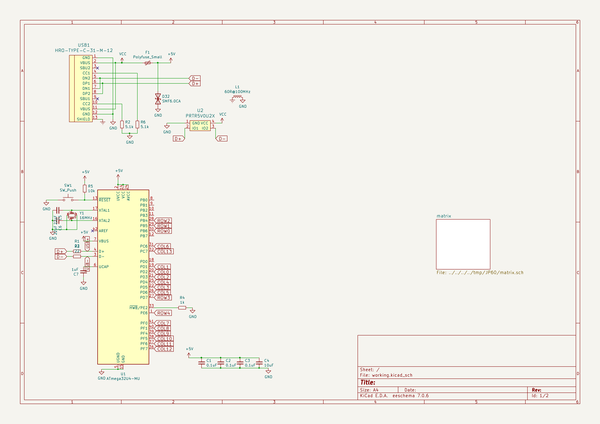
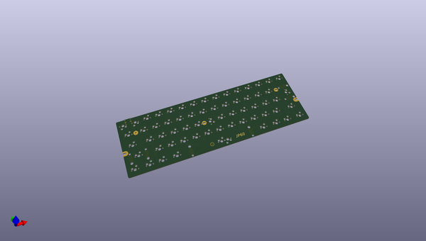
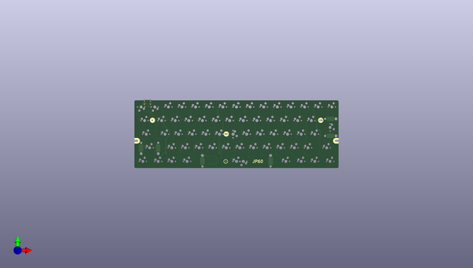
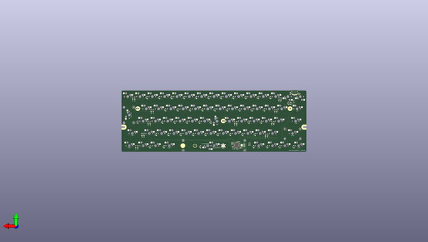

# jp60
 
## summary 
* id: ai03_2725_jp60_jp60
* user: ai03_2725
* name: jp60
* board: jp60
* repo: https://github.com/ai03-2725/JP60
* src_file_repo_kicad_pcb: JP60.kicad_pcb
* src_file_repo_kicad_pcb_link: https://github.com/ai03-2725/JP60/tree/main/JP60.kicad_pcb

* src_file_repo_sch: JP60.sch
* src_file_repo_sch_link: https://github.com/ai03-2725/JP60/tree/main/JP60.sch
* full details link: https://github.com/oomlout/oomlout_oomp_project_bot_v_2/tree/main/projects/ai03_2725_jp60_jp60/current_version/working  

## schematic  
  
[schematic (pdf)](working_schematic.pdf) 

## pcb  
 
  
  
  
[board (pdf)](working.pdf)  

## working_bom
| Id | Designator | Footprint | Quantity | Designation | Supplier and ref |  | None | 
| --- | --- | --- | --- | --- | --- | --- | --- | 
| 1 | K_.1,K_,1,K_#1,K_#2,K_#3,K_#4,K_#5,K_#6,K_#7,K_#8,K_#9,K_#0_1,K_'1,K_-1,K_/1,K_;1,K_[1,K_\1,K_]1,K_A1,K_B1,K_SBSPC1,K_C1,K_D1,K_E1,K_F1,K_G1,K_ESC1,K_H1,K_I1,K_J1,K_K1,K_L1,K_LALT1,K_M1,K_N1,K_O1,K_P1,K_R1,K_RALT1,K_S1,K_T1,K_U1,K_V1,K_X1,K_Y1,K_Z1,K_LGUI1,K_RGUI1,K_SRSFT1,K_SBSPC2,K_W1,K_Q1,K_=1,K_SPC2 | MXOnly-1U-Hotswap | 55 | MX-NoLED |  |  | [''] | 
| 2 | K_ENTER1 | MXOnly-ISO-ROTATED-Hotswap | 1 | MX-NoLED |  |  | [''] | 
| 3 | K_LCTRL1,K_RCTRL1,K_NFER1,K_XFER1 | MXOnly-1.25U-Hotswap | 4 | MX-NoLED |  |  | [''] | 
| 4 | K_LSFT1 | MXOnly-2.25U-Hotswap | 1 | MX-NoLED |  |  | [''] | 
| 5 | K_SRSFT2 | MXOnly-1.75U-Hotswap | 1 | MX-NoLED |  |  | [''] | 
| 6 | K_SPC1 | MXOnly-6U-Centered-Hotswap-ReversedStabilizers | 1 | MX-NoLED |  |  | [''] | 
| 7 | K_TAB1 | MXOnly-1.5U-Hotswap | 1 | MX-NoLED |  |  | [''] | 
| 8 | K_CAPS1 | MXOnly-1.75U-Hotswap | 1 | MX-LED |  |  | [''] | 
| 9 | G***,G*** | ai-ring-6mm-Combined | 2 | LOGO |  |  | [''] | 
| 10 | D2,D3,D4,D5,D6,D8,D12,D14,D15,D16,D18,D19,D20,D21,D23,D24,D25,D26,D28,D29,D31,D33,D34,D35,D36,D38,D39,D40,D41,D42,D44,D45,D46,D47,D49,D50,D51,D52,D54,D55,D56,D57,D59,D60,D61,D62,D63,D66,D67,D71,D72,D74,D70,D65,D11,D17,D22,D27,D13,D1,D10,D30,D9,D7 | D_SOD-123 | 64 | SOD-123 |  |  | [''] | 
| 11 | R4 | R_0603_1608Metric | 1 | 1k |  |  | [''] | 
| 12 | C1,C2,C3 | C_0603_1608Metric | 3 | 0.1uF |  |  | [''] | 
| 13 | R5 | R_0603_1608Metric | 1 | 10k |  |  | [''] | 
| 14 | SW1 | SW_SPST_TL3342 | 1 | SW_Push |  |  | [''] | 
| 15 | D32 | D_SOD-123 | 1 | SMF6.0CA |  |  | [''] | 
| 16 | F1 | Fuse_1206_3216Metric | 1 | Polyfuse_Small |  |  | [''] | 
| 17 | L1 | L_1206_3216Metric | 1 | 60R@100MHz |  |  | [''] | 
| 18 | R2,R6 | R_0603_1608Metric | 2 | 5.1k |  |  | [''] | 
| 19 | U2 | SOT143B | 1 | PRTR5V0U2X |  |  | [''] | 
| 20 | USB1 | HRO-TYPE-C-31-M-12-Assembly | 1 | HRO-TYPE-C-31-M-12 |  |  | [''] | 
| 21 | U1 | QFN-44-1EP_7x7mm_P0.5mm_EP5.2x5.2mm | 1 | ATmega32U4-MU |  |  | [''] | 
| 22 | Y1 | Crystal_SMD_3225-4Pin_3.2x2.5mm | 1 | 16MHz |  |  | [''] | 
| 23 | C6,C5 | C_0603_1608Metric | 2 | 22pF |  |  | [''] | 
| 24 | C4 | C_0603_1608Metric | 1 | 10uF |  |  | [''] | 
| 25 | C7 | C_0603_1608Metric | 1 | 1uF |  |  | [''] | 
| 26 | R1,R3 | R_0603_1608Metric | 2 | 22 |  |  | [''] | 

## bom_schematic
| Ref | Qnty | Value | Cmp name | Footprint | Description | Vendor | DNP | 
| --- | --- | --- | --- | --- | --- | --- | --- | 
| C1, C2, C3 | 3 | 0.1uF | C_Small | Capacitor_SMD:C_0603_1608Metric | Unpolarized capacitor, small symbol |  |  | 
| C4 | 1 | 10uF | C_Small | Capacitor_SMD:C_0603_1608Metric | Unpolarized capacitor, small symbol |  |  | 
| C5, C6 | 2 | 22pF | C_Small | Capacitor_SMD:C_0603_1608Metric | Unpolarized capacitor, small symbol |  |  | 
| C7 | 1 | 1uF | C_Small | Capacitor_SMD:C_0603_1608Metric | Unpolarized capacitor, small symbol |  |  | 
| D32 | 1 | SMF6.0CA | D_TVS | Diode_SMD:D_SOD-123 | Bidirectional transient-voltage-suppression diode |  |  | 
| F1 | 1 | Polyfuse_Small | Polyfuse_Small | Fuse:Fuse_1206_3216Metric | Resettable fuse, polymeric positive temperature coefficient, small symbol |  |  | 
| L1 | 1 | 60R@100MHz | L_Core_Ferrite_Small-Device | Inductor_SMD:L_1206_3216Metric |  |  |  | 
| R1, R3 | 2 | 22 | R_Small | Resistor_SMD:R_0603_1608Metric | Resistor, small symbol |  |  | 
| R2, R6 | 2 | 5.1k | R_Small | Resistor_SMD:R_0603_1608Metric | Resistor, small symbol |  |  | 
| R4 | 1 | 1k | R_Small | Resistor_SMD:R_0603_1608Metric | Resistor, small symbol |  |  | 
| R5 | 1 | 10k | R_Small | Resistor_SMD:R_0603_1608Metric | Resistor, small symbol |  |  | 
| SW1 | 1 | SW_Push | SW_Push | Button_Switch_SMD:SW_SPST_TL3342 | Push button switch, generic, two pins |  |  | 
| U1 | 1 | ATmega32U4-MU | ATmega32U4-MU-MCU_Microchip_ATmega | Package_DFN_QFN:QFN-44-1EP_7x7mm_P0.5mm_EP5.2x5.2mm |  |  |  | 
| U2 | 1 | PRTR5V0U2X | PRTR5V0U2X | random-keyboard-parts:SOT143B |  |  |  | 
| USB1 | 1 | HRO-TYPE-C-31-M-12 | HRO-TYPE-C-31-M-12-Type-C | Type-C:HRO-TYPE-C-31-M-12-Assembly |  |  |  | 
| Y1 | 1 | 16MHz | Crystal_GND24_Small | Crystal:Crystal_SMD_3225-4Pin_3.2x2.5mm | Four pin crystal, GND on pins 2 and 4, small symbol |  |  | 

