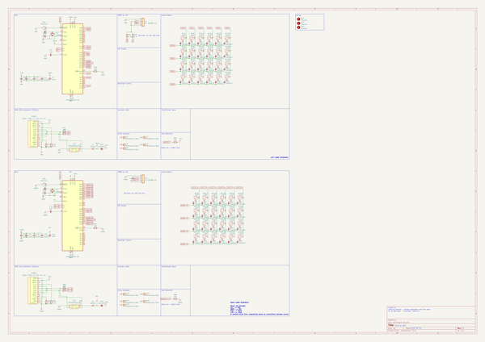

# orbit
 
## summary 
* id: ai03_2725_orbit_orbit
* user: ai03_2725
* name: orbit
* board: orbit
* repo: https://github.com/ai03-2725/Orbit
* src_file_repo_kicad_pcb: OrbitX-PCB/Orbit.kicad_pcb
* src_file_repo_kicad_pcb_link: https://github.com/ai03-2725/Orbit/tree/master/OrbitX-PCB/Orbit.kicad_pcb

* src_file_repo_sch: OrbitX-PCB/Orbit.sch
* src_file_repo_sch_link: https://github.com/ai03-2725/Orbit/tree/master/OrbitX-PCB/Orbit.sch
* full details link: https://github.com/oomlout/oomlout_oomp_project_bot_v_2/tree/main/projects/ai03_2725_orbit_orbit/current_version/working  

## schematic  
  
[schematic (pdf)](working_schematic.pdf) 

## pcb  
 
  
  
  
[board (pdf)](working.pdf)  

## working_bom
| Id | Designator | Footprint | Quantity | Designation | Supplier and ref |  | None | 
| --- | --- | --- | --- | --- | --- | --- | --- | 
| 1 | J3,J5,J6,J7,J9,J13,J14,J17,J18,J19 | breakaway-mousebites | 10 | Breakaway_Tabs |  |  | [''] | 
| 2 | MX1,MX2,MX3,MX4,MX5,MX6,MX7,MX8,MX9,MX10,MX11,MX13,MX14,MX15,MX16,MX17,MX18,MX19,MX20,MX21,MX22,MX23,MX24,MX25,MX26,MX27,MX28,MX29,MX30,MX31,MX32,MX33,MX34,MX35,MX36,MX37,MX38,MX39,MX41,MX42,MX43,MX44,MX45,MX46,MX47,MX48 | MXOnly-1U-NoLED | 46 | MX-NoLED |  |  | [''] | 
| 3 | MX12,MX40 | MXOnly-1.5U-NoLED | 2 | MX-NoLED |  |  | [''] | 
| 4 | G***,G***,G***,G***,G*** | orbitx | 5 | LOGO |  |  | [''] | 
| 5 | G***,G***,G***,G*** | ai-ring-6mm-Combined | 4 | LOGO |  |  | [''] | 
| 6 | C1,C2,C8,C9 | C_0603_1608Metric | 4 | 22pF |  |  | [''] | 
| 7 | C5,C6,C11,C12,C13,C4,C15,C16 | C_0603_1608Metric | 8 | 0.1uF |  |  | [''] | 
| 8 | C7,C14 | C_0603_1608Metric | 2 | 10uF |  |  | [''] | 
| 9 | C10,C3 | C_0603_1608Metric | 2 | 1uF |  |  | [''] | 
| 10 | D1,D2,D3,D4,D5,D6,D7,D8,D9,D10,D11,D12,D13,D14,D15,D16,D17,D18,D19,D20,D21,D22,D23,D24,D25,D26,D28,D29,D30,D31,D32,D33,D34,D36,D37,D38,D39,D40,D41,D42,D43,D44,D45,D46,D47,D48,D35,D27 | D_SOD-123 | 48 | SOD123 |  |  | [''] | 
| 11 | D75,D76 | D_SOD-123 | 2 | Schottky |  |  | [''] | 
| 12 | F1,F2 | Fuse_1206_3216Metric | 2 | 500mA |  |  | [''] | 
| 13 | FID1,FID2,FID3 | Fiducial_1mm_Dia_2.54mm_Outer_CopperTop | 3 | Fiducial |  |  | [''] | 
| 14 | J1,J11 | PJ-3200B-4A | 2 | PJ-3200B-4A |  |  | [''] | 
| 15 | R10,R9 | R_0603_1608Metric | 2 | 4.7k |  |  | [''] | 
| 16 | R25,R67,R87,R88 | R_0603_1608Metric | 4 | 10k |  |  | [''] | 
| 17 | R41,R42,R83,R84 | R_0603_1608Metric | 4 | 22 |  |  | [''] | 
| 18 | R43,R44,R85,R86 | R_0603_1608Metric | 4 | 5.1k |  |  | [''] | 
| 19 | SW1,SW2 | SKQGADE010 | 2 | SW_Push |  |  | [''] | 
| 20 | U2,U4 | SOT143B | 2 | PRTR5V0U2X |  |  | [''] | 
| 21 | USB1,USB2 | HRO-TYPE-C-31-M-12-Assembly | 2 | HRO-TYPE-C-31-M-12 |  |  | [''] | 
| 22 | Y1,Y2 | Crystal_SMD_3225-4Pin_3.2x2.5mm | 2 | 16MHz |  |  | [''] | 
| 23 | U1,U3 | TQFP-44_10x10mm_P0.8mm | 2 | ATmega32U4-AU |  |  | [''] | 

## bom_schematic
| Ref | Qnty | Value | Cmp name | Footprint | Description | Vendor | DNP | 
| --- | --- | --- | --- | --- | --- | --- | --- | 
| C1, C2, C8, C9 | 4 | 22pF | C_Small | Capacitor_SMD:C_0603_1608Metric | Unpolarized capacitor, small symbol |  |  | 
| C3, C10 | 2 | 1uF | C_Small | Capacitor_SMD:C_0603_1608Metric | Unpolarized capacitor, small symbol |  |  | 
| C4, C5, C6, C11, C12, C13, C15, C16 | 8 | 0.1uF | C_Small | Capacitor_SMD:C_0603_1608Metric | Unpolarized capacitor, small symbol |  |  | 
| C7, C14 | 2 | 10uF | C_Small | Capacitor_SMD:C_0603_1608Metric | Unpolarized capacitor, small symbol |  |  | 
| D1, D2, D3, D4, D5, D6, D7, D8, D9, D10, D11, D12, D13, D14, D15, D16, D17, D18, D19, D20, D21, D22, D23, D24, D25, D26, D27, D28, D29, D30, D31, D32, D33, D34, D35, D36, D37, D38, D39, D40, D41, D42, D43, D44, D45, D46, D47, D48 | 48 | SOD123 | D_Small | Diode_SMD:D_SOD-123 | Diode, small symbol |  |  | 
| D75, D76 | 2 | Schottky | D_Schottky_Small | Diode_SMD:D_SOD-123 | Schottky diode, small symbol |  |  | 
| F1, F2 | 2 | 500mA | Polyfuse_Small | Fuse:Fuse_1206_3216Metric | Resettable fuse, polymeric positive temperature coefficient, small symbol |  |  | 
| FID1, FID2, FID3 | 3 | Fiducial | MountingHole | Fiducial:Fiducial_1mm_Dia_2.54mm_Outer_CopperTop | Mounting Hole without connection |  |  | 
| J1, J11 | 2 | PJ-3200B-4A | Conn_01x04 | locallib:PJ-3200B-4A | Generic connector, single row, 01x04, script generated (kicad-library-utils/schlib/autogen/connector/) |  |  | 
| J3, J5, J6, J7, J9, J13, J14, J17, J18, J19 | 10 | Breakaway_Tabs | Conn_01x01 | locallib:breakaway-mousebites | Generic connector, single row, 01x01, script generated (kicad-library-utils/schlib/autogen/connector/) |  |  | 
| MX1, MX2, MX3, MX4, MX5, MX6, MX7, MX8, MX9, MX10, MX11, MX13, MX14, MX15, MX16, MX17, MX18, MX19, MX20, MX21, MX22, MX23, MX24, MX25, MX26, MX27, MX28, MX29, MX30, MX31, MX32, MX33, MX34, MX35, MX36, MX37, MX38, MX39, MX41, MX42, MX43, MX44, MX45, MX46, MX47, MX48 | 46 | MX-NoLED | MX-NoLED-MX_Alps_Hybrid | MX_Only:MXOnly-1U-NoLED |  |  |  | 
| MX12, MX40 | 2 | MX-NoLED | MX-NoLED-MX_Alps_Hybrid | MX_Only:MXOnly-1.5U-NoLED |  |  |  | 
| R9, R10 | 2 | 4.7k | R_Small | Resistor_SMD:R_0603_1608Metric | Resistor, small symbol |  |  | 
| R25, R67, R87, R88 | 4 | 10k | R_Small | Resistor_SMD:R_0603_1608Metric | Resistor, small symbol |  |  | 
| R41, R42, R83, R84 | 4 | 22 | R_Small | Resistor_SMD:R_0603_1608Metric | Resistor, small symbol |  |  | 
| R43, R44, R85, R86 | 4 | 5.1k | R_Small | Resistor_SMD:R_0603_1608Metric | Resistor, small symbol |  |  | 
| SW1, SW2 | 2 | SW_Push | SW_Push | locallib:SKQGADE010 | Push button switch, generic, two pins |  |  | 
| U1, U3 | 2 | ATmega32U4-AU | ATmega32U4-AU-MCU_Microchip_ATmega | Package_QFP:TQFP-44_10x10mm_P0.8mm |  |  |  | 
| U2, U4 | 2 | PRTR5V0U2X | PRTR5V0U2X | locallib:SOT143B |  |  |  | 
| USB1, USB2 | 2 | HRO-TYPE-C-31-M-12 | HRO-TYPE-C-31-M-12-Type-C | Type-C:HRO-TYPE-C-31-M-12-Assembly |  |  |  | 
| Y1, Y2 | 2 | 16MHz | Crystal_GND24_Small | Crystal:Crystal_SMD_3225-4Pin_3.2x2.5mm | Four pin crystal, GND on pins 2 and 4, small symbol |  |  | 

