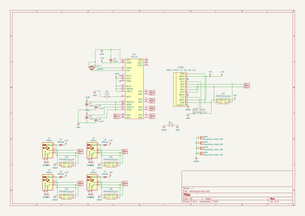
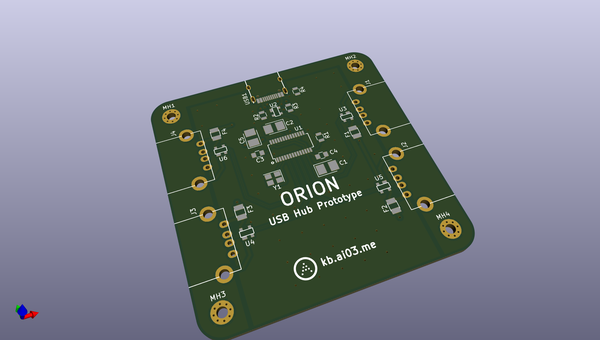
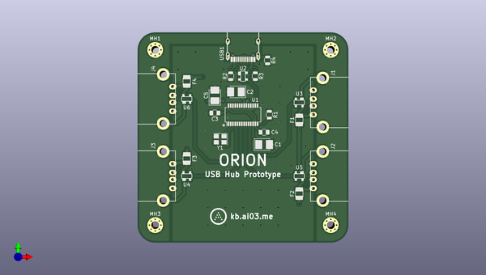
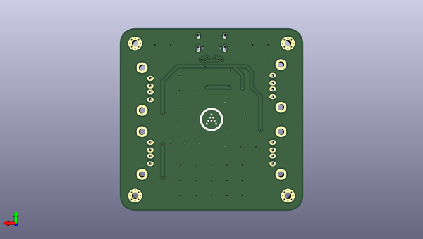

# orion
 
## summary 
* id: ai03_2725_orion_orion
* user: ai03_2725
* name: orion
* board: orion
* repo: https://github.com/ai03-2725/Orion
* src_file_repo_kicad_pcb: Orion.kicad_pcb
* src_file_repo_kicad_pcb_link: https://github.com/ai03-2725/Orion/tree/master/Orion.kicad_pcb

* src_file_repo_sch: Orion.sch
* src_file_repo_sch_link: https://github.com/ai03-2725/Orion/tree/master/Orion.sch
* full details link: https://github.com/oomlout/oomlout_oomp_project_bot_v_2/tree/main/projects/ai03_2725_orion_orion/current_version/working  

## schematic  
  
[schematic (pdf)](working_schematic.pdf) 

## pcb  
 
  
  
  
[board (pdf)](working.pdf)  

## working_bom
| Id | Designator | Footprint | Quantity | Designation | Supplier and ref |  | None | 
| --- | --- | --- | --- | --- | --- | --- | --- | 
| 1 | C1,C2,C5 | CP_Tantalum_Case-B_EIA-3528-21_Reflow | 3 | 10uF |  |  | [''] | 
| 2 | C3,C4 | C_0805 | 2 | 0.1uF |  |  | [''] | 
| 3 | J2,J4,J3,J1 | USB-A-Generic | 4 | USB_A |  |  | [''] | 
| 4 | R1 | R_0805 | 1 | 2.7k |  |  | [''] | 
| 5 | R2,R3 | R_0805 | 2 | 5.1k |  |  | [''] | 
| 6 | U1 | SSOP-28_3.9x9.9mm_Pitch0.635mm | 1 | FE1.1s |  |  | [''] | 
| 7 | USB1 | HRO-TYPE-C-31-M-12-Assembly | 1 | HRO-TYPE-C-31-M-12 |  |  | [''] | 
| 8 | U2,U3,U4,U5,U6 | SOT143B | 5 | PRTR5V0U2X |  |  | [''] | 
| 9 | F1,F2,F3,F4 | Fuse_SMD1206_Reflow | 4 | 500mA |  |  | [''] | 
| 10 | Y1 | Crystal_SMD_3225-4pin_3.2x2.5mm | 1 | 12MHz |  |  | [''] | 
| 11 | R4 | R_0805 | 1 | 0 |  |  | [''] | 
| 12 | G*** | ai-4.8-ring | 1 | LOGO |  |  | [''] | 
| 13 | G*** | ai-outline-7.6 | 1 | LOGO |  |  | [''] | 

## bom_schematic
| Ref | Qnty | Value | Cmp name | Footprint | Description | Vendor | DNP | 
| --- | --- | --- | --- | --- | --- | --- | --- | 
| C1, C2, C5 | 3 | 10uF | CP1_Small-Device | Capacitors_Tantalum_SMD:CP_Tantalum_Case-B_EIA-3528-21_Reflow |  |  |  | 
| C3, C4 | 2 | 0.1uF | C_Small | Capacitors_SMD:C_0805 | Unpolarized capacitor, small symbol |  |  | 
| F1, F2, F3, F4 | 4 | 500mA | Polyfuse_Small | Fuse_Holders_and_Fuses:Fuse_SMD1206_Reflow | Resettable fuse, polymeric positive temperature coefficient, small symbol |  |  | 
| J1, J2, J3, J4 | 4 | USB_A | USB_A-Connector | random-keyboard-parts:USB-A-Generic |  |  |  | 
| MH1, MH2, MH3, MH4 | 4 | Mounting-Hole-M2 | Conn_01x01 | Mounting_Holes:MountingHole_2.2mm_M2_Pad_Via | Generic connector, single row, 01x01, script generated (kicad-library-utils/schlib/autogen/connector/) |  |  | 
| R1 | 1 | 2.7k | R_Small | Resistors_SMD:R_0805 | Resistor, small symbol |  |  | 
| R2, R3 | 2 | 5.1k | R_Small | Resistors_SMD:R_0805 | Resistor, small symbol |  |  | 
| R4 | 1 | 0 | R_Small | Resistors_SMD:R_0805 | Resistor, small symbol |  |  | 
| U1 | 1 | FE1.1s | FE1.1s-random-keyboard-parts | Housings_SSOP:SSOP-28_3.9x9.9mm_Pitch0.635mm |  |  |  | 
| U2, U3, U4, U5, U6 | 5 | PRTR5V0U2X | PRTR5V0U2X-random-keyboard-parts | random-keyboard-parts:SOT143B |  |  |  | 
| USB1 | 1 | HRO-TYPE-C-31-M-12 | HRO-TYPE-C-31-M-12-Type-C | Type-C:HRO-TYPE-C-31-M-12-Assembly |  |  |  | 
| Y1 | 1 | 12MHz | Crystal_GND24_Small-Device | Crystals:Crystal_SMD_3225-4pin_3.2x2.5mm |  |  |  | 

