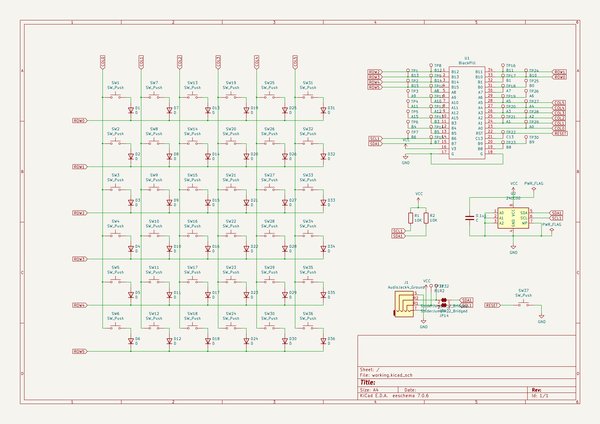
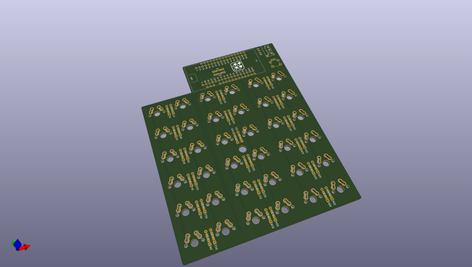
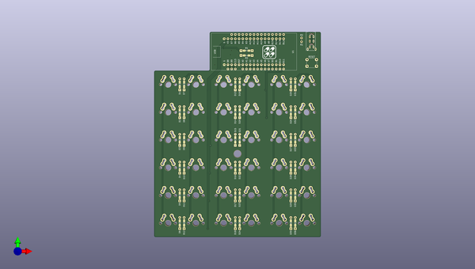
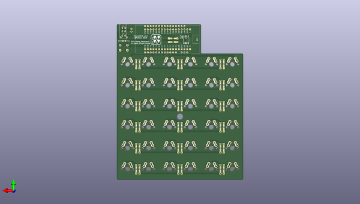

# pillcase36
 
## summary 
* id: ai03_2725_pillcase36_pillcase36
* user: ai03_2725
* name: pillcase36
* board: pillcase36
* repo: https://github.com/ai03-2725/pillcase36
* src_file_repo_kicad_pcb: pillcase36.kicad_pcb
* src_file_repo_kicad_pcb_link: https://github.com/ai03-2725/pillcase36/tree/master/pillcase36.kicad_pcb

* src_file_repo_sch: pillcase36.sch
* src_file_repo_sch_link: https://github.com/ai03-2725/pillcase36/tree/master/pillcase36.sch
* full details link: https://github.com/oomlout/oomlout_oomp_project_bot_v_2/tree/main/projects/ai03_2725_pillcase36_pillcase36/current_version/working  

## schematic  
  
[schematic (pdf)](working_schematic.pdf) 

## pcb  
 
  
  
  
[board (pdf)](working.pdf)  

## working_bom
| Id | Designator | Footprint | Quantity | Designation | Supplier and ref |  | None | 
| --- | --- | --- | --- | --- | --- | --- | --- | 
| 1 | D1,D2,D3,D4,D5,D7,D8,D9,D10,D11,D12,D13,D14,D15,D16,D17,D18,D19,D20,D21,D22,D23,D24,D25,D26,D27,D28,D29,D30,D31,D32,D33,D34,D35,D36,D6 | Diode_SMD_THT_N | 36 | D |  |  | [''] | 
| 2 | J1 | trrs_jack_aki_flip | 1 | AudioJack4_Ground |  |  | [''] | 
| 3 | R2,R1 | Resister_SMD_THT_N | 2 | 10K |  |  | [''] | 
| 4 | SW1,SW2,SW3,SW4,SW5,SW6,SW7,SW8,SW9,SW10,SW11,SW12,SW13,SW14,SW15,SW16,SW17,SW18,SW19,SW20,SW21,SW22,SW23,SW24,SW25,SW26,SW27,SW28,SW29,SW30,SW31,SW32,SW33,SW34,SW35,SW36 | key_switch_mx | 36 | SW_Push |  |  | [''] | 
| 5 | RESET | SW_PUSH_6mm_h5mm | 1 | SW_Push |  |  | [''] | 
| 6 | U1 | BlackPill | 1 | BlackPill |  |  | [''] | 
| 7 |  | Hole_5mm | 1 |  |  |  | [''] | 
| 8 | G***,G*** | pillcase36_logo | 2 | pillcase36_logo |  |  | [''] | 
| 9 | U2 | SOIC-8-N | 1 | 24LC00 |  |  | [''] | 
| 10 | SCL1 ,SDA1 | JP | 2 | SolderJumper_2_Bridged |  |  | [''] | 
| 11 | 0.1u | C_0603 | 1 | C |  |  | [''] | 

## bom_schematic
| Ref | Qnty | Value | Cmp name | Footprint | Description | Vendor | DNP | 
| --- | --- | --- | --- | --- | --- | --- | --- | 
| 0.1u1 | 1 | C | C | Capacitors_SMD:C_0603 | Unpolarized capacitor |  |  | 
| D1, D2, D3, D4, D5, D6, D7, D8, D9, D10, D11, D12, D13, D14, D15, D16, D17, D18, D19, D20, D21, D22, D23, D24, D25, D26, D27, D28, D29, D30, D31, D32, D33, D34, D35, D36 | 36 | D | D | pillcase36:Diode_SMD_THT_N | Diode |  |  | 
| J1 | 1 | AudioJack4_Ground | AudioJack4_Ground-Connector | pillcase36:trrs_jack_aki_flip |  |  |  | 
| JP13, JP14 | 2 | SolderJumper_2_Bridged | SolderJumper_2_Bridged | pillcase36:JP | Solder Jumper, 2-pole, closed/bridged |  |  | 
| R1, R2 | 2 | 10K | R | pillcase36:Resister_SMD_THT_N | Resistor |  |  | 
| SW1, SW2, SW3, SW4, SW5, SW6, SW7, SW8, SW9, SW10, SW11, SW12, SW13, SW14, SW15, SW16, SW17, SW18, SW19, SW20, SW21, SW22, SW23, SW24, SW25, SW26, SW27, SW28, SW29, SW30, SW31, SW32, SW33, SW34, SW35, SW36 | 36 | SW_Push | SW_Push | pillcase36:key_switch_mx | Push button switch, generic, two pins |  |  | 
| SW37 | 1 | SW_Push | SW_Push | Buttons_Switches_THT:SW_PUSH_6mm_h5mm | Push button switch, generic, two pins |  |  | 
| TP1 | 1 | B13 | TestPoint | Measurement_Points:Measurement_Point_Round-TH_Small | test point |  |  | 
| TP2 | 1 | B15 | TestPoint | Measurement_Points:Measurement_Point_Round-TH_Small | test point |  |  | 
| TP3 | 1 | A9 | TestPoint | Measurement_Points:Measurement_Point_Round-TH_Small | test point |  |  | 
| TP4 | 1 | A11 | TestPoint | Measurement_Points:Measurement_Point_Round-TH_Small | test point |  |  | 
| TP5 | 1 | A15 | TestPoint | Measurement_Points:Measurement_Point_Round-TH_Small | test point |  |  | 
| TP6 | 1 | B4 | TestPoint | Measurement_Points:Measurement_Point_Round-TH_Small | test point |  |  | 
| TP7 | 1 | B6 | TestPoint | Measurement_Points:Measurement_Point_Round-TH_Small | test point |  |  | 
| TP8 | 1 | B12 | TestPoint | Measurement_Points:Measurement_Point_Round-TH_Small | test point |  |  | 
| TP9 | 1 | B14 | TestPoint | Measurement_Points:Measurement_Point_Round-TH_Small | test point |  |  | 
| TP10 | 1 | A8 | TestPoint | Measurement_Points:Measurement_Point_Round-TH_Small | test point |  |  | 
| TP11 | 1 | A10 | TestPoint | Measurement_Points:Measurement_Point_Round-TH_Small | test point |  |  | 
| TP12 | 1 | A12 | TestPoint | Measurement_Points:Measurement_Point_Round-TH_Small | test point |  |  | 
| TP13 | 1 | B3 | TestPoint | Measurement_Points:Measurement_Point_Round-TH_Small | test point |  |  | 
| TP14 | 1 | B5 | TestPoint | Measurement_Points:Measurement_Point_Round-TH_Small | test point |  |  | 
| TP15 | 1 | B7 | TestPoint | Measurement_Points:Measurement_Point_Round-TH_Small | test point |  |  | 
| TP16 | 1 | B11 | TestPoint | Measurement_Points:Measurement_Point_Round-TH_Small | test point |  |  | 
| TP17 | 1 | B1 | TestPoint | Measurement_Points:Measurement_Point_Round-TH_Small | test point |  |  | 
| TP18 | 1 | A7 | TestPoint | Measurement_Points:Measurement_Point_Round-TH_Small | test point |  |  | 
| TP19 | 1 | A5 | TestPoint | Measurement_Points:Measurement_Point_Round-TH_Small | test point |  |  | 
| TP20 | 1 | A3 | TestPoint | Measurement_Points:Measurement_Point_Round-TH_Small | test point |  |  | 
| TP21 | 1 | A1 | TestPoint | Measurement_Points:Measurement_Point_Round-TH_Small | test point |  |  | 
| TP22 | 1 | C13 | TestPoint | Measurement_Points:Measurement_Point_Round-TH_Small | test point |  |  | 
| TP23 | 1 | B8 | TestPoint | Measurement_Points:Measurement_Point_Round-TH_Small | test point |  |  | 
| TP24 | 1 | B10 | TestPoint | Measurement_Points:Measurement_Point_Round-TH_Small | test point |  |  | 
| TP25 | 1 | B0 | TestPoint | Measurement_Points:Measurement_Point_Round-TH_Small | test point |  |  | 
| TP26 | 1 | A6 | TestPoint | Measurement_Points:Measurement_Point_Round-TH_Small | test point |  |  | 
| TP27 | 1 | A4 | TestPoint | Measurement_Points:Measurement_Point_Round-TH_Small | test point |  |  | 
| TP28 | 1 | A2 | TestPoint | Measurement_Points:Measurement_Point_Round-TH_Small | test point |  |  | 
| TP29 | 1 | A0 | TestPoint | Measurement_Points:Measurement_Point_Round-TH_Small | test point |  |  | 
| TP30 | 1 | B9 | TestPoint | Measurement_Points:Measurement_Point_Round-TH_Small | test point |  |  | 
| TP31 | 1 | R1 | TestPoint | Measurement_Points:Measurement_Point_Round-TH_Small | test point |  |  | 
| TP32 | 1 | R2 | TestPoint | Measurement_Points:Measurement_Point_Round-TH_Small | test point |  |  | 
| U1 | 1 | BlackPill | BlackPill-pillcase36 | pillcase36:BlackPill |  |  |  | 
| U2 | 1 | 24LC00 | 24LC00 | SMD_Packages:SOIC-8-N | I2C Serial EEPROM, 128 Bits, DIP-8/SOIC-8/TSSOP-8/DFN-8 |  |  | 

