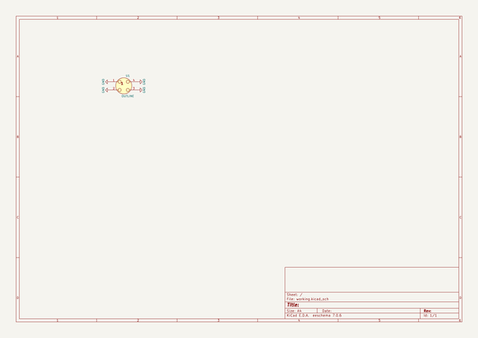

# pluto
 
## summary 
* id: ai03_2725_pluto_pluto
* user: ai03_2725
* name: pluto
* board: pluto
* repo: https://github.com/ai03-2725/Pluto
* src_file_repo_kicad_pcb: Pluto.kicad_pcb
* src_file_repo_kicad_pcb_link: https://github.com/ai03-2725/Pluto/tree/master/Pluto.kicad_pcb

* src_file_repo_sch: Pluto.sch
* src_file_repo_sch_link: https://github.com/ai03-2725/Pluto/tree/master/Pluto.sch
* full details link: https://github.com/oomlout/oomlout_oomp_project_bot_v_2/tree/main/projects/ai03_2725_pluto_pluto/current_version/working  

## schematic  
  
[schematic (pdf)](working_schematic.pdf) 

## pcb  
 
  
  
  
[board (pdf)](working.pdf)  

## bom_schematic
| Ref | Qnty | Value | Cmp name | Footprint | Description | Vendor | DNP | 
| --- | --- | --- | --- | --- | --- | --- | --- | 
| U1 | 1 | OUTLINE | XLR4 |  |  |  |  | 

