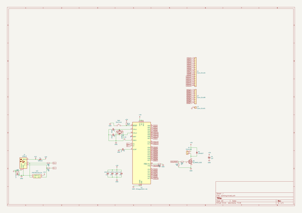
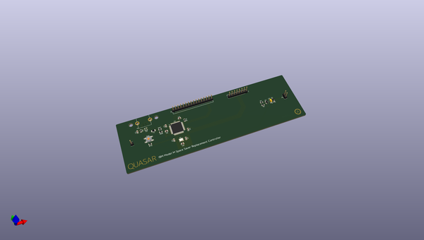
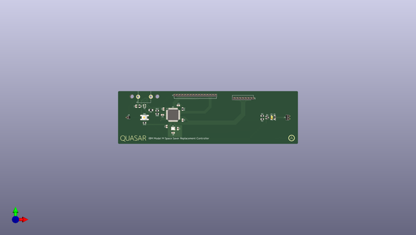
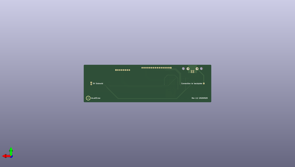

# quasar
 
## summary 
* id: ai03_2725_quasar_ssk_controller
* user: ai03_2725
* name: quasar
* board: ssk_controller
* repo: https://github.com/ai03-2725/Quasar
* src_file_repo_kicad_pcb: ssk-controller.kicad_pcb
* src_file_repo_kicad_pcb_link: https://github.com/ai03-2725/Quasar/tree/master/ssk-controller.kicad_pcb

* src_file_repo_sch: ssk-controller.sch
* src_file_repo_sch_link: https://github.com/ai03-2725/Quasar/tree/master/ssk-controller.sch
* full details link: https://github.com/oomlout/oomlout_oomp_project_bot_v_2/tree/main/projects/ai03_2725_quasar_ssk_controller/current_version/working  

## schematic  
  
[schematic (pdf)](working_schematic.pdf) 

## pcb  
 
  
  
  
[board (pdf)](working.pdf)  

## working_bom
| Id | Designator | Footprint | Quantity | Designation | Supplier and ref |  | None | 
| --- | --- | --- | --- | --- | --- | --- | --- | 
| 1 | F1 | Fuse_1206_3216Metric | 1 | 500mA |  |  | [''] | 
| 2 | J1 | PinHeader_1x16_P2.54mm_Vertical | 1 | Conn_01x16 |  |  | [''] | 
| 3 | R67,R68 | R_0805_2012Metric | 2 | 22 |  |  | [''] | 
| 4 | R70,R1 | R_0805_2012Metric | 2 | 10k |  |  | [''] | 
| 5 | R71 | R_0805_2012Metric | 1 | 1k |  |  | [''] | 
| 6 | SW1 | SKQG-1155865 | 1 | SW_Push |  |  | [''] | 
| 7 | Y1 | Crystal_SMD_3225-4Pin_3.2x2.5mm | 1 | 16Mhz |  |  | [''] | 
| 8 | U1 | TQFP-44_10x10mm_P0.8mm | 1 | ATmega32U4-AU |  |  | [''] | 
| 9 | J2 | PinHeader_1x08_P2.54mm_Vertical | 1 | Conn_01x08 |  |  | [''] | 
| 10 | C2 | C_0805_2012Metric | 1 | 10uF |  |  | [''] | 
| 11 | C3,C4,C5 | C_0805_2012Metric | 3 | 0.1uF |  |  | [''] | 
| 12 | C6 | C_0805_2012Metric | 1 | 1uF |  |  | [''] | 
| 13 | C7,C8 | C_0805_2012Metric | 2 | 22pF |  |  | [''] | 
| 14 | J3 | PinHeader_1x01_P2.54mm_Vertical | 1 | Conn_01x01 |  |  | [''] | 
| 15 | G*** | Quasar-Logo | 1 | LOGO |  |  | [''] | 
| 16 | G*** | Quasar-Desc | 1 | LOGO |  |  | [''] | 
| 17 | G***,G*** | ai-ring-6mm-Combined | 2 | LOGO |  |  | [''] | 
| 18 | J4 | TE-292304-2 | 1 | USB_B |  |  | [''] | 
| 19 | U2 | SOT143B | 1 | PRTR5V0U2X |  |  | [''] | 
| 20 | J5 | PinHeader_1x02_P2.54mm_Vertical | 1 | Solenoid |  |  | [''] | 
| 21 | R2 | R_0805_2012Metric | 1 | 100 |  |  | [''] | 
| 22 | C1 | C_0805_2012Metric | 1 | 4.7nF |  |  | [''] | 
| 23 | R3 | R_0805_2012Metric | 1 | 1M |  |  | [''] | 
| 24 | D1 | D_SOD-123 | 1 | 1N4007 |  |  | [''] | 
| 25 | Q1 | SOT-23 | 1 | Q_NMOS_GSD |  |  | [''] | 
| 26 | C9 | CP_EIA-3216-18_Kemet-A | 1 | 1uF |  |  | [''] | 

## bom_schematic
| Ref | Qnty | Value | Cmp name | Footprint | Description | Vendor | DNP | 
| --- | --- | --- | --- | --- | --- | --- | --- | 
| C1 | 1 | 4.7nF | C_Small | Capacitor_SMD:C_0805_2012Metric | Unpolarized capacitor, small symbol |  |  | 
| C2 | 1 | 10uF | C_Small | Capacitor_SMD:C_0805_2012Metric | Unpolarized capacitor, small symbol |  |  | 
| C3, C4, C5 | 3 | 0.1uF | C_Small | Capacitor_SMD:C_0805_2012Metric | Unpolarized capacitor, small symbol |  |  | 
| C6 | 1 | 1uF | C_Small | Capacitor_SMD:C_0805_2012Metric | Unpolarized capacitor, small symbol |  |  | 
| C7, C8 | 2 | 22pF | C_Small | Capacitor_SMD:C_0805_2012Metric | Unpolarized capacitor, small symbol |  |  | 
| C9 | 1 | 1uF | CP_Small-Device | Capacitor_Tantalum_SMD:CP_EIA-3216-18_Kemet-A |  |  |  | 
| D1 | 1 | 1N4007 | D_Small | Diode_SMD:D_SOD-123 | Diode, small symbol |  |  | 
| F1 | 1 | 500mA | Polyfuse_Small | Fuse:Fuse_1206_3216Metric | Resettable fuse, polymeric positive temperature coefficient, small symbol |  |  | 
| J1 | 1 | Conn_01x16 | Conn_01x16 | Connector_PinHeader_2.54mm:PinHeader_1x16_P2.54mm_Vertical | Generic connector, single row, 01x16, script generated (kicad-library-utils/schlib/autogen/connector/) |  |  | 
| J2 | 1 | Conn_01x08 | Conn_01x08 | Connector_PinHeader_2.54mm:PinHeader_1x08_P2.54mm_Vertical | Generic connector, single row, 01x08, script generated (kicad-library-utils/schlib/autogen/connector/) |  |  | 
| J3 | 1 | Conn_01x01 | Conn_01x01 | Connector_PinHeader_2.54mm:PinHeader_1x01_P2.54mm_Vertical | Generic connector, single row, 01x01, script generated (kicad-library-utils/schlib/autogen/connector/) |  |  | 
| J4 | 1 | USB_B | USB_B-Connector | locallib:TE-292304-2 |  |  |  | 
| J5 | 1 | Solenoid | Conn_01x02 | Connector_PinHeader_2.54mm:PinHeader_1x02_P2.54mm_Vertical | Generic connector, single row, 01x02, script generated (kicad-library-utils/schlib/autogen/connector/) |  |  | 
| Q1 | 1 | Q_NMOS_GSD | Q_NMOS_GSD | Package_TO_SOT_SMD:SOT-23 | N-MOSFET transistor, gate/source/drain |  |  | 
| R1, R70 | 2 | 10k | R_Small | Resistor_SMD:R_0805_2012Metric | Resistor, small symbol |  |  | 
| R2 | 1 | 100 | R_Small | Resistor_SMD:R_0805_2012Metric | Resistor, small symbol |  |  | 
| R3 | 1 | 1M | R_Small | Resistor_SMD:R_0805_2012Metric | Resistor, small symbol |  |  | 
| R67, R68 | 2 | 22 | R_Small | Resistor_SMD:R_0805_2012Metric | Resistor, small symbol |  |  | 
| R71 | 1 | 1k | R_Small | Resistor_SMD:R_0805_2012Metric | Resistor, small symbol |  |  | 
| SW1 | 1 | SW_Push | SW_Push | random-keyboard-parts:SKQG-1155865 | Push button switch, generic, two pins |  |  | 
| U1 | 1 | ATmega32U4-AU | ATmega32U4-AU-MCU_Microchip_ATmega | Package_QFP:TQFP-44_10x10mm_P0.8mm |  |  |  | 
| U2 | 1 | PRTR5V0U2X | PRTR5V0U2X | locallib:SOT143B |  |  |  | 
| Y1 | 1 | 16Mhz | Crystal_GND24 | Crystal:Crystal_SMD_3225-4Pin_3.2x2.5mm | Four pin crystal, GND on pins 2 and 4 |  |  | 

