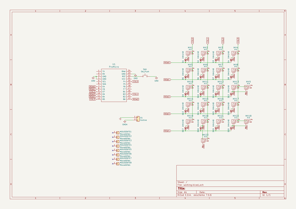
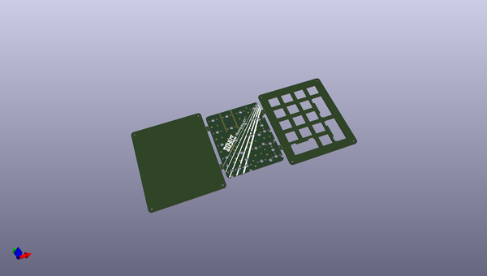
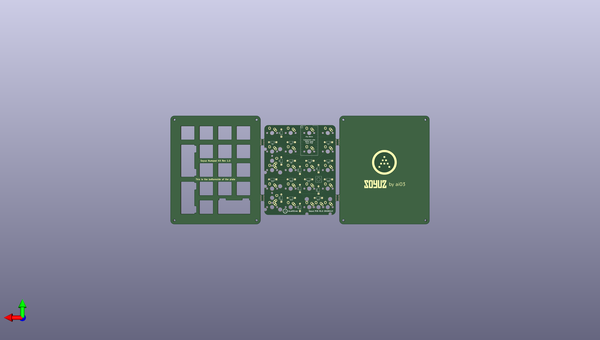

# soyuz
 
## summary 
* id: ai03_2725_soyuz_soyuz
* user: ai03_2725
* name: soyuz
* board: soyuz
* repo: https://github.com/ai03-2725/Soyuz
* src_file_repo_kicad_pcb: Soyuz.kicad_pcb
* src_file_repo_kicad_pcb_link: https://github.com/ai03-2725/Soyuz/tree/master/Soyuz.kicad_pcb

* src_file_repo_sch: Soyuz.sch
* src_file_repo_sch_link: https://github.com/ai03-2725/Soyuz/tree/master/Soyuz.sch
* full details link: https://github.com/oomlout/oomlout_oomp_project_bot_v_2/tree/main/projects/ai03_2725_soyuz_soyuz/current_version/working  

## schematic  
  
[schematic (pdf)](working_schematic.pdf) 

## pcb  
 
  
  
  
[board (pdf)](working.pdf)  

## working_bom
| Id | Designator | Footprint | Quantity | Designation | Supplier and ref |  | None | 
| --- | --- | --- | --- | --- | --- | --- | --- | 
| 1 | G*** | soyuz-logo-30mm | 1 | LOGO |  |  | [''] | 
| 2 | MX1,MX2,MX3,MX4,MX5,MX6,MX7,MX8,MX10,MX11,MX12,MX13,MX14,MX15,MX16,MX17,MX19,MX20,MX21,MX22 | MX-1U-NoLED | 20 | MX-1U |  |  | [''] | 
| 3 | MX9,MX18,MX23 | MX-2U-ReversedStabilizers-NoLED | 3 | MX-2U |  |  | [''] | 
| 4 | MOUSEBITE1,MOUSEBITE2,MOUSEBITE3,MOUSEBITE4,MOUSEBITE5,MOUSEBITE6,MOUSEBITE7,MOUSEBITE8 | breakaway-mousebites | 8 | Mousebites |  |  | [''] | 
| 5 | O1 | outline | 1 | Outline |  |  | [''] | 
| 6 | D1,D2,D3,D4,D5,D7,D8,D9,D10,D11,D12,D13,D14,D15,D16,D17,D18,D19,D20,D6 | D_DO-35_SOD27_P7.62mm_Horizontal | 20 | 1N4148 |  |  | [''] | 
| 7 | U1 | ProMicro-EnforcedTop | 1 | ProMicro |  |  | [''] | 
| 8 | G*** | ai-4.8-silk | 1 | LOGO |  |  | [''] | 
| 9 | G*** | ai-ring-25mm-mask | 1 | LOGO |  |  | [''] | 
| 10 | SW1 | PushButton_6x6mm_TH_Pretty | 1 | SW_Push |  |  | [''] | 
| 11 | G*** | soyuz-by-ai03 | 1 | LOGO |  |  | [''] | 

## bom_schematic
| Ref | Qnty | Value | Cmp name | Footprint | Description | Vendor | DNP | 
| --- | --- | --- | --- | --- | --- | --- | --- | 
| D1, D2, D3, D4, D5, D6, D7, D8, D9, D10, D11, D12, D13, D14, D15, D16, D17, D18, D19, D20 | 20 | 1N4148 | D_Small | Diodes_THT:D_DO-35_SOD27_P7.62mm_Horizontal | Diode, small symbol |  |  | 
| MOUSEBITE1, MOUSEBITE2, MOUSEBITE3, MOUSEBITE4, MOUSEBITE5, MOUSEBITE6, MOUSEBITE7, MOUSEBITE8 | 8 | Mousebites | Conn_01x01 | random-keyboard-parts:breakaway-mousebites | Generic connector, single row, 01x01, script generated (kicad-library-utils/schlib/autogen/connector/) |  |  | 
| MX1, MX2, MX3, MX4, MX5, MX6, MX7, MX8, MX10, MX11, MX12, MX13, MX14, MX15, MX16, MX17, MX19, MX20, MX21, MX22 | 20 | MX-1U | MX-1U-MX_Alps_Hybrids | MX_Alps_Hybrid:MX-1U-NoLED |  |  |  | 
| MX9, MX18, MX23 | 3 | MX-2U | MX-1U-MX_Alps_Hybrids | MX_Alps_Hybrid:MX-2U-ReversedStabilizers-NoLED |  |  |  | 
| O1 | 1 | Outline | Conn_01x02 | locallib:outline | Generic connector, single row, 01x02, script generated (kicad-library-utils/schlib/autogen/connector/) |  |  | 
| SW1 | 1 | SW_Push | SW_Push | random-keyboard-parts:PushButton_6x6mm_TH_Pretty | Push button switch, generic, two pins |  |  | 
| U1 | 1 | ProMicro | ProMicro-promicro | promicro:ProMicro-EnforcedTop |  |  |  | 

