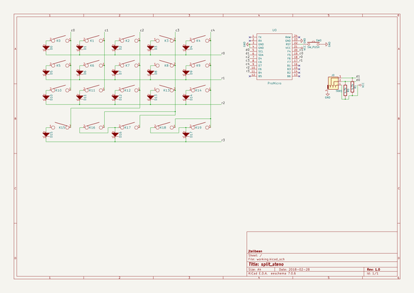

# split_steno
 
## summary 
* id: ai03_2725_split_steno_split_steno_rev1_0
* user: ai03_2725
* name: split_steno
* board: split_steno_rev1_0
* repo: https://github.com/ai03-2725/split_steno
* src_file_repo_kicad_pcb: rev1.0/split_steno_rev1.0.kicad_pcb
* src_file_repo_kicad_pcb_link: https://github.com/ai03-2725/split_steno/tree/master/rev1.0/split_steno_rev1.0.kicad_pcb

* src_file_repo_sch: rev1.0/split_steno_rev1.0.sch
* src_file_repo_sch_link: https://github.com/ai03-2725/split_steno/tree/master/rev1.0/split_steno_rev1.0.sch
* full details link: https://github.com/oomlout/oomlout_oomp_project_bot_v_2/tree/main/projects/ai03_2725_split_steno_split_steno_rev1_0/current_version/working  

## schematic  
  
[schematic (pdf)](working_schematic.pdf) 

## pcb  
 
  
  
  
[board (pdf)](working.pdf)  

## working_bom
| Id | Designator | Footprint | Quantity | Designation | Supplier and ref |  | None | 
| --- | --- | --- | --- | --- | --- | --- | --- | 
| 1 | J0 | TRRS-PJ-320A | 1 | TRRS |  |  | [''] | 
| 2 | K0,K1,K2,K3,K4,K5,K6,K7,K8,K9,K10,K11,K12,K13,K14,K15,K17,K19 | Hybrid_PCB_100H_Dual_hole | 18 | KEYSW |  |  | [''] | 
| 3 | K16,K18 | Hybrid_PCB_200H-dual-nosilk | 2 | KEYSW |  |  | [''] | 
| 4 | REF** | TRRS-PJ-320A | 1 | TRRS-PJ-320A |  |  | [''] | 
| 5 | D0,D1,D2,D3,D4,D5,D6,D7,D8,D9,D10,D11,D12,D13,D14,D15,D16,D17 | Diode-dual | 18 | D |  |  | [''] | 
| 6 | R1,R0 | Resistor-Hybrid | 2 | 4.7k |  |  | [''] | 
| 7 | SW0 | SW_Tactile_SPST_Angled_MJTP1117 | 1 | SW_PUSH |  |  | [''] | 
| 8 | U0 | ArduinoProMicro | 1 | ProMicro |  |  | [''] | 

## bom_schematic
| Ref | Qnty | Value | Cmp name | Footprint | Description | Vendor | DNP | 
| --- | --- | --- | --- | --- | --- | --- | --- | 
| D0, D1, D2, D3, D4, D5, D6, D7, D8, D9, D10, D11, D12, D13, D14, D15, D16, D17 | 18 | D | D | lib_fp:Diode-dual |  |  |  | 
| J0 | 1 | TRRS | Audio-Jack-4 | lib_fp:TRRS-PJ-320A |  |  |  | 
| K0, K1, K2, K3, K4, K5, K6, K7, K8, K9, K10, K11, K12, K13, K14, K15, K17, K19 | 18 | KEYSW | KEYSW | lib_fp:Hybrid_PCB_100H_Dual_hole |  |  |  | 
| K16, K18 | 2 | KEYSW | KEYSW | lib_fp:Hybrid_PCB_200H-dual-nosilk |  |  |  | 
| R0, R1 | 2 | 4.7k | R | lib_fp:Resistor-Hybrid |  |  |  | 
| SW0 | 1 | SW_PUSH | SW_PUSH | lib_fp:SW_Tactile_SPST_Angled_MJTP1117 |  |  |  | 
| U0 | 1 | ProMicro | ProMicro | lib_fp:ArduinoProMicro |  |  |  | 

