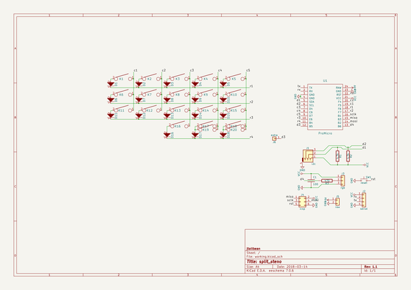
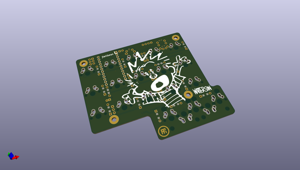
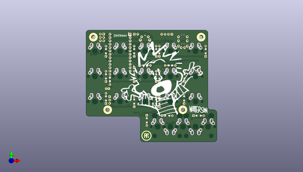
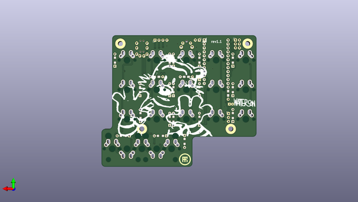

# split_steno
 
## summary 
* id: ai03_2725_split_steno_split_steno_rev1_1
* user: ai03_2725
* name: split_steno
* board: split_steno_rev1_1
* repo: https://github.com/ai03-2725/split_steno
* src_file_repo_kicad_pcb: rev1.1/split_steno_rev1.1.kicad_pcb
* src_file_repo_kicad_pcb_link: https://github.com/ai03-2725/split_steno/tree/master/rev1.1/split_steno_rev1.1.kicad_pcb

* src_file_repo_sch: rev1.1/split_steno_rev1.1.sch
* src_file_repo_sch_link: https://github.com/ai03-2725/split_steno/tree/master/rev1.1/split_steno_rev1.1.sch
* full details link: https://github.com/oomlout/oomlout_oomp_project_bot_v_2/tree/main/projects/ai03_2725_split_steno_split_steno_rev1_1/current_version/working  

## schematic  
  
[schematic (pdf)](working_schematic.pdf) 

## pcb  
 
  
  
  
[board (pdf)](working.pdf)  

## working_bom
| Id | Designator | Footprint | Quantity | Designation | Supplier and ref |  | None | 
| --- | --- | --- | --- | --- | --- | --- | --- | 
| 1 | REF**,REF**,REF**,REF** | MountingHole_3.2mm_M3_Pad | 4 |  |  |  | [''] | 
| 2 | REF** | TRRS-PJ-320A | 1 | TRRS-PJ-320A |  |  | [''] | 
| 3 | G***,G*** | airi_icon-7.6 | 2 | LOGO |  |  | [''] | 
| 4 | K1,K2,K3,K5,K6,K7,K8,K11,K12,K13,K18 | Hybrid_PCB_100H_Dual_hole | 11 | KEYSW |  |  | [''] | 
| 5 | K4,K9,K10,K14,K15,K16,K17 | Hybrid_PCB_100H_Dual_hole-flip | 7 | KEYSW |  |  | [''] | 
| 6 | K19,K20 | Hybrid_PCB_200H-dual-nosilk | 2 | KEYSW |  |  | [''] | 
| 7 | G*** | calvin | 1 | LOGO |  |  | [''] | 
| 8 | G***,G*** | watterson | 2 | LOGO |  |  | [''] | 
| 9 | C1 | CP_Radial_D5.0mm_P2.00mm | 1 | 100 |  |  | [''] | 
| 10 | D1,D2,D3,D4,D5,D6,D7,D8,D9,D10,D11,D12,D13,D14,D15,D16,D17,D18 | Diode-dual | 18 | D |  |  | [''] | 
| 11 | G*** | hobbes | 1 | LOGO |  |  | [''] | 
| 12 | J1 | TRRS-PJ-320A | 1 | i2c |  |  | [''] | 
| 13 | J2 | Pin_Header_Straight_1x04_Pitch2.54mm | 1 | serial |  |  | [''] | 
| 14 | J3 | Pin_Header_Straight_1x03_Pitch2.54mm | 1 | rgb |  |  | [''] | 
| 15 | J4 | Pin_Header_Straight_2x03_Pitch2.54mm | 1 | icsp |  |  | [''] | 
| 16 | J5 | Pin_Header_Straight_1x02_Pitch2.54mm | 1 | raw |  |  | [''] | 
| 17 | J6 | Pin_Header_Straight_1x01_Pitch2.54mm | 1 | extra |  |  | [''] | 
| 18 | R1,R2 | Resistor-Hybrid | 2 | 4.7k |  |  | [''] | 
| 19 | R3 | Resistor-Hybrid | 1 | 470 |  |  | [''] | 
| 20 | SW1 | SW_Tactile_SPST_Angled_MJTP1117 | 1 | reset |  |  | [''] | 
| 21 | U1 | ArduinoProMicro | 1 | ProMicro |  |  | [''] | 

## bom_schematic
| Ref | Qnty | Value | Cmp name | Footprint | Description | Vendor | DNP | 
| --- | --- | --- | --- | --- | --- | --- | --- | 
| C1 | 1 | 100 | C | lib_fp:CP_Radial_D5.0mm_P2.00mm |  |  |  | 
| D1, D2, D3, D4, D5, D6, D7, D8, D9, D10, D11, D12, D13, D14, D15, D16, D17, D18 | 18 | D | D | lib_fp:Diode-dual |  |  |  | 
| J1 | 1 | i2c | Audio-Jack-4 | lib_fp:TRRS-PJ-320A |  |  |  | 
| J2 | 1 | serial | Conn_01x04 | lib_fp:Pin_Header_Straight_1x04_Pitch2.54mm |  |  |  | 
| J3 | 1 | rgb | Conn_01x03 | lib_fp:Pin_Header_Straight_1x03_Pitch2.54mm |  |  |  | 
| J4 | 1 | icsp | Conn_02x03_Odd_Even | lib_fp:Pin_Header_Straight_2x03_Pitch2.54mm |  |  |  | 
| J5 | 1 | raw | Conn_01x02 | lib_fp:Pin_Header_Straight_1x02_Pitch2.54mm |  |  |  | 
| J6 | 1 | extra | Conn_01x01 | lib_fp:Pin_Header_Straight_1x01_Pitch2.54mm |  |  |  | 
| K1, K2, K3, K5, K6, K7, K8, K11, K12, K13, K18 | 11 | KEYSW | KEYSW | lib_fp:Hybrid_PCB_100H_Dual_hole |  |  |  | 
| K4, K9, K10, K14, K15, K16, K17 | 7 | KEYSW | KEYSW | lib_fp:Hybrid_PCB_100H_Dual_hole-flip |  |  |  | 
| K19, K20 | 2 | KEYSW | KEYSW | lib_fp:Hybrid_PCB_200H-dual-nosilk |  |  |  | 
| R1, R2 | 2 | 4.7k | R | lib_fp:Resistor-Hybrid |  |  |  | 
| R3 | 1 | 470 | R | lib_fp:Resistor-Hybrid |  |  |  | 
| SW1 | 1 | reset | SW_Push | lib_fp:SW_Tactile_SPST_Angled_MJTP1117 |  |  |  | 
| U1 | 1 | ProMicro | ProMicro | lib_fp:ArduinoProMicro |  |  |  | 

## mounting_holes
| x | y | package | value | ref | size | 
| --- | --- | --- | --- | --- | --- | 
| 0.0 | 55.0 | MountingHole_3.2mm_M3_Pad | nan | REF** | m3 | 
| 81.6 | 55.0 | MountingHole_3.2mm_M3_Pad | nan | REF** | m3 | 
| 10.8 | 0.0 | MountingHole_3.2mm_M3_Pad | nan | REF** | m3 | 
| 67.8 | 0.0 | MountingHole_3.2mm_M3_Pad | nan | REF** | m3 | 

