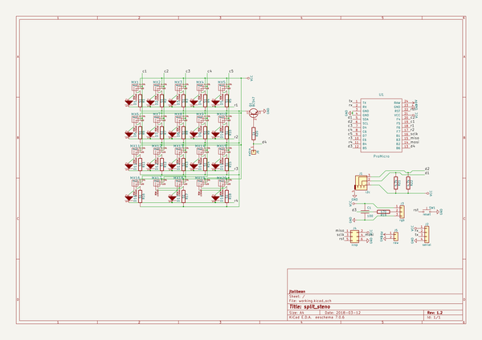
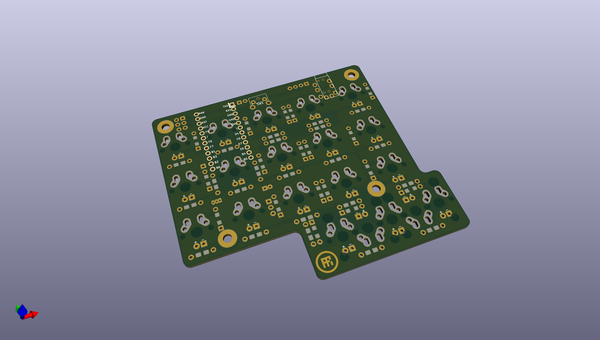
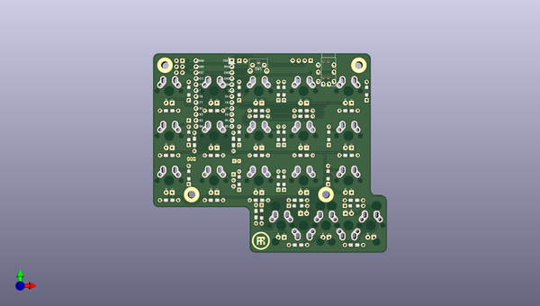
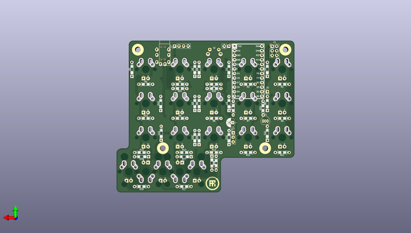

# split_steno
 
## summary 
* id: ai03_2725_split_steno_split_steno_rev1_2
* user: ai03_2725
* name: split_steno
* board: split_steno_rev1_2
* repo: https://github.com/ai03-2725/split_steno
* src_file_repo_kicad_pcb: rev1.2/split_steno_rev1.2.kicad_pcb
* src_file_repo_kicad_pcb_link: https://github.com/ai03-2725/split_steno/tree/master/rev1.2/split_steno_rev1.2.kicad_pcb

* src_file_repo_sch: rev1.2/split_steno_rev1.2.sch
* src_file_repo_sch_link: https://github.com/ai03-2725/split_steno/tree/master/rev1.2/split_steno_rev1.2.sch
* full details link: https://github.com/oomlout/oomlout_oomp_project_bot_v_2/tree/main/projects/ai03_2725_split_steno_split_steno_rev1_2/current_version/working  

## schematic  
  
[schematic (pdf)](working_schematic.pdf) 

## pcb  
 
  
  
  
[board (pdf)](working.pdf)  

## working_bom
| Id | Designator | Footprint | Quantity | Designation | Supplier and ref |  | None | 
| --- | --- | --- | --- | --- | --- | --- | --- | 
| 1 | MX1,MX2,MX3,MX4,MX5,MX6,MX7,MX8,MX9,MX10,MX11,MX12,MX13,MX14,MX15,MX16,MX18,MX20 | Hybrid_PCB_100H_Dual_hole-LED | 18 | MX-1U |  |  | [''] | 
| 2 | MX17,MX19 | Hybrid_PCB_200H-dual-LED | 2 | MX-1U |  |  | [''] | 
| 3 | SW1 | SW_Tactile_SPST_Angled_MJTP1117 | 1 | reset |  |  | [''] | 
| 4 | REF**,J1 | TRRS-PJ-320A | 2 | i2c |  |  | [''] | 
| 5 | REF**,REF**,REF**,REF** | MountingHole_3.2mm_M3_Pad | 4 |  |  |  | [''] | 
| 6 | G***,G*** | airi_icon-7.6 | 2 | LOGO |  |  | [''] | 
| 7 | C1 | CP_Radial_D5.0mm_P2.00mm | 1 | 100 |  |  | [''] | 
| 8 | D1,D2,D3,D4,D5,D6,D7,D8,D9,D10,D11,D12,D13,D14,D15,D16,D17,D18 | Diode-dual | 18 | D |  |  | [''] | 
| 9 | J2 | Pin_Header_Straight_1x04_Pitch2.54mm | 1 | serial |  |  | [''] | 
| 10 | J3 | Pin_Header_Straight_1x03_Pitch2.54mm | 1 | rgb |  |  | [''] | 
| 11 | J4 | Pin_Header_Straight_2x03_Pitch2.54mm | 1 | icsp |  |  | [''] | 
| 12 | J5 | Pin_Header_Straight_1x02_Pitch2.54mm | 1 | raw |  |  | [''] | 
| 13 | J6 | Pin_Header_Straight_1x01_Pitch2.54mm | 1 | extra |  |  | [''] | 
| 14 | Q1 | TO-92_Inline_Narrow_Oval | 1 | BC547 |  |  | [''] | 
| 15 | R1,R2,R3,R4,R5,R6,R7,R8,R9,R10,R11,R12,R13,R14,R15,R16,R17,R18 | Resistor-Hybrid | 18 | 51 |  |  | [''] | 
| 16 | R19 | Resistor-Hybrid | 1 | 470 |  |  | [''] | 
| 17 | R20 | Resistor-Hybrid | 1 | 1k |  |  | [''] | 
| 18 | R21,R22 | Resistor-Hybrid | 2 | 4.7k |  |  | [''] | 
| 19 | U1 | ArduinoProMicro | 1 | ProMicro |  |  | [''] | 

## bom_schematic
| Ref | Qnty | Value | Cmp name | Footprint | Description | Vendor | DNP | 
| --- | --- | --- | --- | --- | --- | --- | --- | 
| C1 | 1 | 100 | C | Capacitors_THT:CP_Radial_D5.0mm_P2.00mm |  |  |  | 
| D1, D2, D3, D4, D5, D6, D7, D8, D9, D10, D11, D12, D13, D14, D15, D16, D17, D18 | 18 | D | D | Keebio-Parts:Diode-dual |  |  |  | 
| J1 | 1 | i2c | Audio-Jack-4 | Keebio-Parts:TRRS-PJ-320A |  |  |  | 
| J2 | 1 | serial | Conn_01x04 | Pin_Headers:Pin_Header_Straight_1x04_Pitch2.54mm |  |  |  | 
| J3 | 1 | rgb | Conn_01x03 | Pin_Headers:Pin_Header_Straight_1x03_Pitch2.54mm |  |  |  | 
| J4 | 1 | icsp | Conn_02x03_Odd_Even | Pin_Headers:Pin_Header_Straight_2x03_Pitch2.54mm |  |  |  | 
| J5 | 1 | raw | Conn_01x02 | Pin_Headers:Pin_Header_Straight_1x02_Pitch2.54mm |  |  |  | 
| J6 | 1 | extra | Conn_01x01 | Pin_Headers:Pin_Header_Straight_1x01_Pitch2.54mm |  |  |  | 
| MX1, MX2, MX3, MX4, MX5, MX6, MX7, MX8, MX9, MX10, MX11, MX12, MX13, MX14, MX15, MX16, MX18, MX20 | 18 | MX-1U | MX-1U | Keebio-Parts:Hybrid_PCB_100H_Dual_hole-LED |  |  |  | 
| MX17, MX19 | 2 | MX-1U | MX-1U | Keebio-Parts:Hybrid_PCB_200H-dual-LED |  |  |  | 
| Q1 | 1 | BC547 | BC547 | TO_SOT_Packages_THT:TO-92_Inline_Narrow_Oval |  |  |  | 
| R1, R2, R3, R4, R5, R6, R7, R8, R9, R10, R11, R12, R13, R14, R15, R16, R17, R18 | 18 | 51 | R | Keebio-Parts:Resistor-Hybrid |  |  |  | 
| R19 | 1 | 470 | R | Keebio-Parts:Resistor-Hybrid |  |  |  | 
| R20 | 1 | 1k | R | Keebio-Parts:Resistor-Hybrid |  |  |  | 
| R21, R22 | 2 | 4.7k | R | Keebio-Parts:Resistor-Hybrid |  |  |  | 
| SW1 | 1 | reset | SW_Push | Keebio-Parts:SW_Tactile_SPST_Angled_MJTP1117 |  |  |  | 
| U1 | 1 | ProMicro | ProMicro | Keebio-Parts:ArduinoProMicro |  |  |  | 

## mounting_holes
| x | y | package | value | ref | size | 
| --- | --- | --- | --- | --- | --- | 
| 0.0 | 55.07 | MountingHole_3.2mm_M3_Pad | nan | REF** | m3 | 
| 82.45 | 55.07 | MountingHole_3.2mm_M3_Pad | nan | REF** | m3 | 
| 68.46 | 0.0 | MountingHole_3.2mm_M3_Pad | nan | REF** | m3 | 
| 11.31 | 0.0 | MountingHole_3.2mm_M3_Pad | nan | REF** | m3 | 

