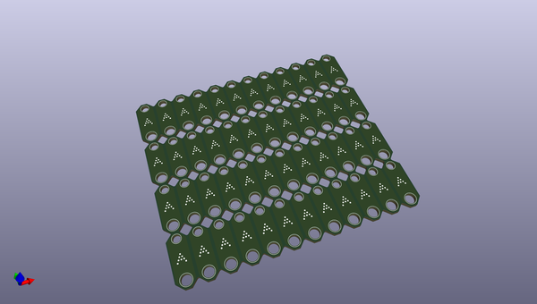
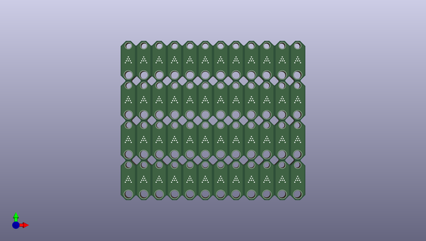
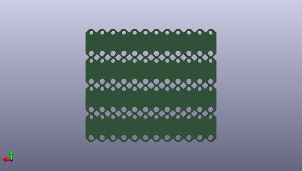

# stabilizershims
 
## summary 
* id: ai03_2725_stabilizershims_stabilizershims
* user: ai03_2725
* name: stabilizershims
* board: stabilizershims
* repo: https://github.com/ai03-2725/StabilizerShims
* src_file_repo_kicad_pcb: StabilizerShims.kicad_pcb
* src_file_repo_kicad_pcb_link: https://github.com/ai03-2725/StabilizerShims/tree/master/StabilizerShims.kicad_pcb

* src_file_repo_sch: StabilizerShims.sch
* src_file_repo_sch_link: https://github.com/ai03-2725/StabilizerShims/tree/master/StabilizerShims.sch
* full details link: https://github.com/oomlout/oomlout_oomp_project_bot_v_2/tree/main/projects/ai03_2725_stabilizershims_stabilizershims/current_version/working  

## schematic  
  
[schematic (pdf)](working_schematic.pdf) 

## pcb  
 
  
  
  
[board (pdf)](working.pdf)  

## working_bom
| Id | Designator | Footprint | Quantity | Designation | Supplier and ref |  | None | 
| --- | --- | --- | --- | --- | --- | --- | --- | 
| 1 | REF**,REF**,REF**,REF**,REF**,REF**,REF**,REF**,REF**,REF**,REF**,REF**,REF**,REF**,REF**,REF**,REF**,REF**,REF**,REF**,REF**,REF**,REF**,REF**,REF**,REF**,REF**,REF**,REF**,REF**,REF**,REF**,REF**,REF**,REF**,REF**,REF**,REF**,REF**,REF**,REF**,REF**,REF**,REF**,REF**,REF**,REF**,REF** | StabilizerShim-Holes | 48 | StabilizerShim-Holes |  |  | [''] | 
| 2 | G***,G***,G***,G***,G***,G***,G***,G***,G***,G***,G***,G***,G***,G***,G***,G***,G***,G***,G***,G***,G***,G***,G***,G***,G***,G***,G***,G***,G***,G***,G***,G***,G***,G***,G***,G***,G***,G***,G***,G***,G***,G***,G***,G***,G***,G***,G***,G*** | ai-outline-7.6 - Copy | 48 | LOGO |  |  | [''] | 

## bom_schematic
no data

