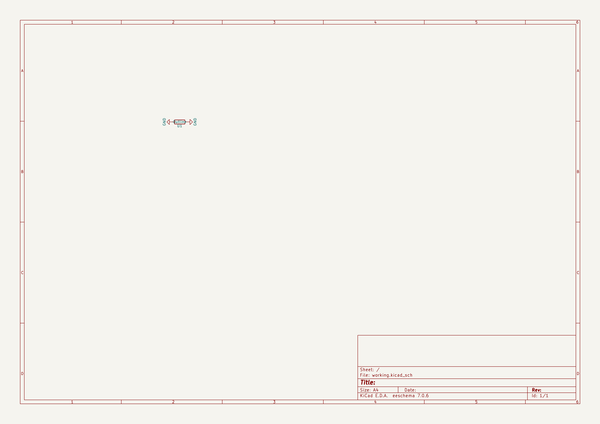

# titan
 
## summary 
* id: ai03_2725_titan_titan
* user: ai03_2725
* name: titan
* board: titan
* repo: https://github.com/ai03-2725/Titan
* src_file_repo_kicad_pcb: Titan.kicad_pcb
* src_file_repo_kicad_pcb_link: https://github.com/ai03-2725/Titan/tree/master/Titan.kicad_pcb

* src_file_repo_sch: Titan.sch
* src_file_repo_sch_link: https://github.com/ai03-2725/Titan/tree/master/Titan.sch
* full details link: https://github.com/oomlout/oomlout_oomp_project_bot_v_2/tree/main/projects/ai03_2725_titan_titan/current_version/working  

## schematic  
  
[schematic (pdf)](working_schematic.pdf) 

## pcb  
 
  
  
  
[board (pdf)](working.pdf)  

## working_bom
| Id | Designator | Footprint | Quantity | Designation | Supplier and ref |  | None | 
| --- | --- | --- | --- | --- | --- | --- | --- | 
| 1 | U1 | outline | 1 | Outline |  |  | [''] | 
| 2 | REF** | ai03-20mil | 1 | ai03-20mil |  |  | [''] | 
| 3 | G*** | AI03-Silkscreen-5.4mm | 1 | LOGO |  |  | [''] | 

## bom_schematic
| Ref | Qnty | Value | Cmp name | Footprint | Description | Vendor | DNP | 
| --- | --- | --- | --- | --- | --- | --- | --- | 
| U1 | 1 | Outline | R | locallib:outline |  |  |  | 

