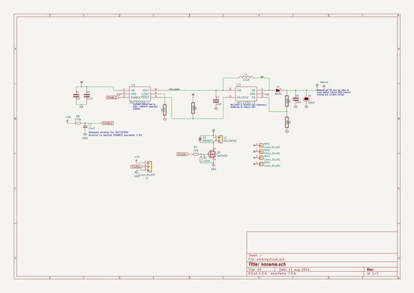
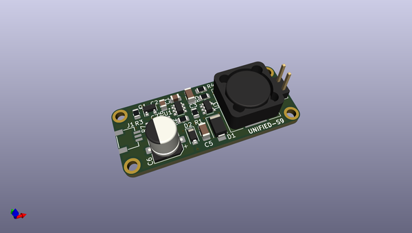
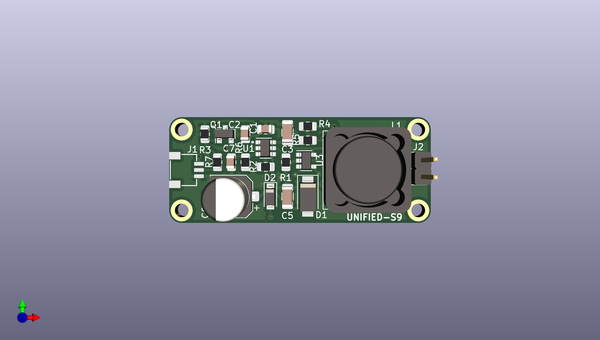
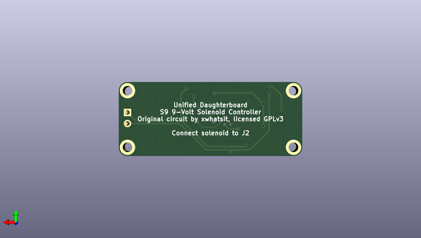

# unified_s9_solenoid_controller
 
## summary 
* id: ai03_2725_unified_s9_solenoid_controller_solenoid_driver
* user: ai03_2725
* name: unified_s9_solenoid_controller
* board: solenoid_driver
* repo: https://github.com/ai03-2725/unified-s9-solenoid-controller
* src_file_repo_kicad_pcb: schem/solenoid-driver.kicad_pcb
* src_file_repo_kicad_pcb_link: https://github.com/ai03-2725/unified-s9-solenoid-controller/tree/master/schem/solenoid-driver.kicad_pcb

* src_file_repo_sch: schem/solenoid-driver.sch
* src_file_repo_sch_link: https://github.com/ai03-2725/unified-s9-solenoid-controller/tree/master/schem/solenoid-driver.sch
* full details link: https://github.com/oomlout/oomlout_oomp_project_bot_v_2/tree/main/projects/ai03_2725_unified_s9_solenoid_controller_solenoid_driver/current_version/working  

## schematic  
  
[schematic (pdf)](working_schematic.pdf) 

## pcb  
 
  
  
  
[board (pdf)](working.pdf)  

## working_bom
| Id | Designator | Footprint | Quantity | Designation | Supplier and ref |  | None | 
| --- | --- | --- | --- | --- | --- | --- | --- | 
| 1 | C1 | C_0805_2012Metric | 1 | 1uF |  |  | [''] | 
| 2 | C2 | C_0805_2012Metric | 1 | 0.1uF |  |  | [''] | 
| 3 | C5,C3 | C_1206_3216Metric | 2 | 22uF |  |  | [''] | 
| 4 | C6 | CP_Elec_6.3x7.7 | 1 | 220uF |  |  | [''] | 
| 5 | J2 | PinHeader_1x02_P2.54mm_Vertical | 1 | SOLENOID |  |  | [''] | 
| 6 | L1 | L_12x12mm_H6mm | 1 | 22uH |  |  | [''] | 
| 7 | R2,R4,R3 | R_0805_2012Metric | 3 | 100K |  |  | [''] | 
| 8 | U1 | SOT-23-6 | 1 | MIC2009A-1 |  |  | [''] | 
| 9 | U3 | SOT-23-5 | 1 | MIC2250-2 |  |  | [''] | 
| 10 | R1 | R_0805_2012Metric | 1 | 470 |  |  | [''] | 
| 11 | D1 | D_SMA | 1 | B220A |  |  | [''] | 
| 12 | R5 | R_0805_2012Metric | 1 | 16K |  |  | [''] | 
| 13 | C7 | C_0805_2012Metric | 1 | 10uF |  |  | [''] | 
| 14 | R7 | R_0805_2012Metric | 1 | 100 |  |  | [''] | 
| 15 | Q1 | SOT-23 | 1 | AO3400 |  |  | [''] | 
| 16 | J1 | JST-SR-3 | 1 | Conn_01x03 |  |  | [''] | 
| 17 | R6 | R_0805_2012Metric | 1 | 270k |  |  | [''] | 
| 18 | D2 | D_SOD-123 | 1 | RB060T |  |  | [''] | 

## bom_schematic
| Ref | Qnty | Value | Cmp name | Footprint | Description | Vendor | DNP | 
| --- | --- | --- | --- | --- | --- | --- | --- | 
| C1 | 1 | 1uF | C | Capacitor_SMD:C_0805_2012Metric |  |  |  | 
| C2 | 1 | 0.1uF | C | Capacitor_SMD:C_0805_2012Metric |  |  |  | 
| C3, C5 | 2 | 22uF | C | Capacitor_SMD:C_1206_3216Metric |  |  |  | 
| C6 | 1 | 220uF | CP | Capacitor_SMD:CP_Elec_6.3x7.7 |  |  |  | 
| C7 | 1 | 10uF | C_Small | Capacitor_SMD:C_0805_2012Metric | Unpolarized capacitor, small symbol |  |  | 
| D1 | 1 | B220A | DIODESCH | Diode_SMD:D_SMA |  |  |  | 
| D2 | 1 | RB060T | D_Small | Diode_SMD:D_SOD-123 | Diode, small symbol |  |  | 
| J1 | 1 | Conn_01x03 | Conn_01x03 | random-keyboard-parts:JST-SR-3 | Generic connector, single row, 01x03, script generated (kicad-library-utils/schlib/autogen/connector/) |  |  | 
| J2 | 1 | SOLENOID | Conn_01x02 | Connector_PinHeader_2.54mm:PinHeader_1x02_P2.54mm_Vertical | Generic connector, single row, 01x02, script generated (kicad-library-utils/schlib/autogen/connector/) |  |  | 
| L1 | 1 | 22uH | INDUCTOR_SMALL | Inductor_SMD:L_12x12mm_H6mm |  |  |  | 
| MH1, MH2, MH3, MH4 | 4 | Conn_01x01 | Conn_01x01 | random-keyboard-parts:Generic-Mounthole | Generic connector, single row, 01x01, script generated (kicad-library-utils/schlib/autogen/connector/) |  |  | 
| Q1 | 1 | AO3400 | Q_NMOS_GSD | Package_TO_SOT_SMD:SOT-23 | N-MOSFET transistor, gate/source/drain |  |  | 
| R1 | 1 | 470 | R | Resistor_SMD:R_0805_2012Metric |  |  |  | 
| R2, R3, R4 | 3 | 100K | R | Resistor_SMD:R_0805_2012Metric |  |  |  | 
| R5 | 1 | 16K | R | Resistor_SMD:R_0805_2012Metric |  |  |  | 
| R6 | 1 | 270k | R_Small | Resistor_SMD:R_0805_2012Metric | Resistor, small symbol |  |  | 
| R7 | 1 | 100 | R_Small | Resistor_SMD:R_0805_2012Metric | Resistor, small symbol |  |  | 
| U1 | 1 | MIC2009A-1 | MIC2009A | Package_TO_SOT_SMD:SOT-23-6 |  |  |  | 
| U3 | 1 | MIC2250-2 | MIC2250 | Package_TO_SOT_SMD:SOT-23-5 |  |  |  | 

