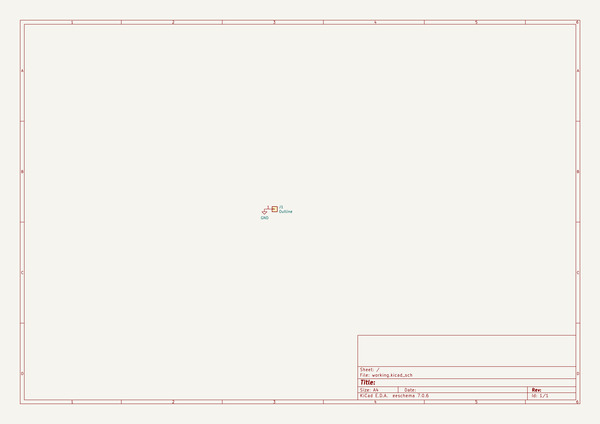
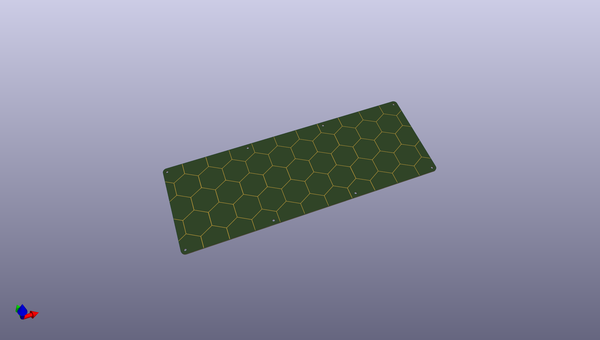
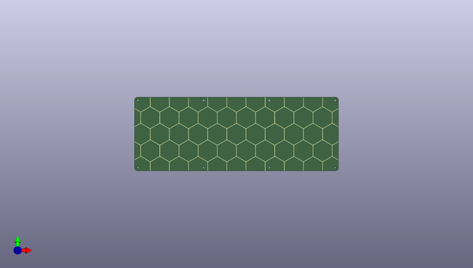

# ut47_2
 
## summary 
* id: ai03_2725_ut47_2_ut47_2_bottom
* user: ai03_2725
* name: ut47_2
* board: ut47_2_bottom
* repo: https://github.com/ai03-2725/UT47.2
* src_file_repo_kicad_pcb: Case Files/Bottom/UT47.2-Bottom.kicad_pcb
* src_file_repo_kicad_pcb_link: https://github.com/ai03-2725/UT47.2/tree/master/Case Files/Bottom/UT47.2-Bottom.kicad_pcb

* src_file_repo_sch: Case Files/Bottom/UT47.2-Bottom.sch
* src_file_repo_sch_link: https://github.com/ai03-2725/UT47.2/tree/master/Case Files/Bottom/UT47.2-Bottom.sch
* full details link: https://github.com/oomlout/oomlout_oomp_project_bot_v_2/tree/main/projects/ai03_2725_ut47_2_ut47_2_bottom/current_version/working  

## schematic  
  
[schematic (pdf)](working_schematic.pdf) 

## pcb  
 
  
  
  
[board (pdf)](working.pdf)  

## working_bom
| Id | Designator | Footprint | Quantity | Designation | Supplier and ref |  | None | 
| --- | --- | --- | --- | --- | --- | --- | --- | 
| 1 | J1 | Outline | 1 | Outline |  |  | [''] | 
| 2 | G*** | hex | 1 | LOGO |  |  | [''] | 
| 3 | G*** | ai-ring-6mm-Combined | 1 | LOGO |  |  | [''] | 

## bom_schematic
| Ref | Qnty | Value | Cmp name | Footprint | Description | Vendor | DNP | 
| --- | --- | --- | --- | --- | --- | --- | --- | 
| J1 | 1 | Outline | Conn_01x01 | locallib:Outline | Generic connector, single row, 01x01, script generated (kicad-library-utils/schlib/autogen/connector/) |  |  | 

