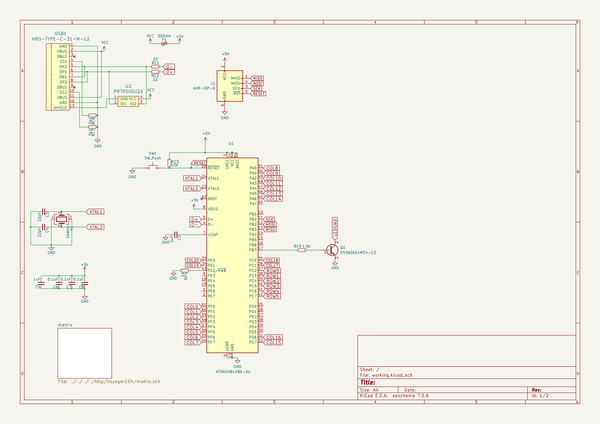
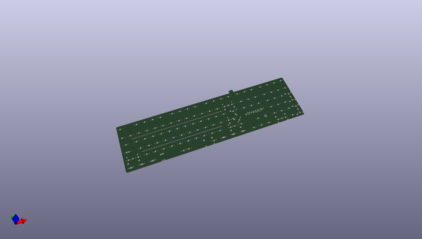
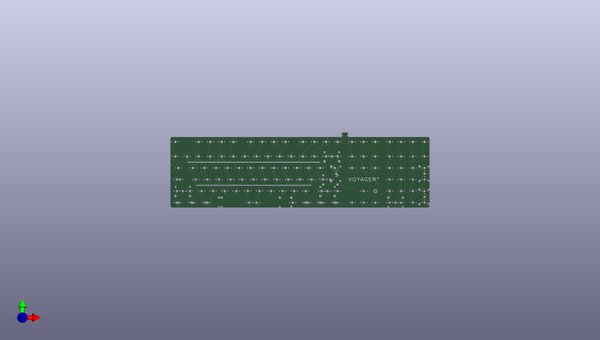
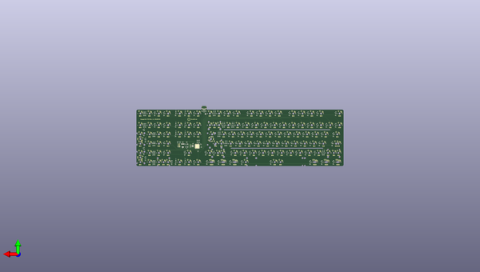

# voyager104
 
## summary 
* id: ai03_2725_voyager104_voyager104
* user: ai03_2725
* name: voyager104
* board: voyager104
* repo: https://github.com/ai03-2725/Voyager104
* src_file_repo_kicad_pcb: Voyager104.kicad_pcb
* src_file_repo_kicad_pcb_link: https://github.com/ai03-2725/Voyager104/tree/master/Voyager104.kicad_pcb

* src_file_repo_sch: 
* src_file_repo_sch_link: https://github.com/ai03-2725/Voyager104/tree/master/
* full details link: https://github.com/oomlout/oomlout_oomp_project_bot_v_2/tree/main/projects/ai03_2725_voyager104_voyager104/current_version/working  

## schematic  
  
[schematic (pdf)](working_schematic.pdf) 

## pcb  
 
  
  
  
[board (pdf)](working.pdf)  

## working_bom
| Id | Designator | Footprint | Quantity | Designation | Supplier and ref |  | None | 
| --- | --- | --- | --- | --- | --- | --- | --- | 
| 1 | MX_.1,MX_,1,MX_#1,MX_#2,MX_#3,MX_#4,MX_#5,MX_#6,MX_#7,MX_#8,MX_#9,MX_#0_1,MX_'1,MX_-1,MX_/1,MX_;1,MX_=1,MX_[1,MX_]1,MX_`1,MX_A1,MX_B1,MX_C1,MX_D1,MX_E1,MX_ESC1,MX_F1,MX_FN1,MX_FN2,MX_FN3,MX_FN4,MX_FN5,MX_FN6,MX_FN7,MX_FN8,MX_FN9,MX_FN10,MX_FN11,MX_FN12,MX_G1,MX_H1,MX_I1,MX_J1,MX_K1,MX_L1,MX_M1,MX_N1,MX_O1,MX_P1,MX_Q1,MX_R1,MX_S1,MX_T1,MX_U1,MX_V1,MX_W1,MX_X1,MX_Y1,MX_Z1,MX_\2,MX_BACK2,MX_BACK3,MX_DEL1,MX_DN1,MX_END1,MX_HOME1,MX_INS1,MX_LFT1,MX_LSHIFT3,MX_PAUSE1,MX_PGDN1,MX_PGUP1,MX_PRINT1,MX_RSHIFT3,MX_RT1,MX_SLOCK1,MX_UP1,MX_RGUI2,MX_NUM1,MX_NUM2,MX_NUM3,MX_NUM4,MX_NUM5,MX_NUM6,MX_NUM7,MX_NUM8,MX_NUM9,MX_NUM10,MX_NUM11,MX_NUM12,MX_NUM13,MX_NUM14,MX_NUM15,MX_NUM16,MX_NUM17,MX_NUM18,MX_NUM19,MX_NUM20,MX_NUM21,MX_NUM22,MX_NUM23,MX_NUM24 | MX-1U | 102 | MX-1U |  |  | [''] | 
| 2 | MX_\1,MX_TAB1,MX_RALT2,MX_RCTRL2 | MX-1.5U | 4 | MX-1.5U |  |  | [''] | 
| 3 | MX_RETURN1,MX_LSHIFT1 | MX-2.25U | 2 | MX-2.25U |  |  | [''] | 
| 4 | MX_BACK1 | MX-2U | 1 | MX-2U |  |  | [''] | 
| 5 | MX_CLOCK1,MX_RSHIFT2 | MX-1.75U | 2 | MX-1.75U |  |  | [''] | 
| 6 | MX_CLOCK2,MX_RGUI1,MX_RCTRL1,MX_RMENU1 | MX-1.25U-FLIPPED | 4 | MX-1.25U |  |  | [''] | 
| 7 | MX_LALT1,MX_LCTRL1,MX_LSHIFT2,MX_RALT1,MX_LGUI1 | MX-1.25U | 5 | MX-1.25U |  |  | [''] | 
| 8 | MX_LCTRL2,MX_LALT2 | MX-1.5U-FLIPPED | 2 | MX-1.5U |  |  | [''] | 
| 9 | MX_RETURN2 | MX-ISO-ReversedStabilizers | 1 | MX-ISO |  |  | [''] | 
| 10 | MX_RSHIFT1 | MX-2.75U | 1 | MX-2.75U |  |  | [''] | 
| 11 | MX_SP1 | MX-6.25U-ReversedStabilizers | 1 | MX-6.25U |  |  | [''] | 
| 12 | MX_SP2 | MX-7U-ReversedStabilizers | 1 | MX-7U |  |  | [''] | 
| 13 | MX_LGUI2 | MX-1U-FLIPPED | 1 | MX-1U |  |  | [''] | 
| 14 | G*** | ai-ring-6mm | 1 | LOGO |  |  | [''] | 
| 15 | MX_NUM_EX1,MX_NUM_EX2,MX_NUM_EX3 | MX-2U-ReversedStabilizers | 3 | MX-2U |  |  | [''] | 
| 16 | C2,C5 | C_0603 | 2 | 1uF |  |  | [''] | 
| 17 | C3,C4 | C_0603 | 2 | 22pF |  |  | [''] | 
| 18 | C6,C7,C8 | C_0603 | 3 | 0.1uF |  |  | [''] | 
| 19 | D1,D2,D3,D4,D5,D6,D7,D8,D9,D10,D11,D12,D13,D14,D17,D18,D19,D20,D21,D22,D23,D24,D25,D26,D27,D28,D29,D30,D31,D35,D36,D37,D38,D39,D40,D41,D42,D43,D44,D45,D46,D47,D48,D52,D53,D54,D55,D56,D57,D58,D59,D60,D61,D62,D63,D65,D66,D67,D68,D69,D70,D71,D72,D73,D74,D75,D76,D77,D78,D81,D82,D84,D85,D86,D87,D90,D91,D92,D93,D94,D95,D96,D97,D99,D100,D101,D111,D112,D113,D15,D16,D32,D33,D34,D49,D50,D51,D64,D79,D80,D83,D88,D89,D98,D102,D103,D104,D105,D106,D107,D109,D110,D108,D114 | D_SOD-123 | 114 | SOD-323 |  |  | [''] | 
| 20 | F1 | Fuse_SMD1206_Reflow | 1 | 500mA |  |  | [''] | 
| 21 | Q1 | SOT-223-3_TabPin2 | 1 | DSS60601MZ4-13 |  |  | [''] | 
| 22 | R1,R2,R3,R4,R5,R6,R7,R8,R9,R10,R11,R12,R13,R14,R16,R17,R18,R19,R20,R21,R22,R23,R24,R25,R26,R27,R28,R29,R30,R31,R32,R33,R35,R36,R37,R38,R39,R40,R41,R42,R43,R44,R45,R46,R47,R48,R52,R53,R54,R55,R56,R57,R58,R59,R60,R61,R62,R63,R65,R66,R67,R68,R69,R70,R71,R72,R73,R74,R75,R76,R77,R78,R81,R82,R84,R85,R86,R87,R90,R91,R95,R96,R97,R99,R100,R101,R112,R113,RC4,R15,R34,R49,R50,R51,R64,R79,R80,R83,R88,R89,R92,R93,R94,R98,R102,R103,R104,R105,R106,R107,R109,R110,R114,R108,R111 | R_0603 | 115 | 1k |  |  | [''] | 
| 23 | RC1,RC2 | R_0603 | 2 | 22 |  |  | [''] | 
| 24 | RC3 | R_0603 | 1 | 10k |  |  | [''] | 
| 25 | RC5 | R_0603 | 1 | 1.5k |  |  | [''] | 
| 26 | RC6,RC7 | R_0603 | 2 | 5k1 |  |  | [''] | 
| 27 | U2 | SOT143B | 1 | PRTR5V0U2X |  |  | [''] | 
| 28 | USB1 | HRO-TYPE-C-31-M-12-Assembly | 1 | HRO-TYPE-C-31-M-12 |  |  | [''] | 
| 29 | Y1 | Crystal_SMD_3225-4pin_3.2x2.5mm | 1 | 16MHz |  |  | [''] | 
| 30 | SW1 | SKQG-1155865 | 1 | SW_Push |  |  | [''] | 
| 31 | U1 | QFN-64-1EP_9x9mm_Pitch0.5mm | 1 | AT90USB1286-AU |  |  | [''] | 
| 32 | G*** | ai-ring-6mm-FancyAss | 1 | LOGO |  |  | [''] | 
| 33 | G*** | ai-ring-6mm-FancyAss-Mask | 1 | LOGO |  |  | [''] | 

## bom_schematic
| Ref | Qnty | Value | Cmp name | Footprint | Description | Vendor | DNP | 
| --- | --- | --- | --- | --- | --- | --- | --- | 
| C2, C5 | 2 | 1uF | C_Small | Capacitors_SMD:C_0603 | Unpolarized capacitor, small symbol |  |  | 
| C3, C4 | 2 | 22pF | C_Small | Capacitors_SMD:C_0603 | Unpolarized capacitor, small symbol |  |  | 
| C6, C7, C8 | 3 | 0.1uF | C_Small | Capacitors_SMD:C_0603 | Unpolarized capacitor, small symbol |  |  | 
| F1 | 1 | 500mA | Polyfuse_Small | Fuse_Holders_and_Fuses:Fuse_SMD1206_Reflow | Resettable fuse, polymeric positive temperature coefficient, small symbol |  |  | 
| J1 | 1 | AVR-ISP-6 | AVR-ISP-6-Connector | random-keyboard-parts:Reset_Pretty-Mask |  |  |  | 
| Q1 | 1 | DSS60601MZ4-13 | Q_NPN_BCE | TO_SOT_Packages_SMD:SOT-223-3_TabPin2 | NPN transistor, base/collector/emitter |  |  | 
| RC1, RC2 | 2 | 22 | R_Small | Resistors_SMD:R_0603 | Resistor, small symbol |  |  | 
| RC3 | 1 | 10k | R_Small | Resistors_SMD:R_0603 | Resistor, small symbol |  |  | 
| RC4 | 1 | 1k | R_Small | Resistors_SMD:R_0603 | Resistor, small symbol |  |  | 
| RC5 | 1 | 1.5k | R_Small | Resistors_SMD:R_0603 | Resistor, small symbol |  |  | 
| RC6, RC7 | 2 | 5k1 | R_Small | Resistors_SMD:R_0603 | Resistor, small symbol |  |  | 
| SW1 | 1 | SW_Push | SW_Push | random-keyboard-parts:SKQG-1155865 | Push button switch, generic, two pins |  |  | 
| U1 | 1 | AT90USB1286-AU | AT90USB1286-MU-MCU_Microchip_AVR | Housings_DFN_QFN:QFN-64-1EP_9x9mm_Pitch0.5mm |  |  |  | 
| U2 | 1 | PRTR5V0U2X | PRTR5V0U2X | locallib:SOT143B |  |  |  | 
| USB1 | 1 | HRO-TYPE-C-31-M-12 | HRO-TYPE-C-31-M-12-Type-C | Type-C:HRO-TYPE-C-31-M-12-Assembly |  |  |  | 
| Y1 | 1 | 16MHz | Crystal_GND24 | Crystals:Crystal_SMD_3225-4pin_3.2x2.5mm | Four pin crystal, GND on pins 2 and 4 |  |  | 

