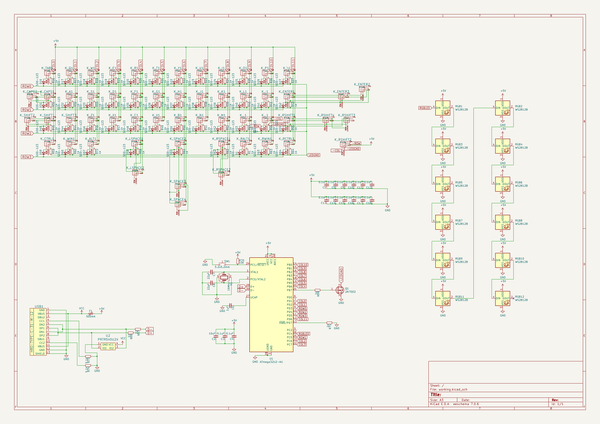
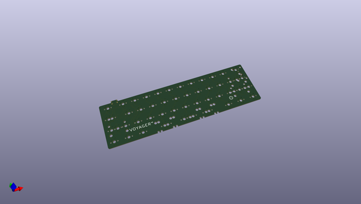
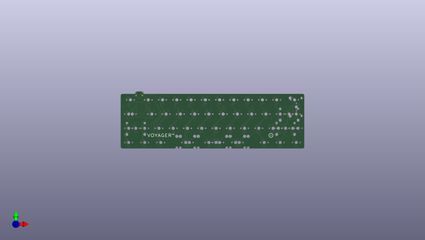
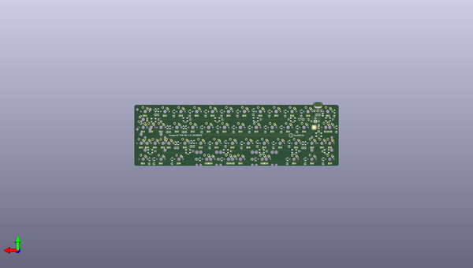

# voyager40
 
## summary 
* id: ai03_2725_voyager40_voyager40
* user: ai03_2725
* name: voyager40
* board: voyager40
* repo: https://github.com/ai03-2725/Voyager40
* src_file_repo_kicad_pcb: Voyager40.kicad_pcb
* src_file_repo_kicad_pcb_link: https://github.com/ai03-2725/Voyager40/tree/master/Voyager40.kicad_pcb

* src_file_repo_sch: Voyager40.sch
* src_file_repo_sch_link: https://github.com/ai03-2725/Voyager40/tree/master/Voyager40.sch
* full details link: https://github.com/oomlout/oomlout_oomp_project_bot_v_2/tree/main/projects/ai03_2725_voyager40_voyager40/current_version/working  

## schematic  
  
[schematic (pdf)](working_schematic.pdf) 

## pcb  
 
  
  
  
[board (pdf)](working.pdf)  

## working_bom
| Id | Designator | Footprint | Quantity | Designation | Supplier and ref |  | None | 
| --- | --- | --- | --- | --- | --- | --- | --- | 
| 1 | K_,1,K_.1,K_;1,K_A1,K_B1,K_C1,K_D1,K_E1,K_F1,K_G1,K_H1,K_I1,K_J1,K_K1,K_L1,K_M1,K_N1,K_O1,K_P1,K_Q1,K_R1,K_S1,K_SHIFT3,K_SPACE3,K_T1,K_U1,K_V1,K_W1,K_WIN1,K_X1,K_Y1,K_Z1,K_RSHIFT3 | MX-1U | 33 | MX-1U |  |  | [''] | 
| 2 | K_\1,K_TAB1 | MX-1.5U | 2 | MX-1.5U |  |  | [''] | 
| 3 | K_ALT1,K_CTRL1,K_RALT1,K_RCTRL1,K_SHIFT2,K_ENTER2 | MX-1.25U | 6 | MX-1.25U |  |  | [''] | 
| 4 | K_CAPS1,K_RSHIFT1,K_RSHIFT2 | MX-1.75U | 3 | MX-1.75U |  |  | [''] | 
| 5 | K_CAPS2 | MX-1.25U-FLIPPED | 1 | MX-1.25U |  |  | [''] | 
| 6 | K_LSPACE1 | MX-2.25U-ReversedStabilizers | 1 | MX-2.25U |  |  | [''] | 
| 7 | K_RSPACE1 | MX-2.75U-ReversedStabilizers | 1 | MX-2.75U |  |  | [''] | 
| 8 | K_RWIN1 | MX-1U | 1 | MX-1.25U |  |  | [''] | 
| 9 | K_SHIFT1,K_ENTER1 | MX-2.25U | 2 | MX-2.25U |  |  | [''] | 
| 10 | K_ENTER3 | MX-ISO-ReversedStabilizers | 1 | MX-ISO |  |  | [''] | 
| 11 | K_RSHIFT4 | MX-2.75U | 1 | MX-2.75U |  |  | [''] | 
| 12 | K_SPACE2 | MX-6U-ReversedStabilizers | 1 | MX-6U |  |  | [''] | 
| 13 | K_SPACE4 | MX-1U-FLIPPED | 1 | MX-1U |  |  | [''] | 
| 14 | K_LSPACE2 | MX-2.75U-FLIPPED-ReversedStabilizers | 1 | MX-2.75U |  |  | [''] | 
| 15 | K_RSPACE2 | MX-2.25U-FLIPPED-ReversedStabilizers | 1 | MX-2.25U |  |  | [''] | 
| 16 | G*** | ai-ring-6mm | 1 | LOGO |  |  | [''] | 
| 17 | C2 | C_0603 | 1 | 10uF |  |  | [''] | 
| 18 | C3,C4,C1,C5,C9,C10,C11,C12,C13,C14,C15,C16,C17,C18 | C_0603 | 14 | 0.1uF |  |  | [''] | 
| 19 | C6 | C_0603 | 1 | 1uF |  |  | [''] | 
| 20 | C7,C8 | C_0603 | 2 | 22pF |  |  | [''] | 
| 21 | D1,D16,D17,D18,D19,D20,D21,D22,D23,D24,D25,D26,D27,D31,D32,D33,D34,D35,D36,D37,D38,D39,D40,D42,D44,D45,D46,D47,D48,D49,D50,D51,D52,D53,D55,D58,D59,D60,D61,D62,D63,D64,D67,D41,D54 | D_SOD-123 | 45 | SOD-123 |  |  | [''] | 
| 22 | F1 | Fuse_SMD1206_Reflow | 1 | 500mA |  |  | [''] | 
| 23 | Q1 | SOT-23 | 1 | 2N7002 |  |  | [''] | 
| 24 | R1,R16,R17,R18,R19,R20,R21,R22,R23,R24,R25,R26,R27,R31,R32,R33,R34,R35,R36,R37,R38,R39,R40,R41,R42,R44,R45,R46,R47,R48,R49,R50,R51,R52,R53,R54,R55,R58,R59,R60,R61,R62,R63,R64,R69,R71,R72 | R_0805 | 47 | 1k |  |  | [''] | 
| 25 | R67,R68 | R_0805 | 2 | 22 |  |  | [''] | 
| 26 | R70 | R_0805 | 1 | 10k |  |  | [''] | 
| 27 | R73,R74 | R_0805 | 2 | 5.1k |  |  | [''] | 
| 28 | SW1 | SKQGADE010 | 1 | 5.2x5.2mm |  |  | [''] | 
| 29 | U2 | SOT143B | 1 | PRTR5V0U2X |  |  | [''] | 
| 30 | Y1 | Crystal_SMD_3225-4pin_3.2x2.5mm | 1 | 16Mhz |  |  | [''] | 
| 31 | USB1 | HRO-TYPE-C-31-M-12-Assembly | 1 | HRO-TYPE-C-31-M-12 |  |  | [''] | 
| 32 | U1 | QFN-32-1EP_5x5mm_Pitch0.5mm | 1 | ATmega32U2-AU |  |  | [''] | 
| 33 | RGB1,RGB2,RGB4,RGB5,RGB6,RGB7,RGB8,RGB9,RGB10,RGB12,RGB3,RGB11 | LED_WS2812B-PLCC4 | 12 | WS2812B |  |  | [''] | 
| 34 | G*** | ai-4.8-ring | 1 | LOGO |  |  | [''] | 

## bom_schematic
| Ref | Qnty | Value | Cmp name | Footprint | Description | Vendor | DNP | 
| --- | --- | --- | --- | --- | --- | --- | --- | 
| C1, C3, C4, C5, C9, C10, C11, C12, C13, C14, C15, C16, C17, C18 | 14 | 0.1uF | C_Small | Capacitors_SMD:C_0603 | Unpolarized capacitor, small symbol |  |  | 
| C2 | 1 | 10uF | C_Small | Capacitors_SMD:C_0603 | Unpolarized capacitor, small symbol |  |  | 
| C6 | 1 | 1uF | C_Small | Capacitors_SMD:C_0603 | Unpolarized capacitor, small symbol |  |  | 
| C7, C8 | 2 | 22pF | C_Small | Capacitors_SMD:C_0603 | Unpolarized capacitor, small symbol |  |  | 
| D1, D16, D17, D18, D19, D20, D21, D22, D23, D24, D25, D26, D27, D31, D32, D33, D34, D35, D36, D37, D38, D39, D40, D41, D42, D44, D45, D46, D47, D48, D49, D50, D51, D52, D53, D54, D55, D58, D59, D60, D61, D62, D63, D64, D67 | 45 | SOD-123 | D_Small | Diodes_SMD:D_SOD-123 | Diode, small symbol |  |  | 
| F1 | 1 | 500mA | Polyfuse_Small | Fuse_Holders_and_Fuses:Fuse_SMD1206_Reflow | Resettable fuse, polymeric positive temperature coefficient, small symbol |  |  | 
| K_,1 | 1 | MX-1U | MX-1U-MX_Alps_Hybrids | MX_Alps_Hybrid:MX-1U |  |  |  | 
| K_.1 | 1 | MX-1U | MX-1U-MX_Alps_Hybrids | MX_Alps_Hybrid:MX-1U |  |  |  | 
| K_;1 | 1 | MX-1U | MX-1U-MX_Alps_Hybrids | MX_Alps_Hybrid:MX-1U |  |  |  | 
| K_\1 | 1 | MX-1.5U | MX-1U-MX_Alps_Hybrids | MX_Alps_Hybrid:MX-1.5U |  |  |  | 
| K_A1 | 1 | MX-1U | MX-1U-MX_Alps_Hybrids | MX_Alps_Hybrid:MX-1U |  |  |  | 
| K_ALT1 | 1 | MX-1.25U | MX-1U-MX_Alps_Hybrids | MX_Alps_Hybrid:MX-1.25U |  |  |  | 
| K_B1 | 1 | MX-1U | MX-1U-MX_Alps_Hybrids | MX_Alps_Hybrid:MX-1U |  |  |  | 
| K_C1 | 1 | MX-1U | MX-1U-MX_Alps_Hybrids | MX_Alps_Hybrid:MX-1U |  |  |  | 
| K_CAPS1 | 1 | MX-1.75U | MX-1U-MX_Alps_Hybrids | MX_Alps_Hybrid:MX-1.75U |  |  |  | 
| K_CAPS2 | 1 | MX-1.25U | MX-1U-MX_Alps_Hybrids | MX_Alps_Hybrid:MX-1.25U-FLIPPED |  |  |  | 
| K_CTRL1 | 1 | MX-1.25U | MX-1U-MX_Alps_Hybrids | MX_Alps_Hybrid:MX-1.25U |  |  |  | 
| K_D1 | 1 | MX-1U | MX-1U-MX_Alps_Hybrids | MX_Alps_Hybrid:MX-1U |  |  |  | 
| K_E1 | 1 | MX-1U | MX-1U-MX_Alps_Hybrids | MX_Alps_Hybrid:MX-1U |  |  |  | 
| K_ENTER1 | 1 | MX-2.25U | MX-1U-MX_Alps_Hybrids | MX_Alps_Hybrid:MX-2.25U |  |  |  | 
| K_ENTER2 | 1 | MX-1.25U | MX-1U-MX_Alps_Hybrids | MX_Alps_Hybrid:MX-1.25U |  |  |  | 
| K_ENTER3 | 1 | MX-ISO | MX-1U-MX_Alps_Hybrids | MX_Alps_Hybrid:MX-ISO-ReversedStabilizers |  |  |  | 
| K_F1 | 1 | MX-1U | MX-1U-MX_Alps_Hybrids | MX_Alps_Hybrid:MX-1U |  |  |  | 
| K_G1 | 1 | MX-1U | MX-1U-MX_Alps_Hybrids | MX_Alps_Hybrid:MX-1U |  |  |  | 
| K_H1 | 1 | MX-1U | MX-1U-MX_Alps_Hybrids | MX_Alps_Hybrid:MX-1U |  |  |  | 
| K_I1 | 1 | MX-1U | MX-1U-MX_Alps_Hybrids | MX_Alps_Hybrid:MX-1U |  |  |  | 
| K_J1 | 1 | MX-1U | MX-1U-MX_Alps_Hybrids | MX_Alps_Hybrid:MX-1U |  |  |  | 
| K_K1 | 1 | MX-1U | MX-1U-MX_Alps_Hybrids | MX_Alps_Hybrid:MX-1U |  |  |  | 
| K_L1 | 1 | MX-1U | MX-1U-MX_Alps_Hybrids | MX_Alps_Hybrid:MX-1U |  |  |  | 
| K_LSPACE1 | 1 | MX-2.25U | MX-1U-MX_Alps_Hybrids | MX_Alps_Hybrid:MX-2.25U-ReversedStabilizers |  |  |  | 
| K_LSPACE2 | 1 | MX-2.75U | MX-1U-MX_Alps_Hybrids | MX_Alps_Hybrid:MX-2.75U-FLIPPED-ReversedStabilizers |  |  |  | 
| K_M1 | 1 | MX-1U | MX-1U-MX_Alps_Hybrids | MX_Alps_Hybrid:MX-1U |  |  |  | 
| K_N1 | 1 | MX-1U | MX-1U-MX_Alps_Hybrids | MX_Alps_Hybrid:MX-1U |  |  |  | 
| K_O1 | 1 | MX-1U | MX-1U-MX_Alps_Hybrids | MX_Alps_Hybrid:MX-1U |  |  |  | 
| K_P1 | 1 | MX-1U | MX-1U-MX_Alps_Hybrids | MX_Alps_Hybrid:MX-1U |  |  |  | 
| K_Q1 | 1 | MX-1U | MX-1U-MX_Alps_Hybrids | MX_Alps_Hybrid:MX-1U |  |  |  | 
| K_R1 | 1 | MX-1U | MX-1U-MX_Alps_Hybrids | MX_Alps_Hybrid:MX-1U |  |  |  | 
| K_RALT1 | 1 | MX-1.25U | MX-1U-MX_Alps_Hybrids | MX_Alps_Hybrid:MX-1.25U |  |  |  | 
| K_RCTRL1 | 1 | MX-1.25U | MX-1U-MX_Alps_Hybrids | MX_Alps_Hybrid:MX-1.25U |  |  |  | 
| K_RSHIFT1, K_RSHIFT2 | 2 | MX-1.75U | MX-1U-MX_Alps_Hybrids | MX_Alps_Hybrid:MX-1.75U |  |  |  | 
| K_RSHIFT3 | 1 | MX-1U | MX-1U-MX_Alps_Hybrids | MX_Alps_Hybrid:MX-1U |  |  |  | 
| K_RSHIFT4 | 1 | MX-2.75U | MX-1U-MX_Alps_Hybrids | MX_Alps_Hybrid:MX-2.75U |  |  |  | 
| K_RSPACE1 | 1 | MX-2.75U | MX-1U-MX_Alps_Hybrids | MX_Alps_Hybrid:MX-2.75U-ReversedStabilizers |  |  |  | 
| K_RSPACE2 | 1 | MX-2.25U | MX-1U-MX_Alps_Hybrids | MX_Alps_Hybrid:MX-2.25U-FLIPPED-ReversedStabilizers |  |  |  | 
| K_RWIN1 | 1 | MX-1.25U | MX-1U-MX_Alps_Hybrids | MX_Alps_Hybrid:MX-1U |  |  |  | 
| K_S1 | 1 | MX-1U | MX-1U-MX_Alps_Hybrids | MX_Alps_Hybrid:MX-1U |  |  |  | 
| K_SHIFT1 | 1 | MX-2.25U | MX-1U-MX_Alps_Hybrids | MX_Alps_Hybrid:MX-2.25U |  |  |  | 
| K_SHIFT2 | 1 | MX-1.25U | MX-1U-MX_Alps_Hybrids | MX_Alps_Hybrid:MX-1.25U |  |  |  | 
| K_SHIFT3 | 1 | MX-1U | MX-1U-MX_Alps_Hybrids | MX_Alps_Hybrid:MX-1U |  |  |  | 
| K_SPACE2 | 1 | MX-6U | MX-1U-MX_Alps_Hybrids | MX_Alps_Hybrid:MX-6U-ReversedStabilizers |  |  |  | 
| K_SPACE3 | 1 | MX-1U | MX-1U-MX_Alps_Hybrids | MX_Alps_Hybrid:MX-1U |  |  |  | 
| K_SPACE4 | 1 | MX-1U | MX-1U-MX_Alps_Hybrids | MX_Alps_Hybrid:MX-1U-FLIPPED |  |  |  | 
| K_T1 | 1 | MX-1U | MX-1U-MX_Alps_Hybrids | MX_Alps_Hybrid:MX-1U |  |  |  | 
| K_TAB1 | 1 | MX-1.5U | MX-1U-MX_Alps_Hybrids | MX_Alps_Hybrid:MX-1.5U |  |  |  | 
| K_U1 | 1 | MX-1U | MX-1U-MX_Alps_Hybrids | MX_Alps_Hybrid:MX-1U |  |  |  | 
| K_V1 | 1 | MX-1U | MX-1U-MX_Alps_Hybrids | MX_Alps_Hybrid:MX-1U |  |  |  | 
| K_W1 | 1 | MX-1U | MX-1U-MX_Alps_Hybrids | MX_Alps_Hybrid:MX-1U |  |  |  | 
| K_WIN1 | 1 | MX-1U | MX-1U-MX_Alps_Hybrids | MX_Alps_Hybrid:MX-1U |  |  |  | 
| K_X1 | 1 | MX-1U | MX-1U-MX_Alps_Hybrids | MX_Alps_Hybrid:MX-1U |  |  |  | 
| K_Y1 | 1 | MX-1U | MX-1U-MX_Alps_Hybrids | MX_Alps_Hybrid:MX-1U |  |  |  | 
| K_Z1 | 1 | MX-1U | MX-1U-MX_Alps_Hybrids | MX_Alps_Hybrid:MX-1U |  |  |  | 
| Q1 | 1 | 2N7002 | 2N7002 | TO_SOT_Packages_SMD:SOT-23 | 0.115A Id, 60V Vds, N-Channel MOSFET, SOT-23 |  |  | 
| R1, R16, R17, R18, R19, R20, R21, R22, R23, R24, R25, R26, R27, R31, R32, R33, R34, R35, R36, R37, R38, R39, R40, R41, R42, R44, R45, R46, R47, R48, R49, R50, R51, R52, R53, R54, R55, R58, R59, R60, R61, R62, R63, R64, R69, R71, R72 | 47 | 1k | R_Small | Resistors_SMD:R_0805 | Resistor, small symbol |  |  | 
| R67, R68 | 2 | 22 | R_Small | Resistors_SMD:R_0805 | Resistor, small symbol |  |  | 
| R70 | 1 | 10k | R_Small | Resistors_SMD:R_0805 | Resistor, small symbol |  |  | 
| R73, R74 | 2 | 5.1k | R_Small | Resistors_SMD:R_0805 | Resistor, small symbol |  |  | 
| RGB1, RGB2, RGB3, RGB4, RGB5, RGB6, RGB7, RGB8, RGB9, RGB10, RGB11, RGB12 | 12 | WS2812B | WS2812B | LEDs:LED_WS2812B-PLCC4 | RGB LED with integrated controller |  |  | 
| SW1 | 1 | 5.2x5.2mm | SW_Push-Voyager60-rescue | random-keyboard-parts:SKQGADE010 |  |  |  | 
| U1 | 1 | ATmega32U2-AU | ATmega32U2-AU-MCU_Microchip_ATmega | Housings_DFN_QFN:QFN-32-1EP_5x5mm_Pitch0.5mm |  |  |  | 
| U2 | 1 | PRTR5V0U2X | PRTR5V0U2X | random-keyboard-parts:SOT143B |  |  |  | 
| USB1 | 1 | HRO-TYPE-C-31-M-12 | HRO-TYPE-C-31-M-12-Type-C | Type-C:HRO-TYPE-C-31-M-12-Assembly |  |  |  | 
| Y1 | 1 | 16Mhz | Crystal_GND24 | Crystals:Crystal_SMD_3225-4pin_3.2x2.5mm | Four pin crystal, GND on pins 2 and 4 |  |  | 

