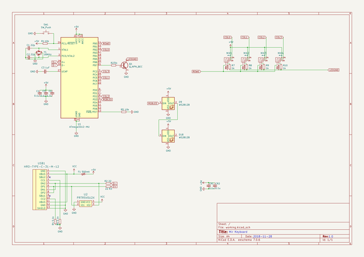

# voyager4
 
## summary 
* id: ai03_2725_voyager4_voyager4
* user: ai03_2725
* name: voyager4
* board: voyager4
* repo: https://github.com/ai03-2725/Voyager4
* src_file_repo_kicad_pcb: Voyager4.kicad_pcb
* src_file_repo_kicad_pcb_link: https://github.com/ai03-2725/Voyager4/tree/master/Voyager4.kicad_pcb

* src_file_repo_sch: 
* src_file_repo_sch_link: https://github.com/ai03-2725/Voyager4/tree/master/
* full details link: https://github.com/oomlout/oomlout_oomp_project_bot_v_2/tree/main/projects/ai03_2725_voyager4_voyager4/current_version/working  

## schematic  
  
[schematic (pdf)](working_schematic.pdf) 

## pcb  
 
  
  
  
[board (pdf)](working.pdf)  

## working_bom
| Id | Designator | Footprint | Quantity | Designation | Supplier and ref |  | None | 
| --- | --- | --- | --- | --- | --- | --- | --- | 
| 1 | MX1,MX2,MX3,MX4 | MX-1U | 4 | MX-1U |  |  | [''] | 
| 2 | C2,C1 | C_0603 | 2 | 22p |  |  | [''] | 
| 3 | C3 | C_0603 | 1 | 1uF |  |  | [''] | 
| 4 | C4,C5,CR1,CR2 | C_0603 | 4 | 0.1u |  |  | [''] | 
| 5 | C6 | C_0603 | 1 | 4.7u |  |  | [''] | 
| 6 | D9,D18 | LED_WS2812B-PLCC4 | 2 | WS2812B |  |  | [''] | 
| 7 | F1 | Fuse_SMD1206_Reflow | 1 | 500mA |  |  | [''] | 
| 8 | Q1 | SOT-23 | 1 | Q_NPN_BEC |  |  | [''] | 
| 9 | R1,R5 | R_0805 | 2 | 10k |  |  | [''] | 
| 10 | R2,R3 | R_0805 | 2 | 22 |  |  | [''] | 
| 11 | R4,R6 | R_0805 | 2 | 5.1k |  |  | [''] | 
| 12 | R7,R8,R9,R10,R27 | R_0805 | 5 | 1k |  |  | [''] | 
| 13 | U2 | SOT143B | 1 | PRTR5V0U2X |  |  | [''] | 
| 14 | USB1 | HRO-TYPE-C-31-M-12-Assembly | 1 | HRO-TYPE-C-31-M-12 |  |  | [''] | 
| 15 | Y1 | Crystal_SMD_3225-4pin_3.2x2.5mm | 1 | 16MHz |  |  | [''] | 
| 16 | U1 | QFN-32-1EP_5x5mm_Pitch0.5mm | 1 | ATmega32U2-MU |  |  | [''] | 

## bom_schematic
| Ref | Qnty | Value | Cmp name | Footprint | Description | Vendor | DNP | 
| --- | --- | --- | --- | --- | --- | --- | --- | 
| C1, C2 | 2 | 22p | C_Small | Capacitors_SMD:C_0603 | Unpolarized capacitor, small symbol |  |  | 
| C3 | 1 | 1uF | C_Small | Capacitors_SMD:C_0603 | Unpolarized capacitor, small symbol |  |  | 
| C4, C5 | 2 | 0.1u | C_Small | Capacitors_SMD:C_0603 | Unpolarized capacitor, small symbol |  |  | 
| C6 | 1 | 4.7u | C_Small | Capacitors_SMD:C_0603 | Unpolarized capacitor, small symbol |  |  | 
| CR1, CR2 | 2 | 0.1u | C_Small | Capacitors_SMD:C_0603 | Unpolarized capacitor, small symbol |  |  | 
| D9, D18 | 2 | WS2812B | WS2812B | LEDs:LED_WS2812B-PLCC4 | RGB LED with integrated controller |  |  | 
| F1 | 1 | 500mA | Polyfuse_Small | Fuse_Holders_and_Fuses:Fuse_SMD1206_Reflow | Resettable fuse, polymeric positive temperature coefficient, small symbol |  |  | 
| MX1, MX2, MX3, MX4 | 4 | MX-1U | MX-1U-MX_Alps_Hybrids | MX_Alps_Hybrid:MX-1U |  |  |  | 
| Q1 | 1 | Q_NPN_BEC | Q_NPN_BEC | TO_SOT_Packages_SMD:SOT-23 | NPN transistor, base/emitter/collector |  |  | 
| R1, R5 | 2 | 10k | R_Small | Resistors_SMD:R_0805 | Resistor, small symbol |  |  | 
| R2, R3 | 2 | 22 | R_Small | Resistors_SMD:R_0805 | Resistor, small symbol |  |  | 
| R4, R6 | 2 | 5.1k | R_Small | Resistors_SMD:R_0805 | Resistor, small symbol |  |  | 
| R7, R8, R9, R10, R27 | 5 | 1k | R_Small | Resistors_SMD:R_0805 | Resistor, small symbol |  |  | 
| SW1 | 1 | SW_Push | SW_Push | random-keyboard-parts:Jumper-UserFriendly-Small | Push button switch, generic, two pins |  |  | 
| U1 | 1 | ATmega32U2-MU | ATmega32U2-MU-MCU_Microchip_ATmega | Housings_DFN_QFN:QFN-32-1EP_5x5mm_Pitch0.5mm |  |  |  | 
| U2 | 1 | PRTR5V0U2X | PRTR5V0U2X | random-keyboard-parts:SOT143B |  |  |  | 
| USB1 | 1 | HRO-TYPE-C-31-M-12 | HRO-TYPE-C-31-M-12-Type-C | Type-C:HRO-TYPE-C-31-M-12-Assembly |  |  |  | 
| Y1 | 1 | 16MHz | Crystal_GND24_Small | Crystals:Crystal_SMD_3225-4pin_3.2x2.5mm | Four pin crystal, GND on pins 2 and 4, small symbol |  |  | 

