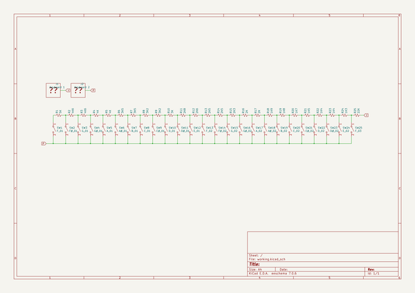
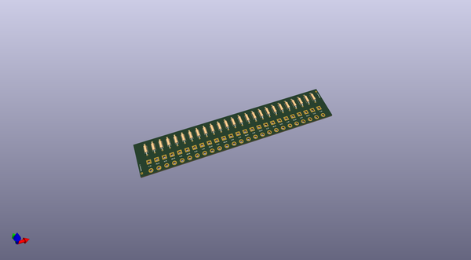
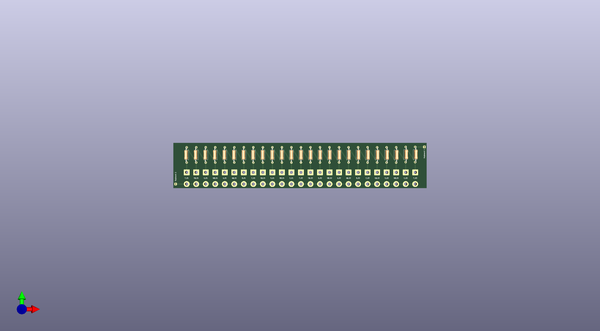
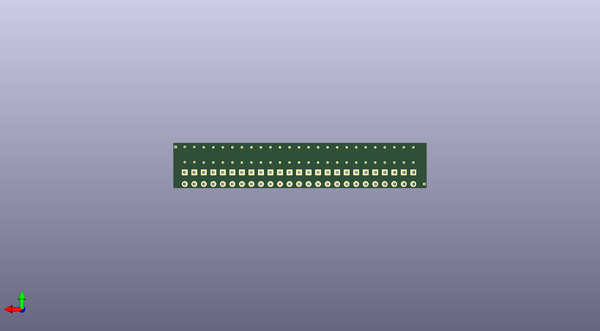

# 1979_mini_gan_pet_103
 
## summary 
* id: alasofia_1979_mini_gan_pet_103_pet103_001_keyboard
* user: alasofia
* name: 1979_mini_gan_pet_103
* board: pet103_001_keyboard
* repo: https://github.com/Alasofia/1979-MINI-GAN-PET-103
* src_file_repo_kicad_pcb: KiCad/PET103_001_Keyboard/PET103_001_Keyboard.kicad_pcb
* src_file_repo_kicad_pcb_link: https://github.com/Alasofia/1979-MINI-GAN-PET-103/tree/main/KiCad/PET103_001_Keyboard/PET103_001_Keyboard.kicad_pcb

* src_file_repo_sch: KiCad/PET103_001_Keyboard/PET103_001_Keyboard.sch
* src_file_repo_sch_link: https://github.com/Alasofia/1979-MINI-GAN-PET-103/tree/main/KiCad/PET103_001_Keyboard/PET103_001_Keyboard.sch
* full details link: https://github.com/oomlout/oomlout_oomp_project_bot_v_2/tree/main/projects/alasofia_1979_mini_gan_pet_103_pet103_001_keyboard/current_version/working  

## schematic  
  
[schematic (pdf)](working_schematic.pdf)  

## pcb  
 
  
  
  
[board (pdf)](working.pdf)  

## working_bom
| Id | Designator | Footprint | Quantity | Designation | Supplier and ref |  | None | 
| --- | --- | --- | --- | --- | --- | --- | --- | 
| 1 | R1 | R_Axial_DIN0207_L6.3mm_D2.5mm_P10.16mm_Horizontal | 1 | 5K |  |  | [''] | 
| 2 | R2,R3 | R_Axial_DIN0207_L6.3mm_D2.5mm_P10.16mm_Horizontal | 2 | 4K6 |  |  | [''] | 
| 3 | R4,R5 | R_Axial_DIN0207_L6.3mm_D2.5mm_P10.16mm_Horizontal | 2 | 4K |  |  | [''] | 
| 4 | R6,R7 | R_Axial_DIN0207_L6.3mm_D2.5mm_P10.16mm_Horizontal | 2 | 3K5 |  |  | [''] | 
| 5 | R8,R9 | R_Axial_DIN0207_L6.3mm_D2.5mm_P10.16mm_Horizontal | 2 | 3K2 |  |  | [''] | 
| 6 | R10 | R_Axial_DIN0207_L6.3mm_D2.5mm_P10.16mm_Horizontal | 1 | 3K |  |  | [''] | 
| 7 | R11 | R_Axial_DIN0207_L6.3mm_D2.5mm_P10.16mm_Horizontal | 1 | 2K8 |  |  | [''] | 
| 8 | R12 | R_Axial_DIN0207_L6.3mm_D2.5mm_P10.16mm_Horizontal | 1 | 2K6 |  |  | [''] | 
| 9 | R13,R14 | R_Axial_DIN0207_L6.3mm_D2.5mm_P10.16mm_Horizontal | 2 | 2K5 |  |  | [''] | 
| 10 | R15 | R_Axial_DIN0207_L6.3mm_D2.5mm_P10.16mm_Horizontal | 1 | 2K3 |  |  | [''] | 
| 11 | R16,R17 | R_Axial_DIN0207_L6.3mm_D2.5mm_P10.16mm_Horizontal | 2 | 2K |  |  | [''] | 
| 12 | R18 | R_Axial_DIN0207_L6.3mm_D2.5mm_P10.16mm_Horizontal | 1 | 1K9 |  |  | [''] | 
| 13 | R19 | R_Axial_DIN0207_L6.3mm_D2.5mm_P10.16mm_Horizontal | 1 | 1K8 |  |  | [''] | 
| 14 | R20 | R_Axial_DIN0207_L6.3mm_D2.5mm_P10.16mm_Horizontal | 1 | 1K7 |  |  | [''] | 
| 15 | R21 | R_Axial_DIN0207_L6.3mm_D2.5mm_P10.16mm_Horizontal | 1 | 1K5 |  |  | [''] | 
| 16 | R22,R23 | R_Axial_DIN0207_L6.3mm_D2.5mm_P10.16mm_Horizontal | 2 | 1K4 |  |  | [''] | 
| 17 | R24 | R_Axial_DIN0207_L6.3mm_D2.5mm_P10.16mm_Horizontal | 1 | 1K3 |  |  | [''] | 
| 18 | R25 | R_Axial_DIN0207_L6.3mm_D2.5mm_P10.16mm_Horizontal | 1 | 22K |  |  | [''] | 

## bom_schematic
| Ref | Qnty | Value | Cmp name | Footprint | Description | Vendor | DNP | 
| --- | --- | --- | --- | --- | --- | --- | --- | 
| R1 | 1 | 5K | R_Small_US | Resistor_THT:R_Axial_DIN0207_L6.3mm_D2.5mm_P10.16mm_Horizontal | Resistor, small US symbol |  |  | 
| R2, R3 | 2 | 4K6 | R_Small_US | Resistor_THT:R_Axial_DIN0207_L6.3mm_D2.5mm_P10.16mm_Horizontal | Resistor, small US symbol |  |  | 
| R4, R5 | 2 | 4K | R_Small_US | Resistor_THT:R_Axial_DIN0207_L6.3mm_D2.5mm_P10.16mm_Horizontal | Resistor, small US symbol |  |  | 
| R6, R7 | 2 | 3K5 | R_Small_US | Resistor_THT:R_Axial_DIN0207_L6.3mm_D2.5mm_P10.16mm_Horizontal | Resistor, small US symbol |  |  | 
| R8, R9 | 2 | 3K2 | R_Small_US | Resistor_THT:R_Axial_DIN0207_L6.3mm_D2.5mm_P10.16mm_Horizontal | Resistor, small US symbol |  |  | 
| R10 | 1 | 3K | R_Small_US | Resistor_THT:R_Axial_DIN0207_L6.3mm_D2.5mm_P10.16mm_Horizontal | Resistor, small US symbol |  |  | 
| R11 | 1 | 2K8 | R_Small_US | Resistor_THT:R_Axial_DIN0207_L6.3mm_D2.5mm_P10.16mm_Horizontal | Resistor, small US symbol |  |  | 
| R12 | 1 | 2K6 | R_Small_US | Resistor_THT:R_Axial_DIN0207_L6.3mm_D2.5mm_P10.16mm_Horizontal | Resistor, small US symbol |  |  | 
| R13, R14 | 2 | 2K5 | R_Small_US | Resistor_THT:R_Axial_DIN0207_L6.3mm_D2.5mm_P10.16mm_Horizontal | Resistor, small US symbol |  |  | 
| R15 | 1 | 2K3 | R_Small_US | Resistor_THT:R_Axial_DIN0207_L6.3mm_D2.5mm_P10.16mm_Horizontal | Resistor, small US symbol |  |  | 
| R16, R17 | 2 | 2K | R_Small_US | Resistor_THT:R_Axial_DIN0207_L6.3mm_D2.5mm_P10.16mm_Horizontal | Resistor, small US symbol |  |  | 
| R18 | 1 | 1K9 | R_Small_US | Resistor_THT:R_Axial_DIN0207_L6.3mm_D2.5mm_P10.16mm_Horizontal | Resistor, small US symbol |  |  | 
| R19 | 1 | 1K8 | R_Small_US | Resistor_THT:R_Axial_DIN0207_L6.3mm_D2.5mm_P10.16mm_Horizontal | Resistor, small US symbol |  |  | 
| R20 | 1 | 1K7 | R_Small_US | Resistor_THT:R_Axial_DIN0207_L6.3mm_D2.5mm_P10.16mm_Horizontal | Resistor, small US symbol |  |  | 
| R21 | 1 | 1K5 | R_Small_US | Resistor_THT:R_Axial_DIN0207_L6.3mm_D2.5mm_P10.16mm_Horizontal | Resistor, small US symbol |  |  | 
| R22, R23 | 2 | 1K4 | R_Small_US | Resistor_THT:R_Axial_DIN0207_L6.3mm_D2.5mm_P10.16mm_Horizontal | Resistor, small US symbol |  |  | 
| R24 | 1 | 1K3 | R_Small_US | Resistor_THT:R_Axial_DIN0207_L6.3mm_D2.5mm_P10.16mm_Horizontal | Resistor, small US symbol |  |  | 
| R25 | 1 | 22K | R_Small_US | Resistor_THT:R_Axial_DIN0207_L6.3mm_D2.5mm_P10.16mm_Horizontal | Resistor, small US symbol |  |  | 
| SW1 | 1 | F_01 | SW_SPST | Connector_Wire:SolderWire-1.5sqmm_1x02_P7.8mm_D1.7mm_OD3.9mm | Single Pole Single Throw (SPST) switch |  |  | 
| SW2 | 1 | F#_01 | SW_SPST | Connector_Wire:SolderWire-1.5sqmm_1x02_P7.8mm_D1.7mm_OD3.9mm | Single Pole Single Throw (SPST) switch |  |  | 
| SW3 | 1 | G_01 | SW_SPST | Connector_Wire:SolderWire-1.5sqmm_1x02_P7.8mm_D1.7mm_OD3.9mm | Single Pole Single Throw (SPST) switch |  |  | 
| SW4 | 1 | G#_01 | SW_SPST | Connector_Wire:SolderWire-1.5sqmm_1x02_P7.8mm_D1.7mm_OD3.9mm | Single Pole Single Throw (SPST) switch |  |  | 
| SW5 | 1 | A_01 | SW_SPST | Connector_Wire:SolderWire-1.5sqmm_1x02_P7.8mm_D1.7mm_OD3.9mm | Single Pole Single Throw (SPST) switch |  |  | 
| SW6 | 1 | A#_01 | SW_SPST | Connector_Wire:SolderWire-1.5sqmm_1x02_P7.8mm_D1.7mm_OD3.9mm | Single Pole Single Throw (SPST) switch |  |  | 
| SW7 | 1 | B_01 | SW_SPST | Connector_Wire:SolderWire-1.5sqmm_1x02_P7.8mm_D1.7mm_OD3.9mm | Single Pole Single Throw (SPST) switch |  |  | 
| SW8 | 1 | C_01 | SW_SPST | Connector_Wire:SolderWire-1.5sqmm_1x02_P7.8mm_D1.7mm_OD3.9mm | Single Pole Single Throw (SPST) switch |  |  | 
| SW9 | 1 | C#_01 | SW_SPST | Connector_Wire:SolderWire-1.5sqmm_1x02_P7.8mm_D1.7mm_OD3.9mm | Single Pole Single Throw (SPST) switch |  |  | 
| SW10 | 1 | D_01 | SW_SPST | Connector_Wire:SolderWire-1.5sqmm_1x02_P7.8mm_D1.7mm_OD3.9mm | Single Pole Single Throw (SPST) switch |  |  | 
| SW11 | 1 | D#_01 | SW_SPST | Connector_Wire:SolderWire-1.5sqmm_1x02_P7.8mm_D1.7mm_OD3.9mm | Single Pole Single Throw (SPST) switch |  |  | 
| SW12 | 1 | E_01 | SW_SPST | Connector_Wire:SolderWire-1.5sqmm_1x02_P7.8mm_D1.7mm_OD3.9mm | Single Pole Single Throw (SPST) switch |  |  | 
| SW13 | 1 | F_02 | SW_SPST | Connector_Wire:SolderWire-1.5sqmm_1x02_P7.8mm_D1.7mm_OD3.9mm | Single Pole Single Throw (SPST) switch |  |  | 
| SW14 | 1 | F#_02 | SW_SPST | Connector_Wire:SolderWire-1.5sqmm_1x02_P7.8mm_D1.7mm_OD3.9mm | Single Pole Single Throw (SPST) switch |  |  | 
| SW15 | 1 | G_02 | SW_SPST | Connector_Wire:SolderWire-1.5sqmm_1x02_P7.8mm_D1.7mm_OD3.9mm | Single Pole Single Throw (SPST) switch |  |  | 
| SW16 | 1 | G#_02 | SW_SPST | Connector_Wire:SolderWire-1.5sqmm_1x02_P7.8mm_D1.7mm_OD3.9mm | Single Pole Single Throw (SPST) switch |  |  | 
| SW17 | 1 | A_02 | SW_SPST | Connector_Wire:SolderWire-1.5sqmm_1x02_P7.8mm_D1.7mm_OD3.9mm | Single Pole Single Throw (SPST) switch |  |  | 
| SW18 | 1 | A#_02 | SW_SPST | Connector_Wire:SolderWire-1.5sqmm_1x02_P7.8mm_D1.7mm_OD3.9mm | Single Pole Single Throw (SPST) switch |  |  | 
| SW19 | 1 | B_02 | SW_SPST | Connector_Wire:SolderWire-1.5sqmm_1x02_P7.8mm_D1.7mm_OD3.9mm | Single Pole Single Throw (SPST) switch |  |  | 
| SW20 | 1 | C_02 | SW_SPST | Connector_Wire:SolderWire-1.5sqmm_1x02_P7.8mm_D1.7mm_OD3.9mm | Single Pole Single Throw (SPST) switch |  |  | 
| SW21 | 1 | C#_02 | SW_SPST | Connector_Wire:SolderWire-1.5sqmm_1x02_P7.8mm_D1.7mm_OD3.9mm | Single Pole Single Throw (SPST) switch |  |  | 
| SW22 | 1 | D_02 | SW_SPST | Connector_Wire:SolderWire-1.5sqmm_1x02_P7.8mm_D1.7mm_OD3.9mm | Single Pole Single Throw (SPST) switch |  |  | 
| SW23 | 1 | D#_02 | SW_SPST | Connector_Wire:SolderWire-1.5sqmm_1x02_P7.8mm_D1.7mm_OD3.9mm | Single Pole Single Throw (SPST) switch |  |  | 
| SW24 | 1 | E_02 | SW_SPST | Connector_Wire:SolderWire-1.5sqmm_1x02_P7.8mm_D1.7mm_OD3.9mm | Single Pole Single Throw (SPST) switch |  |  | 
| SW25 | 1 | F_03 | SW_SPST | Connector_Wire:SolderWire-1.5sqmm_1x02_P7.8mm_D1.7mm_OD3.9mm | Single Pole Single Throw (SPST) switch |  |  | 

