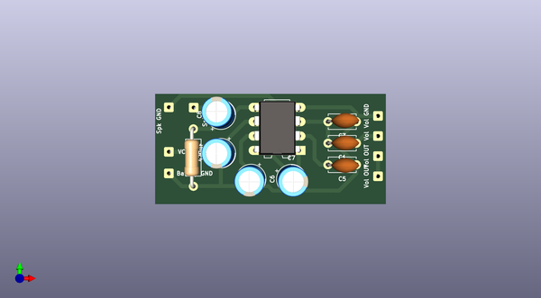

# 1979_mini_gan_pet_103
 
## summary 
* id: alasofia_1979_mini_gan_pet_103_pet103_003_onlyamp
* user: alasofia
* name: 1979_mini_gan_pet_103
* board: pet103_003_onlyamp
* repo: https://github.com/Alasofia/1979-MINI-GAN-PET-103
* src_file_repo_kicad_pcb: KiCad/PET103_003_ONLYAMP/PET103_003_ONLYAMP.kicad_pcb
* src_file_repo_kicad_pcb_link: https://github.com/Alasofia/1979-MINI-GAN-PET-103/tree/main/KiCad/PET103_003_ONLYAMP/PET103_003_ONLYAMP.kicad_pcb

* src_file_repo_sch: KiCad/PET103_003_ONLYAMP/PET103_003_ONLYAMP.sch
* src_file_repo_sch_link: https://github.com/Alasofia/1979-MINI-GAN-PET-103/tree/main/KiCad/PET103_003_ONLYAMP/PET103_003_ONLYAMP.sch
* full details link: https://github.com/oomlout/oomlout_oomp_project_bot_v_2/tree/main/projects/alasofia_1979_mini_gan_pet_103_pet103_003_onlyamp/current_version/working  

## schematic  
  
[schematic (pdf)](working_schematic.pdf) 

## pcb  
 
  
  
  
[board (pdf)](working.pdf)  

## working_bom
| Id | Designator | Footprint | Quantity | Designation | Supplier and ref |  | None | 
| --- | --- | --- | --- | --- | --- | --- | --- | 
| 1 | C1,C5 | C_Disc_D4.7mm_W2.5mm_P5.00mm | 2 | 0.27µF |  |  | [''] | 
| 2 | C3 | C_Disc_D4.7mm_W2.5mm_P5.00mm | 1 | 47pF |  |  | [''] | 
| 3 | C6,C7 | CP_Radial_D5.0mm_P2.50mm | 2 | 10µF |  |  | [''] | 
| 4 | C8,C2 | CP_Radial_D5.0mm_P2.50mm | 2 | 470µF |  |  | [''] | 
| 5 | R1 | R_Axial_DIN0207_L6.3mm_D2.5mm_P10.16mm_Horizontal | 1 | 100Ω |  |  | [''] | 
| 6 | U2 | DIP-8_W7.62mm_LongPads | 1 | LM386 |  |  | [''] | 

## bom_schematic
no data

