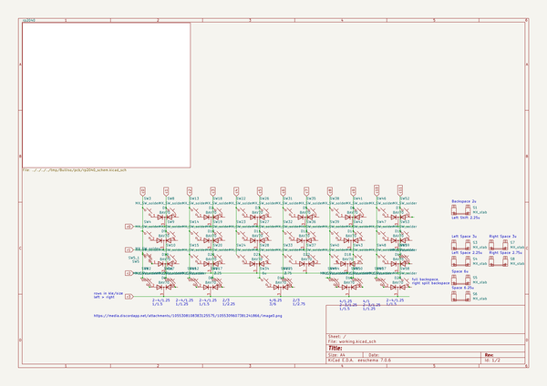
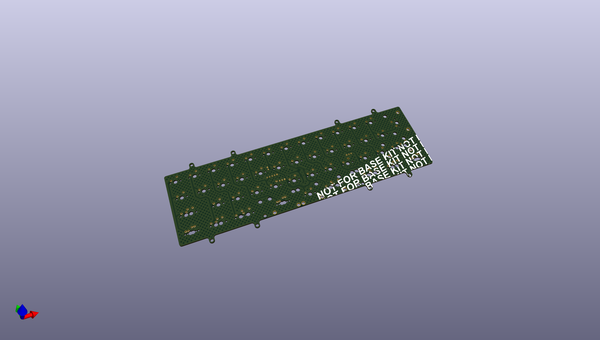
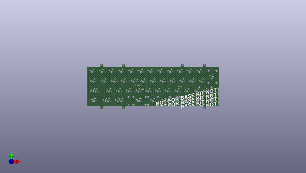
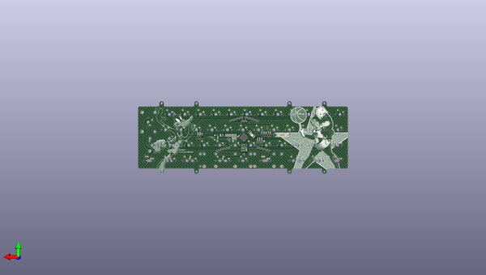

# bulliso
 
## summary 
* id: alasofia_bulliso_pcb
* user: alasofia
* name: bulliso
* board: pcb
* repo: https://github.com/Alasofia/BullIso
* src_file_repo_kicad_pcb: pcb/pcb.kicad_pcb
* src_file_repo_kicad_pcb_link: https://github.com/Alasofia/BullIso/tree/main/pcb/pcb.kicad_pcb
* src_file_repo_kicad_sch: pcb/pcb.kicad_sch
* src_file_repo_kicad_sch_link: https://github.com/Alasofia/BullIso/tree/main/pcb/pcb.kicad_sch

* src_file_repo_sch: 
* src_file_repo_sch_link: https://github.com/Alasofia/BullIso/tree/main/
* full details link: https://github.com/oomlout/oomlout_oomp_project_bot_v_2/tree/main/projects/alasofia_bulliso_pcb/current_version/working  

## schematic  
  
[schematic (pdf)](working_schematic.pdf)  

## pcb  
 
  
  
  
[board (pdf)](working.pdf)  

## working_bom
| Id | Designator | Footprint | Quantity | Designation | Supplier and ref |  | None | 
| --- | --- | --- | --- | --- | --- | --- | --- | 
| 1 | SW10,SW48,SW49,SW41,SW57,SW8,SW60,SW55,SW59,SW15,SW36,SW33,SW6,SW31,SW7,SW13,SW5,SW16,SW24,SW23,SW46,SW26,SW43,SW37,SW50,SW2,SW47,SW35,SW42,SW5_1,SW32,SW19,SW4,SW40,SW9,SW52,SW12,SW61,SW39,SW53,SW27,SW22,SW20,SW38,SW44,SW28,SW18,SW14,SW3,SW11,SW58 | SW_MX_1u | 51 | MX_SW_solder |  |  | [''] | 
| 2 | SW25 | SW_MX_1u | 1 | 2.75 |  |  | [''] | 
| 3 | SW21,SW29 | SW_MX_1u | 2 | 3 |  |  | [''] | 
| 4 | S5 | STAB_MX_6u | 1 | MX_stab |  |  | [''] | 
| 5 | S8 | STAB_MX_P_2.75u | 1 | MX_stab |  |  | [''] | 
| 6 | S4 | STAB_MX_P_2.25u | 1 | MX_stab |  |  | [''] | 
| 7 | S7,S3 | STAB_MX_P_3u | 2 | MX_stab |  |  | [''] | 
| 8 | S6 | STAB_MX_6.25u | 1 | MX_stab |  |  | [''] | 
| 9 | SW34 | SW_MX_1u | 1 | 6u |  |  | [''] | 
| 10 | S1 | STAB_MX_P_2u | 1 | MX_stab |  |  | [''] | 
| 11 | SW17 | SW_MX_1u | 1 | 2.25 |  |  | [''] | 
| 12 | SW9999 | SW_SPST_TL3342 | 1 | RESET  |  |  | [''] | 
| 13 | J3 | JST-SR-4 | 1 | Conn_01x04_Female |  |  | [''] | 
| 14 | D2,D8,D18,D15,D22,D6,D14,D9,D11,D23,D1,D17,D10,D5,D12,D3,D20,D16,D7,D21,D19,D13,D4 | SOT-23 | 23 | BAV70 |  |  | [''] | 
| 15 | C5,C7,C11,C9,C6,C13,C12,C14 | C_0805_2012Metric | 8 | 100n |  |  | [''] | 
| 16 | C10,C8 | C_0805_2012Metric | 2 | 1u |  |  | [''] | 
| 17 | J2 | PinSocket_1x03_P2.54mm_Vertical | 1 | Conn_01x03_Male |  |  | [''] | 
| 18 | R8 | R_0805_2012Metric | 1 | 10k |  |  | [''] | 
| 19 | U4 | SOT-23 | 1 | XC6206P Smaller footprint, less mA ~.5 |  |  | [''] | 
| 20 | C17,C1,C4 | C_0805_2012Metric | 3 | 10u |  |  | [''] | 
| 21 | Y0 | Crystal_SMD_3225-4Pin_3.2x2.5mm | 1 | 12MHZ Crystal  |  |  | [''] | 
| 22 | U3 | RP2040-QFN-56 | 1 | RP2040 |  |  | [''] | 
| 23 | R3,R4 | R_0805_2012Metric | 2 | 27 |  |  | [''] | 
| 24 | C2,C3 | C_0805_2012Metric | 2 | 22pf |  |  | [''] | 
| 25 | R5,R1 | R_0805_2012Metric | 2 | 1k |  |  | [''] | 
| 26 | J4 | PinHeader_1x03_P2.54mm_Vertical | 1 | 3x Breakout | additional pins |  |  | [''] | 
| 27 | J1 | PinSocket_1x05_P2.54mm_Vertical | 1 | BREAKOUT |  |  | [''] | 
| 28 | U2 | SOIC-8_5.23x5.23mm_P1.27mm | 1 | W25Q128JVS |  |  | [''] | 
| 29 | J5 | PinHeader_1x02_P2.54mm_Vertical | 1 | Breakout 1.1v |  |  | [''] | 
| 30 | SW9998 | SW_SPST_TL3342 | 1 | RESET |  |  | [''] | 

## bom_schematic
| Ref | Qnty | Value | Cmp name | Footprint | Description | Vendor | DNP | 
| --- | --- | --- | --- | --- | --- | --- | --- | 
| D1, D2, D3, D4, D5, D6, D7, D8, D9, D10, D11, D12, D13, D14, D15, D16, D17, D18, D19, D20, D21, D22, D23 | 23 | BAV70 | BAV70 | Package_TO_SOT_SMD:SOT-23 | Dual 100V 215mA high-speed switching diodes, common cathode, SOT-23 |  |  | 
| S1 | 1 | MX_stab | MX_stab | marbastlib-mx:STAB_MX_P_2u | Cherry MX-style stabilizer |  |  | 
| S3, S7 | 2 | MX_stab | MX_stab | marbastlib-mx:STAB_MX_P_3u | Cherry MX-style stabilizer |  |  | 
| S4 | 1 | MX_stab | MX_stab | marbastlib-mx:STAB_MX_P_2.25u | Cherry MX-style stabilizer |  |  | 
| S5 | 1 | MX_stab | MX_stab | marbastlib-mx:STAB_MX_6u | Cherry MX-style stabilizer |  |  | 
| S6 | 1 | MX_stab | MX_stab | marbastlib-mx:STAB_MX_6.25u | Cherry MX-style stabilizer |  |  | 
| S8 | 1 | MX_stab | MX_stab | marbastlib-mx:STAB_MX_P_2.75u | Cherry MX-style stabilizer |  |  | 
| SW2, SW3, SW4, SW5, SW6, SW7, SW8, SW9, SW10, SW11, SW12, SW13, SW14, SW15, SW16, SW18, SW19, SW20, SW22, SW23, SW24, SW26, SW27, SW28, SW31, SW32, SW33, SW35, SW36, SW37, SW38, SW39, SW40, SW41, SW42, SW43, SW44, SW46, SW47, SW48, SW49, SW50, SW52, SW53, SW55, SW57, SW58, SW59, SW60, SW61 | 50 | MX_SW_solder | MX_SW_solder | marbastlib-mx:SW_MX_1u | Push button switch, normally open, two pins, 45° tilted |  |  | 
| SW5_1 | 1 | MX_SW_solder | MX_SW_solder | marbastlib-mx:SW_MX_1u | Push button switch, normally open, two pins, 45° tilted |  |  | 
| SW17 | 1 | 2.25 | MX_SW_solder | marbastlib-mx:SW_MX_1u | Push button switch, normally open, two pins, 45° tilted |  |  | 
| SW21, SW29 | 2 | 3 | MX_SW_solder | marbastlib-mx:SW_MX_1u | Push button switch, normally open, two pins, 45° tilted |  |  | 
| SW25 | 1 | 2.75 | MX_SW_solder | marbastlib-mx:SW_MX_1u | Push button switch, normally open, two pins, 45° tilted |  |  | 
| SW34 | 1 | 6u | MX_SW_solder | marbastlib-mx:SW_MX_1u | Push button switch, normally open, two pins, 45° tilted |  |  | 

