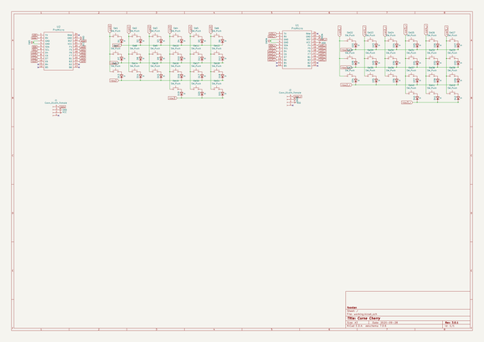
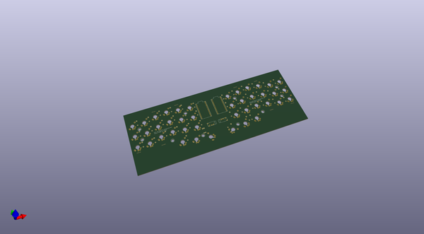
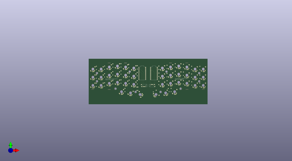
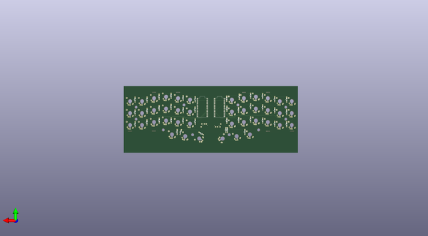

# funky_cornes
 
## summary 
* id: alasofia_funky_cornes_mxmlp_corne
* user: alasofia
* name: funky_cornes
* board: mxmlp_corne
* repo: https://github.com/Alasofia/Funky-Cornes
* src_file_repo_kicad_pcb: MXMLP/MXMLP-Corne.kicad_pcb
* src_file_repo_kicad_pcb_link: https://github.com/Alasofia/Funky-Cornes/tree/master/MXMLP/MXMLP-Corne.kicad_pcb

* src_file_repo_sch: MXMLP/MXMLP-Corne.sch
* src_file_repo_sch_link: https://github.com/Alasofia/Funky-Cornes/tree/master/MXMLP/MXMLP-Corne.sch
* full details link: https://github.com/oomlout/oomlout_oomp_project_bot_v_2/tree/main/projects/alasofia_funky_cornes_mxmlp_corne/current_version/working  

## schematic  
  
[schematic (pdf)](working_schematic.pdf) 

## pcb  
 
  
  
  
[board (pdf)](working.pdf)  

## working_bom
| Id | Designator | Footprint | Quantity | Designation | Supplier and ref |  | None | 
| --- | --- | --- | --- | --- | --- | --- | --- | 
| 1 | D1,D2,D3,D4,D5,D7,D8,D9,D10,D11,D12,D13,D14,D15,D16,D17,D18,D19,D20,D21,D23,D24,D25,D27,D29,D30,D31,D32,D33,D34,D35,D36,D37,D38,D39,D40,D41,D42,D22,D6,D28,D26 | Diode-Hybrid-Back | 42 | D |  |  | [''] | 
| 2 | SW2,SW3,SW4,SW5,SW7,SW8,SW9,SW10,SW11,SW12,SW13,SW14,SW15,SW16,SW17,SW18,SW19,SW20,SW21,SW42,SW37,SW38,SW39,SW40,SW41,SW25,SW26,SW28,SW24,SW29,SW35,SW36,SW22,SW23,SW30,SW31,SW32,SW33,SW34,SW1,SW6,SW27 | MXMountLP-1U | 42 | SW_Push |  |  | [''] | 
| 3 | U4,U4,U4,U4,U4,U4,U4,U4,U4,U4 | MountingHole | 10 | HOLE |  |  | [''] | 
| 4 | J1,J2 | TRRS-PJ-320A | 2 | Conn_01x04_Female |  |  | [''] | 
| 5 | REF**,REF**,REF**,REF**,REF**,REF**,REF**,REF** | breakaway-mousebites | 8 | breakaway-mousebites |  |  | [''] | 
| 6 | U1,U2 | ProMicro | 2 | ProMicro |  |  | [''] | 

## bom_schematic
| Ref | Qnty | Value | Cmp name | Footprint | Description | Vendor | DNP | 
| --- | --- | --- | --- | --- | --- | --- | --- | 
| D1, D2, D3, D4, D5, D6, D7, D8, D9, D10, D11, D12, D13, D14, D15, D16, D17, D18, D19, D20, D21, D22, D23, D24, D25, D26, D27, D28, D29, D30, D31, D32, D33, D34, D35, D36, D37, D38, D39, D40, D41, D42 | 42 | D | D | Keebio-Parts:Diode-Hybrid-Back | Diode |  |  | 
| J1, J2 | 2 | Conn_01x04_Female | Conn_01x04_Female-Connector | Keebio-Parts:TRRS-PJ-320A |  |  |  | 
| SW1, SW2, SW3, SW4, SW5, SW6, SW7, SW8, SW9, SW10, SW11, SW12, SW13, SW14, SW15, SW16, SW17, SW18, SW19, SW20, SW21, SW22, SW23, SW24, SW25, SW26, SW27, SW28, SW29, SW30, SW31, SW32, SW33, SW34, SW35, SW36, SW37, SW38, SW39, SW40, SW41, SW42 | 42 | SW_Push | SW_Push | MXMountLP:MXMountLP-1U | Push button switch, generic, two pins |  |  | 
| U1, U2 | 2 | ProMicro | ProMicro | promicro:ProMicro |  |  |  | 

## mounting_holes
| x | y | package | value | ref | size | 
| --- | --- | --- | --- | --- | --- | 
| 0.0 | 24.87 | MountingHole | HOLE | U4 | m3 | 
| 0.0 | 43.86 | MountingHole | HOLE | U4 | m3 | 
| 75.97 | 47.38 | MountingHole | HOLE | U4 | m3 | 
| 43.16 | 7.62 | MountingHole | HOLE | U4 | m3 | 
| 89.72 | 0.01 | MountingHole | HOLE | U4 | m3 | 
| 194.35 | 7.61 | MountingHole | HOLE | U4 | m3 | 
| 161.54 | 47.37 | MountingHole | HOLE | U4 | m3 | 
| 237.49 | 43.88 | MountingHole | HOLE | U4 | m3 | 
| 237.49 | 24.88 | MountingHole | HOLE | U4 | m3 | 
| 147.78 | 0.0 | MountingHole | HOLE | U4 | m3 | 

