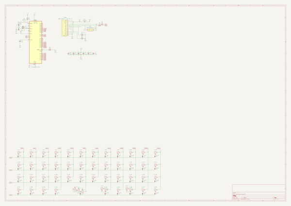
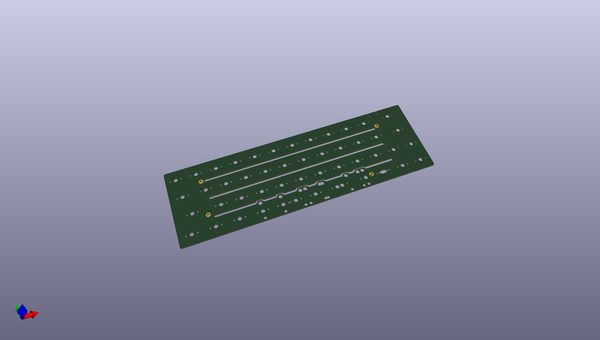
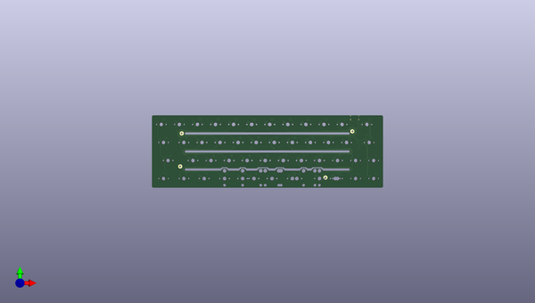
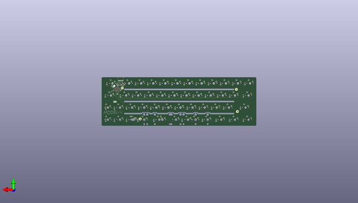

# model_v
 
## summary 
* id: alasofia_model_v_model_v
* user: alasofia
* name: model_v
* board: model_v
* repo: https://github.com/Alasofia/model-v
* src_file_repo_kicad_pcb: model-v.kicad_pcb
* src_file_repo_kicad_pcb_link: https://github.com/Alasofia/model-v/tree/main/model-v.kicad_pcb

* src_file_repo_sch: 
* src_file_repo_sch_link: https://github.com/Alasofia/model-v/tree/main/
* full details link: https://github.com/oomlout/oomlout_oomp_project_bot_v_2/tree/main/projects/alasofia_model_v_model_v/current_version/working  

## schematic  
  
[schematic (pdf)](working_schematic.pdf) 

## pcb  
 
  
  
  
[board (pdf)](working.pdf)  

## working_bom
| Id | Designator | Footprint | Quantity | Designation | Supplier and ref |  | None | 
| --- | --- | --- | --- | --- | --- | --- | --- | 
| 1 | K_42 | MXOnly-2.25U-ReversedStabilizers-NoLED | 1 | KEYSW |  |  | [''] | 
| 2 | K_37,K_13,K_47,K_39 | MXOnly-1.25U-NoLED | 4 | KEYSW |  |  | [''] | 
| 3 | K_6,K_32,K_50,K_48,K_18,K_31,K_20,K_22,K_33,K_30,K_7,K_15,K_17,K_49,K_26,K_36,K_8,K_2,K_11,K_5,K_9,K_1,K_10,K_16,K_14,K_35,K_34,K_46,K_40,K_28,K_3,K_38,K_29,K_21,K_27,K_23,K_19,K_4 | MXOnly-1U-NoLED | 38 | KEYSW |  |  | [''] | 
| 4 | K_44 | MXOnly-2U-ReversedStabilizers-NoLED | 1 | KEYSW |  |  | [''] | 
| 5 | K_12,K_25 | MXOnly-1.75U-NoLED | 2 | KEYSW |  |  | [''] | 
| 6 | K_41,K_45 | MXOnly-3U-ReversedStabilizers-NoLED | 2 | KEYSW |  |  | [''] | 
| 7 | K_24 | MXOnly-1.5U-NoLED | 1 | KEYSW |  |  | [''] | 
| 8 | K_43 | MXOnly-6.25U-ReversedStabilizers-NoLED | 1 | KEYSW |  |  | [''] | 
| 9 | SW1 | SW_Push_SPST_NO_Alps_SKRK | 1 | SW_Push |  |  | [''] | 
| 10 | D_12,D_36,D_46,D_44,D_14,D_20,D_10,D_22,D_13,D_38,D_33,D_45,D_6,D_32,D_2,D_39,D_11,D_37,D_30,D_27,D_18,D_24,D_42,D_17,D_23,D_41,D_9,D_8,D_29,D_31,D_15,D_16,D_1,D_3,D_28,D_7,D_4,D_5,D_19,D_34,D_25,D_21,D_43,D_35,D_40,D_26 | D_SOD-123 | 46 | D |  |  | [''] | 
| 11 | F1 | Fuse_1206_3216Metric | 1 | 500mA |  |  | [''] | 
| 12 | U2 | SOT143B | 1 | PRTR5V0U2X |  |  | [''] | 
| 13 | USB1 | HRO-TYPE-C-31-M-12-Assembly | 1 | HRO-TYPE-C-31-M-12 |  |  | [''] | 
| 14 | R4,R3 | R_0603_1608Metric | 2 | 22 |  |  | [''] | 
| 15 | R2,R1 | R_0603_1608Metric | 2 | 5.1k |  |  | [''] | 
| 16 | C2,C3,C4,C5,C6 | C_0603_1608Metric | 5 | 0.1uF |  |  | [''] | 
| 17 | C7 | C_0603_1608Metric | 1 | 1uF |  |  | [''] | 
| 18 | C8,C9 | C_0603_1608Metric | 2 | 22pF |  |  | [''] | 
| 19 | Y1 | Crystal_SMD_3225-4Pin_3.2x2.5mm | 1 | 16MHz |  |  | [''] | 
| 20 | U1 | QFN-44-1EP_7x7mm_P0.5mm_EP5.2x5.2mm | 1 | ATmega32U4-MU |  |  | [''] | 
| 21 | C1 | C_0603_1608Metric | 1 | 10uF |  |  | [''] | 
| 22 | R5,R6 | R_0603_1608Metric | 2 | 10k |  |  | [''] | 
| 23 | G*** | model-v | 1 | LOGO |  |  | [''] | 

## bom_schematic
| Ref | Qnty | Value | Cmp name | Footprint | Description | Vendor | DNP | 
| --- | --- | --- | --- | --- | --- | --- | --- | 
| C1 | 1 | 10uF | C_Small | Capacitor_SMD:C_0603_1608Metric | Unpolarized capacitor, small symbol |  |  | 
| C2, C3, C4, C5, C6 | 5 | 0.1uF | C_Small | Capacitor_SMD:C_0603_1608Metric | Unpolarized capacitor, small symbol |  |  | 
| C7 | 1 | 1uF | C_Small | Capacitor_SMD:C_0603_1608Metric | Unpolarized capacitor, small symbol |  |  | 
| C8, C9 | 2 | 22pF | C_Small | Capacitor_SMD:C_0603_1608Metric | Unpolarized capacitor, small symbol |  |  | 
| D_1, D_2, D_3, D_4, D_5, D_6, D_7, D_8, D_9, D_10, D_11, D_12, D_13, D_14, D_15, D_16, D_17, D_18, D_19, D_20, D_21, D_22, D_23, D_24, D_25, D_26, D_27, D_28, D_29, D_30, D_31, D_32, D_33, D_34, D_35, D_36, D_37, D_38, D_39, D_40, D_41, D_42, D_43, D_44, D_45, D_46 | 46 | D | D_Small | Diode_SMD:D_SOD-123 | Diode, small symbol |  |  | 
| F1 | 1 | 500mA | Polyfuse_Small | Fuse:Fuse_1206_3216Metric | Resettable fuse, polymeric positive temperature coefficient, small symbol |  |  | 
| K_1, K_2, K_3, K_4, K_5, K_6, K_7, K_8, K_9, K_10, K_11, K_14, K_15, K_16, K_17, K_18, K_19, K_20, K_21, K_22, K_23, K_26, K_27, K_28, K_29, K_30, K_31, K_32, K_33, K_34, K_35, K_36, K_38, K_40, K_46, K_48, K_49, K_50 | 38 | KEYSW | MX-NoLED | MX_Only:MXOnly-1U-NoLED |  |  |  | 
| K_12, K_25 | 2 | KEYSW | MX-NoLED | MX_Only:MXOnly-1.75U-NoLED |  |  |  | 
| K_13, K_37, K_39, K_47 | 4 | KEYSW | MX-NoLED | MX_Only:MXOnly-1.25U-NoLED |  |  |  | 
| K_24 | 1 | KEYSW | MX-NoLED | MX_Only:MXOnly-1.5U-NoLED |  |  |  | 
| K_41, K_45 | 2 | KEYSW | MX-NoLED | MX_Only:MXOnly-3U-ReversedStabilizers-NoLED |  |  |  | 
| K_42 | 1 | KEYSW | MX-NoLED | MX_Only:MXOnly-2.25U-ReversedStabilizers-NoLED |  |  |  | 
| K_43 | 1 | KEYSW | MX-NoLED | MX_Only:MXOnly-6.25U-ReversedStabilizers-NoLED |  |  |  | 
| K_44 | 1 | KEYSW | MX-NoLED | MX_Only:MXOnly-2U-ReversedStabilizers-NoLED |  |  |  | 
| R1, R2 | 2 | 5.1k | R_Small | Resistor_SMD:R_0603_1608Metric | Resistor, small symbol |  |  | 
| R3, R4 | 2 | 22 | R_Small | Resistor_SMD:R_0603_1608Metric | Resistor, small symbol |  |  | 
| R5, R6 | 2 | 10k | R_Small | Resistor_SMD:R_0603_1608Metric | Resistor, small symbol |  |  | 
| SW1 | 1 | SW_Push | SW_Push | Button_Switch_SMD:SW_Push_SPST_NO_Alps_SKRK | Push button switch, generic, two pins |  |  | 
| U1 | 1 | ATmega32U4-MU | ATmega32U4-MU-MCU_Microchip_ATmega | Package_DFN_QFN:QFN-44-1EP_7x7mm_P0.5mm_EP5.2x5.2mm |  |  |  | 
| U2 | 1 | PRTR5V0U2X | PRTR5V0U2X | random-keyboard-parts:SOT143B |  |  |  | 
| USB1 | 1 | HRO-TYPE-C-31-M-12 | HRO-TYPE-C-31-M-12 | Type-C:HRO-TYPE-C-31-M-12-Assembly |  |  |  | 
| Y1 | 1 | 16MHz | Crystal_GND24_Small | Crystal:Crystal_SMD_3225-4Pin_3.2x2.5mm | Four pin crystal, GND on pins 2 and 4, small symbol |  |  | 

