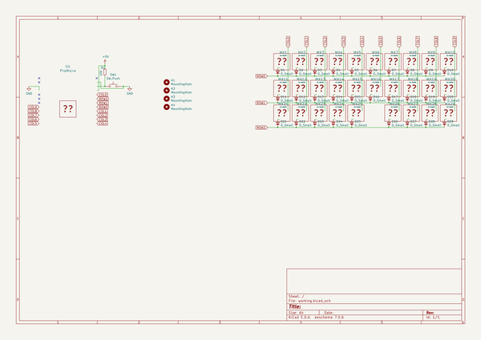
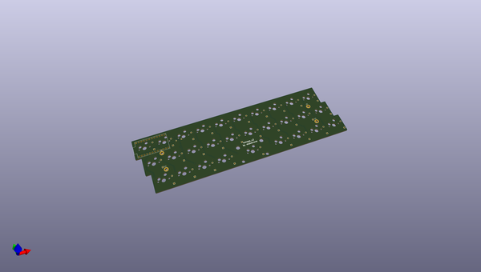
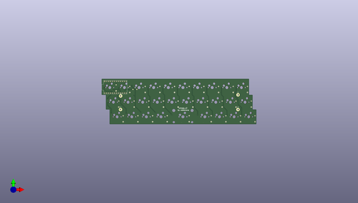
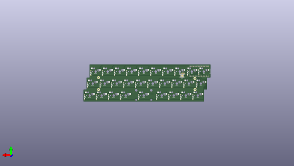

# omega
 
## summary 
* id: alasofia_omega_omega
* user: alasofia
* name: omega
* board: omega
* repo: https://github.com/Alasofia/omega
* src_file_repo_kicad_pcb: omega_hotswap/omega.kicad_pcb
* src_file_repo_kicad_pcb_link: https://github.com/Alasofia/omega/tree/master/omega_hotswap/omega.kicad_pcb

* src_file_repo_sch: omega_hotswap/omega.sch
* src_file_repo_sch_link: https://github.com/Alasofia/omega/tree/master/omega_hotswap/omega.sch
* full details link: https://github.com/oomlout/oomlout_oomp_project_bot_v_2/tree/main/projects/alasofia_omega_omega/current_version/working  

## schematic  
  
[schematic (pdf)](working_schematic.pdf)  

## pcb  
 
  
  
  
[board (pdf)](working.pdf)  

## working_bom
| Id | Designator | Footprint | Quantity | Designation | Supplier and ref |  | None | 
| --- | --- | --- | --- | --- | --- | --- | --- | 
| 1 | D1,D7,D8,D9,D12,D13,D14,D15,D16,D17,D18,D19,D20,D21,D22,D23,D25,D26,D27,D28,D29,D24,D10,D6,D5,D4,D3,D2,D11 | Diode-Hybrid-Back | 29 | D_Small |  |  | [''] | 
| 2 | MX1,MX2,MX4,MX5,MX6,MX7,MX8,MX9,MX10,MX11,MX12,MX13,MX14,MX15,MX16,MX17,MX18,MX19,MX20,MX21,MX22,MX23,MX24,MX26,MX27,MX28,MX29,MX3 | MXOnly-1U-Hotswap | 28 | MX-NoLED |  |  | [''] | 
| 3 | MX25 | MXOnly-2U-Hotswap-ReversedStabilizers | 1 | MX-NoLED |  |  | [''] | 
| 4 | R1 | R_Axial_DIN0204_L3.6mm_D1.6mm_P5.08mm_Horizontal | 1 | 10k |  |  | [''] | 
| 5 | SW1 | SKQG-1155865 | 1 | SW_Push |  |  | [''] | 
| 6 | U1 | ProMicro | 1 | ProMicro |  |  | [''] | 

## bom_schematic
| Ref | Qnty | Value | Cmp name | Footprint | Description | Vendor | DNP | 
| --- | --- | --- | --- | --- | --- | --- | --- | 
| D1, D2, D3, D4, D5, D6, D7, D8, D9, D10, D11, D12, D13, D14, D15, D16, D17, D18, D19, D20, D21, D22, D23, D24, D25, D26, D27, D28, D29 | 29 | D_Small | D_Small | Keebio-Parts:Diode-Hybrid-Back | Diode, small symbol |  |  | 
| H1, H2, H3, H4 | 4 | MountingHole | MountingHole | MountingHole:MountingHole_2.2mm_M2_Pad | Mounting Hole without connection |  |  | 
| R1 | 1 | 10k | R_Small | Resistor_THT:R_Axial_DIN0204_L3.6mm_D1.6mm_P5.08mm_Horizontal | Resistor, small symbol |  |  | 
| SW1 | 1 | SW_Push | SW_Push | random-keyboard-parts:SKQG-1155865 | Push button switch, generic, two pins |  |  | 

