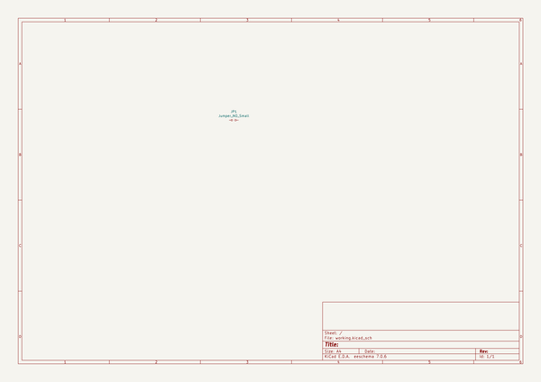
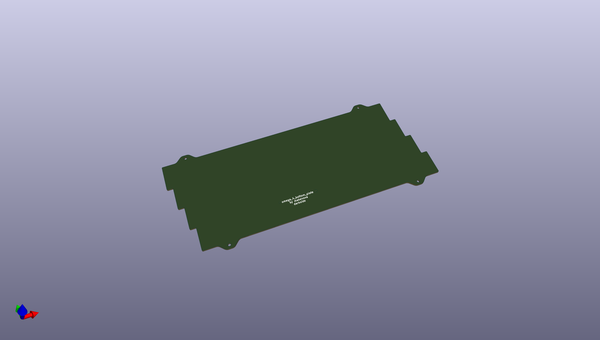
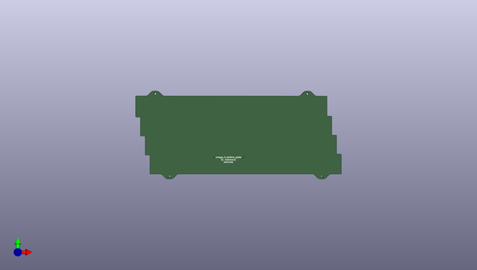
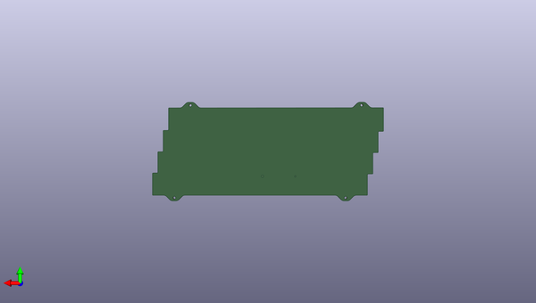

# omega
 
## summary 
* id: alasofia_omega_omega_4_skeleton_bottom
* user: alasofia
* name: omega
* board: omega_4_skeleton_bottom
* repo: https://github.com/Alasofia/omega
* src_file_repo_kicad_pcb: omega_soldered/omega_4_skeleton_bottom.kicad_pcb
* src_file_repo_kicad_pcb_link: https://github.com/Alasofia/omega/tree/master/omega_soldered/omega_4_skeleton_bottom.kicad_pcb

* src_file_repo_sch: omega_soldered/omega_4_skeleton_bottom.sch
* src_file_repo_sch_link: https://github.com/Alasofia/omega/tree/master/omega_soldered/omega_4_skeleton_bottom.sch
* full details link: https://github.com/oomlout/oomlout_oomp_project_bot_v_2/tree/main/projects/alasofia_omega_omega_4_skeleton_bottom/current_version/working  

## schematic  
  
[schematic (pdf)](working_schematic.pdf)  

## pcb  
 
  
  
  
[board (pdf)](working.pdf)  

## bom_schematic
| Ref | Qnty | Value | Cmp name | Footprint | Description | Vendor | DNP | 
| --- | --- | --- | --- | --- | --- | --- | --- | 
| JP1 | 1 | Jumper_NO_Small | Jumper_NO_Small-Device | Keebio-Parts:solder_jumper |  |  |  | 

