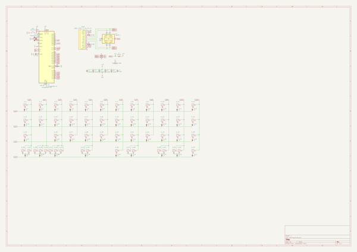
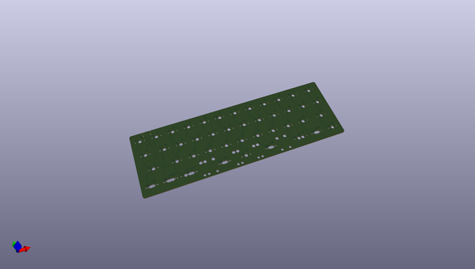
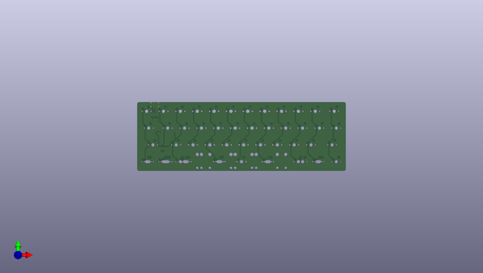
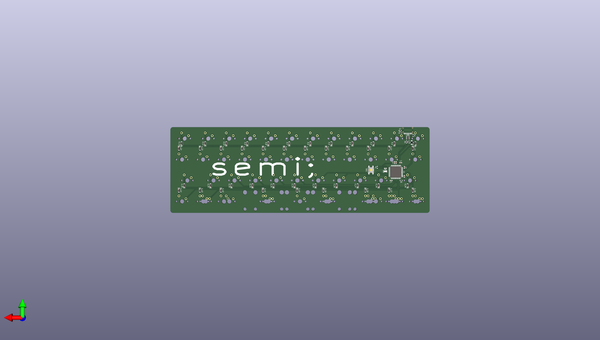

# semi
 
## summary 
* id: alasofia_semi_semi
* user: alasofia
* name: semi
* board: semi
* repo: https://github.com/Alasofia/semi
* src_file_repo_kicad_pcb: semi.kicad_pcb
* src_file_repo_kicad_pcb_link: https://github.com/Alasofia/semi/tree/main/semi.kicad_pcb
* src_file_repo_kicad_sch: semi.kicad_sch
* src_file_repo_kicad_sch_link: https://github.com/Alasofia/semi/tree/main/semi.kicad_sch

* src_file_repo_sch: 
* src_file_repo_sch_link: https://github.com/Alasofia/semi/tree/main/
* full details link: https://github.com/oomlout/oomlout_oomp_project_bot_v_2/tree/main/projects/alasofia_semi_semi/current_version/working  

## schematic  
  
[schematic (pdf)](working_schematic.pdf)  

## pcb  
 
  
  
  
[board (pdf)](working.pdf)  

## working_bom
| Id | Designator | Footprint | Quantity | Designation | Supplier and ref |  | None | 
| --- | --- | --- | --- | --- | --- | --- | --- | 
| 1 | K_42,K_18,K_41,K_28,K_26,K_14,K_50,K_32,K_11,K_22,K_53,K_52,K_24,K_1,K_3,K_4,K_2,K_17,K_40,K_19,K_38,K_36,K_49,K_6,K_30,K_16,K_7,K_15,K_29,K_27,K_23,K_9,K_8,K_10,K_34,K_33,K_5,K_21,K_20,K_31 | MXOnly-1U-NoLED | 40 | KEYSW |  |  | [''] | 
| 2 | K_35 | MXOnly-1.5U-NoLED | 1 | KEYSW |  |  | [''] | 
| 3 | K_45,K_47 | MXOnly-2.75U-ReversedStabilizers-NoLED | 2 | KEYSW |  |  | [''] | 
| 4 | K_13,K_37,K_43,K_39,K_12,K_51 | MXOnly-1.25U-NoLED | 6 | KEYSW |  |  | [''] | 
| 5 | K_48,K_44 | MXOnly-3U-ReversedStabilizers-NoLED | 2 | KEYSW |  |  | [''] | 
| 6 | K_25 | MXOnly-1.75U-NoLED | 1 | KEYSW |  |  | [''] | 
| 7 | K_46 | MXOnly-6.25U-ReversedStabilizers-NoLED | 1 | KEYSW |  |  | [''] | 
| 8 | C1 | C_0603_1608Metric | 1 | 1uF |  |  | [''] | 
| 9 | C2,C3,C4,C5,C6 | C_0603_1608Metric | 5 | 0.1uF |  |  | [''] | 
| 10 | C7 | C_0603_1608Metric | 1 | 10uF |  |  | [''] | 
| 11 | F1 | Fuse_1206_3216Metric | 1 | 500mA |  |  | [''] | 
| 12 | R1,R6 | R_0603_1608Metric | 2 | 10k |  |  | [''] | 
| 13 | R2,R3 | R_0603_1608Metric | 2 | 5.1k |  |  | [''] | 
| 14 | R4,R5 | R_0603_1608Metric | 2 | 22 |  |  | [''] | 
| 15 | SW1 | SKQG-1155865 | 1 | SW_Push |  |  | [''] | 
| 16 | U1 | SOT-23-6 | 1 | SRV05-4 |  |  | [''] | 
| 17 | U2 | TQFP-44_10x10mm_P0.8mm | 1 | ATmega32U4-AU |  |  | [''] | 
| 18 | USB1 | HRO-TYPE-C-31-M-12-Assembly | 1 | HRO-TYPE-C-31-M-12 |  |  | [''] | 
| 19 | Y1 | Resonator_SMD_muRata_CSTxExxV-3Pin_3.0x1.1mm | 1 | Resonator_Small |  |  | [''] | 
| 20 | R7 | R_0603_1608Metric | 1 | 1M |  |  | [''] | 
| 21 | D_25,D_33,D_37,D_20,D_15,D_29,D_5,D_22,D_24,D_2,D_8,D_42,D_21,D_39,D_12,D_18,D_28,D_19,D_7,D_40,D_41,D_36,D_16,D_23,D_3,D_32,D_35,D_38,D_34,D_26,D_43,D_13,D_44,D_9,D_6,D_10,D_14,D_31,D_1,D_17,D_4,D_27,D_30,D_11 | D_SOD-123 | 44 | D |  |  | [''] | 
| 22 | U3 | QFN-44-1EP_7x7mm_P0.5mm_EP5.2x5.2mm | 1 | ATmega32U4-M |  |  | [''] | 

## bom_schematic
| Ref | Qnty | Value | Cmp name | Footprint | Description | Vendor | DNP | 
| --- | --- | --- | --- | --- | --- | --- | --- | 
| C1 | 1 | 1uF | C_Small | Capacitor_SMD:C_0603_1608Metric | Unpolarized capacitor, small symbol |  |  | 
| C2, C3, C4, C5, C6 | 5 | 0.1uF | C_Small | Capacitor_SMD:C_0603_1608Metric | Unpolarized capacitor, small symbol |  |  | 
| C7 | 1 | 10uF | C_Small | Capacitor_SMD:C_0603_1608Metric | Unpolarized capacitor, small symbol |  |  | 
| D_1, D_2, D_3, D_4, D_5, D_6, D_7, D_8, D_9, D_10, D_11, D_12, D_13, D_14, D_15, D_16, D_17, D_18, D_19, D_20, D_21, D_22, D_23, D_24, D_25, D_26, D_27, D_28, D_29, D_30, D_31, D_32, D_33, D_34, D_35, D_36, D_37, D_38, D_39, D_40, D_41, D_42, D_43, D_44 | 44 | D | D_Small | Diode_SMD:D_SOD-123 | Diode, small symbol |  |  | 
| F1 | 1 | 500mA | Polyfuse_Small | Fuse:Fuse_1206_3216Metric | Resettable fuse, polymeric positive temperature coefficient, small symbol |  |  | 
| K_1, K_2, K_3, K_4, K_5, K_6, K_7, K_8, K_9, K_10, K_11, K_14, K_15, K_16, K_17, K_18, K_19, K_20, K_21, K_22, K_23, K_24, K_26, K_27, K_28, K_29, K_30, K_31, K_32, K_33, K_34, K_36, K_38, K_40, K_41, K_42, K_49, K_50, K_52, K_53 | 40 | KEYSW | MX-NoLED | MX_Only:MXOnly-1U-NoLED |  |  |  | 
| K_12, K_13, K_37, K_39, K_43, K_51 | 6 | KEYSW | MX-NoLED | MX_Only:MXOnly-1.25U-NoLED |  |  |  | 
| K_25 | 1 | KEYSW | MX-NoLED | MX_Only:MXOnly-1.75U-NoLED |  |  |  | 
| K_35 | 1 | KEYSW | MX-NoLED | MX_Only:MXOnly-1.5U-NoLED |  |  |  | 
| K_44, K_48 | 2 | KEYSW | MX-NoLED | MX_Only:MXOnly-3U-ReversedStabilizers-NoLED |  |  |  | 
| K_45, K_47 | 2 | KEYSW | MX-NoLED | MX_Only:MXOnly-2.75U-ReversedStabilizers-NoLED |  |  |  | 
| K_46 | 1 | KEYSW | MX-NoLED | MX_Only:MXOnly-6.25U-ReversedStabilizers-NoLED |  |  |  | 
| R1, R6 | 2 | 10k | R_Small | Resistor_SMD:R_0603_1608Metric | Resistor, small symbol |  |  | 
| R2, R3 | 2 | 5.1k | R_Small | Resistor_SMD:R_0603_1608Metric | Resistor, small symbol |  |  | 
| R4, R5 | 2 | 22 | R_Small | Resistor_SMD:R_0603_1608Metric | Resistor, small symbol |  |  | 
| R7 | 1 | 1M | R_Small | Resistor_SMD:R_0603_1608Metric | Resistor, small symbol |  |  | 
| SW1 | 1 | SW_Push | SW_Push | random-keyboard-parts:SKQG-1155865 | Push button switch, generic, two pins |  |  | 
| U1 | 1 | SRV05-4 | SRV05-4 | Package_TO_SOT_SMD:SOT-23-6 | ESD Protection Diodes with Low Clamping Voltage, SOT-23-6 |  |  | 
| U2 | 1 | ATmega32U4-AU | ATmega32U4-A | Package_QFP:TQFP-44_10x10mm_P0.8mm | 16MHz, 32kB Flash, 2.5kB SRAM, 1kB EEPROM, USB 2.0, TQFP-44 |  |  | 
| U3 | 1 | ATmega32U4-M | ATmega32U4-M | Package_DFN_QFN:QFN-44-1EP_7x7mm_P0.5mm_EP5.2x5.2mm | 16MHz, 32kB Flash, 2.5kB SRAM, 1kB EEPROM, USB 2.0, QFN-44 |  |  | 
| USB1 | 1 | HRO-TYPE-C-31-M-12 | HRO-TYPE-C-31-M-12 | Type-C:HRO-TYPE-C-31-M-12-Assembly |  |  |  | 
| Y1 | 1 | Resonator_Small | Resonator_Small | Crystal:Resonator_SMD_muRata_CSTxExxV-3Pin_3.0x1.1mm | Three pin ceramic resonator, small symbol |  |  | 

