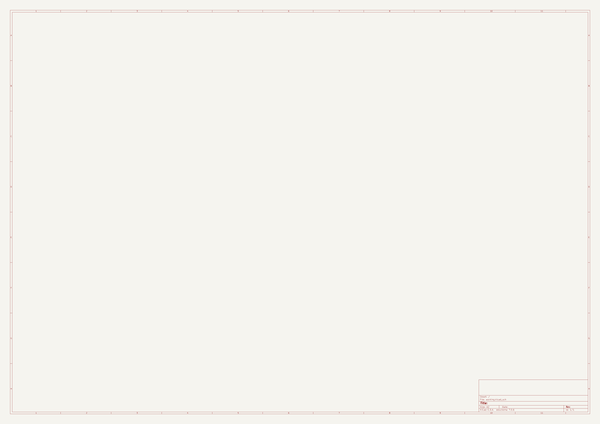
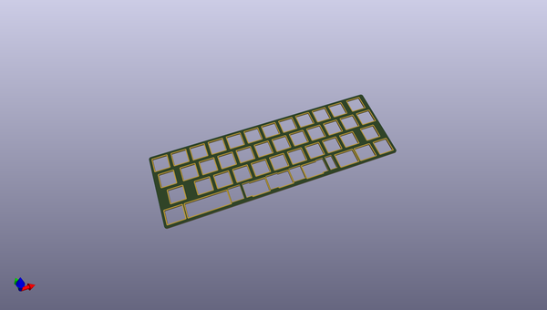
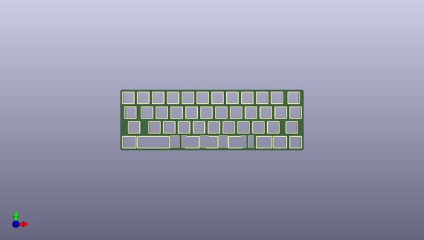
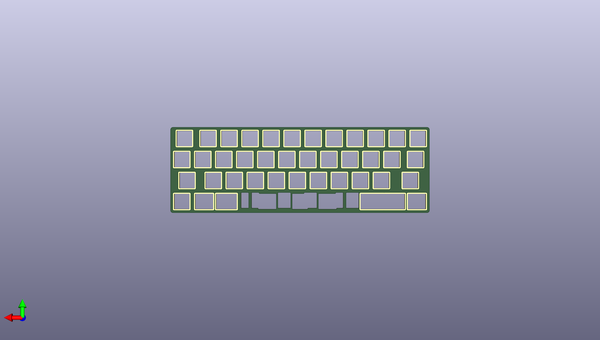

# semi
 
## summary 
* id: alasofia_semi_semi_plate
* user: alasofia
* name: semi
* board: semi_plate
* repo: https://github.com/Alasofia/semi
* src_file_repo_kicad_pcb: plate/semi-plate.kicad_pcb
* src_file_repo_kicad_pcb_link: https://github.com/Alasofia/semi/tree/main/plate/semi-plate.kicad_pcb
* src_file_repo_kicad_sch: semi.kicad_sch
* src_file_repo_kicad_sch_link: https://github.com/Alasofia/semi/tree/main/semi.kicad_sch

* src_file_repo_sch: plate/semi-plate.sch
* src_file_repo_sch_link: https://github.com/Alasofia/semi/tree/main/plate/semi-plate.sch
* full details link: https://github.com/oomlout/oomlout_oomp_project_bot_v_2/tree/main/projects/alasofia_semi_semi_plate/current_version/working  

## schematic  
  
[schematic (pdf)](working_schematic.pdf)  

## pcb  
 
  
  
  
[board (pdf)](working.pdf)  

## working_bom
| Id | Designator | Footprint | Quantity | Designation | Supplier and ref |  | None | 
| --- | --- | --- | --- | --- | --- | --- | --- | 
| 1 | K_39,K_37,K_43,K_51,K_13,K_12 | MX_Cutout_1.25u | 6 | KEYSW |  |  | [''] | 
| 2 | K_30,K_18,K_6,K_53,K_38,K_26,K_28,K_22,K_21,K_19,K_29,K_8,K_1,K_17,K_49,K_3,K_32,K_16,K_2,K_23,K_52,K_31,K_50,K_7,K_15,K_10,K_4,K_11,K_41,K_20,K_40,K_36,K_9,K_24,K_33,K_5,K_27,K_42,K_14,K_34 | MX_Cutout_1u | 40 | KEYSW |  |  | [''] | 
| 3 | K_44,K_48 | MX_Cutout_3u | 2 | KEYSW |  |  | [''] | 
| 4 | K_47,K_45 | MX_Cutout_2.75u | 2 | KEYSW |  |  | [''] | 
| 5 | K_46 | MX_Cutout_6.25u | 1 | KEYSW |  |  | [''] | 
| 6 | K_35 | MX_Cutout_1.5u | 1 | KEYSW |  |  | [''] | 
| 7 | K_25 | MX_Cutout_1.75u | 1 | KEYSW |  |  | [''] | 

## bom_schematic
no data

