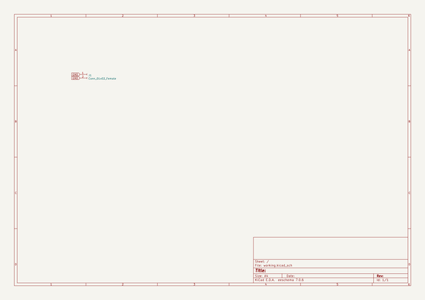

# squid60
 
## summary 
* id: alasofia_squid60_plate
* user: alasofia
* name: squid60
* board: plate
* repo: https://github.com/Alasofia/Squid60
* src_file_repo_kicad_pcb: plate/plate.kicad_pcb
* src_file_repo_kicad_pcb_link: https://github.com/Alasofia/Squid60/tree/master/plate/plate.kicad_pcb

* src_file_repo_sch: plate/plate.sch
* src_file_repo_sch_link: https://github.com/Alasofia/Squid60/tree/master/plate/plate.sch
* full details link: https://github.com/oomlout/oomlout_oomp_project_bot_v_2/tree/main/projects/alasofia_squid60_plate/current_version/working  

## schematic  
  
[schematic (pdf)](working_schematic.pdf)  

## pcb  
 
  
  
  
[board (pdf)](working.pdf)  

## bom_schematic
| Ref | Qnty | Value | Cmp name | Footprint | Description | Vendor | DNP | 
| --- | --- | --- | --- | --- | --- | --- | --- | 
| J1 | 1 | Conn_01x02_Female | Conn_01x02_Female-Connector | Connector_PinHeader_1.00mm:PinHeader_1x02_P1.00mm_Horizontal |  |  |  | 

