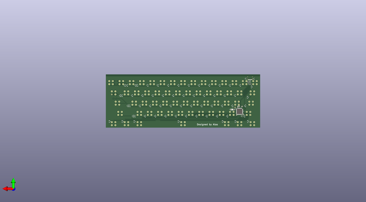

# squid60
 
## summary 
* id: alasofia_squid60_squid60
* user: alasofia
* name: squid60
* board: squid60
* repo: https://github.com/Alasofia/Squid60
* src_file_repo_kicad_pcb: PCB Files/Squid60.kicad_pcb
* src_file_repo_kicad_pcb_link: https://github.com/Alasofia/Squid60/tree/master/PCB Files/Squid60.kicad_pcb

* src_file_repo_sch: 
* src_file_repo_sch_link: https://github.com/Alasofia/Squid60/tree/master/
* full details link: https://github.com/oomlout/oomlout_oomp_project_bot_v_2/tree/main/projects/alasofia_squid60_squid60/current_version/working  

## schematic  
  
[schematic (pdf)](working_schematic.pdf)  

## pcb  
 
  
  
  
[board (pdf)](working.pdf)  

## working_bom
| Id | Designator | Footprint | Quantity | Designation | Supplier and ref |  | None | 
| --- | --- | --- | --- | --- | --- | --- | --- | 
| 1 | MX2,MX3,MX4,MX5,MX6,MX7,MX8,MX9,MX10,MX11,MX12,MX13,MX14,MX15,MX16,MX18,MX19,MX20,MX21,MX22,MX23,MX24,MX25,MX26,MX27,MX28,MX29,MX33,MX34,MX35,MX36,MX37,MX38,MX39,MX40,MX41,MX42,MX43,MX46,MX47,MX48,MX49,MX50,MX51,MX52,MX53,MX54,MX55,MX58,MX62 | Hitek725-1U | 50 | MX-NoLED |  |  | [''] | 
| 2 | MX17,MX57,MX59,MX61,MX63,MX30 | Hitek725-1.5U | 6 | MX-NoLED |  |  | [''] | 
| 3 | MX32 | Hitek725-1.75U | 1 | MX-NoLED |  |  | [''] | 
| 4 | MX44,MX45 | Hitek725-2.25U | 2 | MX-NoLED |  |  | [''] | 
| 5 | MX56 | Hitek725-2.75U | 1 | MX-NoLED |  |  | [''] | 
| 6 | MX60 | Hitek725-7U | 1 | MX-NoLED |  |  | [''] | 
| 7 | SW1 | PinSocket_1x02_P2.00mm_Vertical | 1 | SW_Push |  |  | [''] | 
| 8 | D1,D2,D3,D4,D5,D6,D7,D8,D9,D10,D11,D12,D13,D14,D15,D16,D17,D18,D19,D20,D21,D22,D23,D24,D25,D26,D27,D28,D29,D30,D31,D32,D33,D34,D35,D36,D37,D38,D39,D40,D41,D42,D43,D44,D45,D46,D47,D48,D49,D50,D51,D52,D53,D54,D55,D56,D57,D58,D59,D60,D61 | D_SOD-123-Pretty | 61 | D_Small |  |  | [''] | 
| 9 | MX1 | Hitek725-2U | 1 | MX-NoLED |  |  | [''] | 
| 10 | U2 | SOT143B | 1 | PRTR5V0U2X |  |  | [''] | 
| 11 | USB1 | HRO-TYPE-C-31-M-12-Assembly | 1 | HRO-TYPE-C-31-M-12 |  |  | [''] | 
| 12 | R4,R3 | R_0805_2012Metric | 2 | 22 |  |  | [''] | 
| 13 | C1,C2 | C_0805_2012Metric | 2 | 22pF |  |  | [''] | 
| 14 | C3 | C_0805_2012Metric | 1 | 1uF |  |  | [''] | 
| 15 | C4 | C_0805_2012Metric | 1 | 10uF |  |  | [''] | 
| 16 | C5,C6,C7 | C_0805_2012Metric | 3 | 0.1uF |  |  | [''] | 
| 17 | F1 | Fuse_1206_3216Metric | 1 | 500mA |  |  | [''] | 
| 18 | Y1 | Crystal_SMD_3225-4Pin_3.2x2.5mm | 1 | 16Mhz |  |  | [''] | 
| 19 | U1 | TQFP-44_10x10mm_P0.8mm | 1 | ATmega32U4-AU |  |  | [''] | 
| 20 | R1 | R_0805_2012Metric | 1 | 10k |  |  | [''] | 
| 21 | R2 | R_0805_2012Metric | 1 | 1k |  |  | [''] | 
| 22 | R5,R6 | R_0805_2012Metric | 2 | 5.1k |  |  | [''] | 
| 23 | MX31 | Hitek725-BigAssEnter | 1 | MX-NoLED |  |  | [''] | 

## bom_schematic
| Ref | Qnty | Value | Cmp name | Footprint | Description | Vendor | DNP | 
| --- | --- | --- | --- | --- | --- | --- | --- | 
| C1, C2 | 2 | 22pF | C_Small | Capacitor_SMD:C_0805_2012Metric | Unpolarized capacitor, small symbol |  |  | 
| C3 | 1 | 1uF | C_Small | Capacitor_SMD:C_0805_2012Metric | Unpolarized capacitor, small symbol |  |  | 
| C4 | 1 | 10uF | C_Small | Capacitor_SMD:C_0805_2012Metric | Unpolarized capacitor, small symbol |  |  | 
| C5, C6, C7 | 3 | 0.1uF | C_Small | Capacitor_SMD:C_0805_2012Metric | Unpolarized capacitor, small symbol |  |  | 
| F1 | 1 | 500mA | Polyfuse_Small | Fuse:Fuse_1206_3216Metric | Resettable fuse, polymeric positive temperature coefficient, small symbol |  |  | 
| R1 | 1 | 10k | R_Small | Resistor_SMD:R_0805_2012Metric | Resistor, small symbol |  |  | 
| R2 | 1 | 1k | R_Small | Resistor_SMD:R_0805_2012Metric | Resistor, small symbol |  |  | 
| R3, R4 | 2 | 22 | R_Small | Resistor_SMD:R_0805_2012Metric | Resistor, small symbol |  |  | 
| R5, R6 | 2 | 5.1k | R_Small | Resistor_SMD:R_0805_2012Metric | Resistor, small symbol |  |  | 
| SW1 | 1 | SW_Push | SW_Push | Connector_PinSocket_2.00mm:PinSocket_1x02_P2.00mm_Vertical | Push button switch, generic, two pins |  |  | 
| U1 | 1 | ATmega32U4-AU | ATmega32U4-AU-MCU_Microchip_ATmega | Package_QFP:TQFP-44_10x10mm_P0.8mm |  |  |  | 
| U2 | 1 | PRTR5V0U2X | PRTR5V0U2X | random-keyboard-parts:SOT143B |  |  |  | 
| USB1 | 1 | HRO-TYPE-C-31-M-12 | HRO-TYPE-C-31-M-12 | Type-C:HRO-TYPE-C-31-M-12-Assembly |  |  |  | 
| Y1 | 1 | 16Mhz | Crystal_GND24 | Crystal:Crystal_SMD_3225-4Pin_3.2x2.5mm | Four pin crystal, GND on pins 2 and 4 |  |  | 

