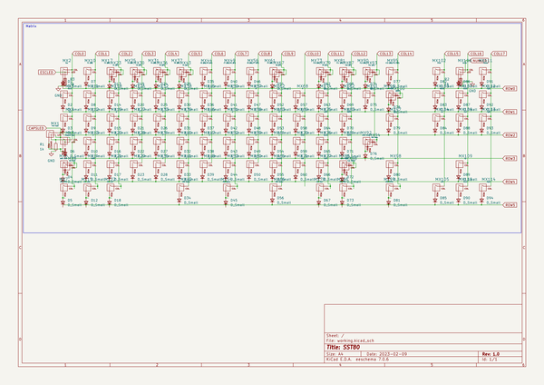

# sst80
 
## summary 
* id: alasofia_sst80_sst80
* user: alasofia
* name: sst80
* board: sst80
* repo: https://github.com/Alasofia/SST80
* src_file_repo_kicad_pcb: KiCad Project Files/SST80.kicad_pcb
* src_file_repo_kicad_pcb_link: https://github.com/Alasofia/SST80/tree/main/KiCad Project Files/SST80.kicad_pcb
* src_file_repo_kicad_sch: KiCad Project Files/Matrix.kicad_sch
* src_file_repo_kicad_sch_link: https://github.com/Alasofia/SST80/tree/main/KiCad Project Files/Matrix.kicad_sch

* src_file_repo_sch: 
* src_file_repo_sch_link: https://github.com/Alasofia/SST80/tree/main/
* full details link: https://github.com/oomlout/oomlout_oomp_project_bot_v_2/tree/main/projects/alasofia_sst80_sst80/current_version/working  

## schematic  
  
[schematic (pdf)](working_schematic.pdf) 

## pcb  
 
  
  
  
[board (pdf)](working.pdf)  

## working_bom
| Id | Designator | Footprint | Quantity | Designation | Supplier and ref |  | None | 
| --- | --- | --- | --- | --- | --- | --- | --- | 
| 1 | MX29 | MX-1U-NoLED | 1 | X |  |  | [''] | 
| 2 | MX65 | MX-1U-NoLED | 1 | Comma |  |  | [''] | 
| 3 | MX33 | MX-1U-NoLED | 1 | R |  |  | [''] | 
| 4 | MX13 | MX-1U-NoLED | 1 | A |  |  | [''] | 
| 5 | MX69 | MX-1U-NoLED | 1 | P |  |  | [''] | 
| 6 | MX58 | MX-1U-NoLED | 1 | I |  |  | [''] | 
| 7 | MX25 | MX-1U-NoLED | 1 | F3 (88) |  |  | [''] | 
| 8 | MX106 | MX-1U | 1 | Scroll |  |  | [''] | 
| 9 | MX98 | MX-1U-NoLED | 1 | Fn |  |  | [''] | 
| 10 | MX91 | MX-1U-NoLED | 1 | LBSPC |  |  | [''] | 
| 11 | MX113 | MX-1U-NoLED | 1 | PgDn |  |  | [''] | 
| 12 | MX49 | MX-1U-NoLED | 1 | F7 (88)/F6 (87) |  |  | [''] | 
| 13 | MX48 | MX-1U-NoLED | 1 | B |  |  | [''] | 
| 14 | MX56 | MX-1U-NoLED | 1 | F8 (88)/F7 (87) |  |  | [''] | 
| 15 | MX46 | MX-1U-NoLED | 1 | Y |  |  | [''] | 
| 16 | MX112 | MX-1U-NoLED | 1 | PgUp |  |  | [''] | 
| 17 | MX88 | MX-2.75U-NoLED | 1 | Full RShift |  |  | [''] | 
| 18 | J_USB-DB1 | PinSocket_1x04_P2.54mm_Vertical | 1 | Solder |  |  | [''] | 
| 19 | MX83 | MX-1U-NoLED | 1 | RBRC |  |  | [''] | 
| 20 | MX5 | MX-1.25U-FLIPPED | 1 | Stepped caps |  |  | [''] | 
| 21 | MX68 | MX-1U-NoLED | 1 | 0 |  |  | [''] | 
| 22 | MX84 | MX-1U-NoLED | 1 | NUHS |  |  | [''] | 
| 23 | MX73 | MX-1U-NoLED | 1 | F10 (88) |  |  | [''] | 
| 24 | MX4 | MX-1.5U-NoLED | 1 | Tab |  |  | [''] | 
| 25 | MX107 | MX-1U-NoLED | 1 | Home |  |  | [''] | 
| 26 | MX95 | MX-1U-NoLED | 1 | F13 (88)/F12 (87) |  |  | [''] | 
| 27 | MX45 | MX-1U-NoLED | 1 | 6 |  |  | [''] | 
| 28 | MX100 | MX-1U-NoLED | 1 | RBSPC |  |  | [''] | 
| 29 | MX71 | MX-1U-NoLED | 1 | Dot |  |  | [''] | 
| 30 | MX81 | MX-1U-NoLED | 1 | F11 (88) |  |  | [''] | 
| 31 | MX93 | MX-1U-NoLED | 1 | F11 (87) |  |  | [''] | 
| 32 | MX42,MX66 | MX-3U-ReversedStabilizers-NoLED | 2 | 300 Space |  |  | [''] | 
| 33 | MX67 | MX-1U-NoLED | 1 | F8 (87) |  |  | [''] | 
| 34 | MX18 | MX-1U-NoLED | 1 | 2 |  |  | [''] | 
| 35 | MX96 | MX-2U-NoLED | 1 | Full BSPC |  |  | [''] | 
| 36 | MX105 | MX-1U-NoLED | 1 | Left |  |  | [''] | 
| 37 | MX39 | MX-1U-NoLED | 1 | T |  |  | [''] | 
| 38 | MX38 | MX-1U-NoLED | 1 | 5 |  |  | [''] | 
| 39 | MX23 | MX-1U-NoLED | 1 | F1 (87) |  |  | [''] | 
| 40 | MX11 | MX-1U-NoLED | 1 | 1 |  |  | [''] | 
| 41 | MX8 | MX-1.25U-NoLED | 1 | ISO Shift |  |  | [''] | 
| 42 | MX52 | MX-1U-NoLED | 1 | J |  |  | [''] | 
| 43 | MX97 | MX-1.5U-NoLED | 1 | BSLS |  |  | [''] | 
| 44 | MX51 | MX-1U-NoLED | 1 | U |  |  | [''] | 
| 45 | MX76 | MX-1U-NoLED | 1 | Quote |  |  | [''] | 
| 46 | MX44 | MX-1U-NoLED | 1 | F6 (88)/F5 (87) |  |  | [''] | 
| 47 | MX31 | MX-1U-NoLED | 1 | F4 (88) |  |  | [''] | 
| 48 | MX41 | MX-1U-NoLED | 1 | V |  |  | [''] | 
| 49 | MX32 | MX-1U-NoLED | 1 | 4 |  |  | [''] | 
| 50 | MX75 | MX-1U-NoLED | 1 | LBRC |  |  | [''] | 
| 51 | MX54 | MX-7U-ReversedStabilizers-NoLED | 1 | 700 Space |  |  | [''] | 
| 52 | MX10 | MX-1U-NoLED | 1 | F1 (88) |  |  | [''] | 
| 53 | MX43 | MX-1U-NoLED | 1 | F4 (87) |  |  | [''] | 
| 54 | MX37 | MX-1U-NoLED | 1 | F5 (88) |  |  | [''] | 
| 55 | MX79 | MX-1U-NoLED | 1 | F9 (87) |  |  | [''] | 
| 56 | MX92 | MX-2.25U-ReversedStabilizers-NoLED | 1 | ANSI Enter |  |  | [''] | 
| 57 | MX85 | MX-1.75U-NoLED | 1 | Split RShift |  |  | [''] | 
| 58 | MX35 | MX-1U-NoLED | 1 | C |  |  | [''] | 
| 59 | MX27 | MX-1U-NoLED | 1 | E |  |  | [''] | 
| 60 | MX103 | MX-1U-NoLED | 1 | Delete |  |  | [''] | 
| 61 | MX2 | MX-1U | 1 | Esc |  |  | [''] | 
| 62 | MX77 | MX-1U-NoLED | 1 | SLSH |  |  | [''] | 
| 63 | MX104 | MX-1U-NoLED | 1 | Ins |  |  | [''] | 
| 64 | MX82 | MX-1U-NoLED | 1 | Equal |  |  | [''] | 
| 65 | MX3 | MX-1U-NoLED | 1 | Grave |  |  | [''] | 
| 66 | MX40 | MX-1U-NoLED | 1 | G |  |  | [''] | 
| 67 | MX14 | MX-1U-NoLED | 1 | NUBS |  |  | [''] | 
| 68 | MX90 | MX-1U-NoLED | 1 | F12 (88) |  |  | [''] | 
| 69 | MX108 | MX-1U-NoLED | 1 | End |  |  | [''] | 
| 70 | MX20 | MX-1U-NoLED | 1 | S |  |  | [''] | 
| 71 | MX15 | MX-1U-NoLED | 1 | 100 LGUI |  |  | [''] | 
| 72 | MX78 | MX-1.5U-NoLED | 1 | 150 RALT |  |  | [''] | 
| 73 | MX61 | MX-1U-NoLED | 1 | F9 (88) |  |  | [''] | 
| 74 | MX12 | MX-1U-NoLED | 1 | Q |  |  | [''] | 
| 75 | MX7 | MX-1.5U-NoLED | 1 | 150 LCTRL |  |  | [''] | 
| 76 | MX28 | MX-1U-NoLED | 1 | D |  |  | [''] | 
| 77 | MX114 | MX-1U-NoLED | 1 | Right |  |  | [''] | 
| 78 | MX1 | MX-1.75U | 1 | Full Caps |  |  | [''] | 
| 79 | MX53 | MX-1U-NoLED | 1 | N |  |  | [''] | 
| 80 | MX87 | MX-1U-NoLED | 1 | F10 (87) |  |  | [''] | 
| 81 | MX99 | MX-1.5U-NoLED | 1 | 150 RCTRL |  |  | [''] | 
| 82 | MX70 | MX-1U-NoLED | 1 | SCLN |  |  | [''] | 
| 83 | MX57 | MX-1U-NoLED | 1 | 8 |  |  | [''] | 
| 84 | MX60 | MX-1U-NoLED | 1 | M |  |  | [''] | 
| 85 | MX62 | MX-1U-NoLED | 1 | 9 |  |  | [''] | 
| 86 | MX111 | MX-1U-NoLED | 1 | Pause |  |  | [''] | 
| 87 | MX50 | MX-1U-NoLED | 1 | 7 |  |  | [''] | 
| 88 | MX6 | MX-2.25U-NoLED | 1 | ANSI Shift |  |  | [''] | 
| 89 | MX34 | MX-1U-NoLED | 1 | F |  |  | [''] | 
| 90 | MX74 | MX-1U-NoLED | 1 | Minus |  |  | [''] | 
| 91 | MX17 | MX-1U-NoLED | 1 | F2 (88) |  |  | [''] | 
| 92 | MX109 | MX-1U-NoLED | 1 | Up |  |  | [''] | 
| 93 | MX47 | MX-1U-NoLED | 1 | H |  |  | [''] | 
| 94 | MX21 | MX-1U-NoLED | 1 | Z |  |  | [''] | 
| 95 | MX59 | MX-1U-NoLED | 1 | K |  |  | [''] | 
| 96 | MX86 | MX-1U-NoLED | 1 | 100 RGUI |  |  | [''] | 
| 97 | MX22 | MX-1.5U-NoLED | 1 | 150 LALT |  |  | [''] | 
| 98 | MX102 | MX-1U-NoLED | 1 | Print |  |  | [''] | 
| 99 | MX110 | MX-1U-NoLED | 1 | Down |  |  | [''] | 
| 100 | MX26 | MX-1U-NoLED | 1 | 3 |  |  | [''] | 
| 101 | MX63 | MX-1U-NoLED | 1 | O |  |  | [''] | 
| 102 | MX64 | MX-1U-NoLED | 1 | L |  |  | [''] | 
| 103 | MX30 | MX-1U-NoLED | 1 | F2 (87) |  |  | [''] | 
| 104 | MX36 | MX-1U-NoLED | 1 | F3 (87) |  |  | [''] | 
| 105 | MX19 | MX-1U-NoLED | 1 | W |  |  | [''] | 
| 106 | MX94 | MX-ISO-FLIPPED-ReversedStabilizers | 1 | ISO Enter |  |  | [''] | 
| 107 | R7,R6 | R_0402_1005Metric | 2 | 27 |  |  | [''] | 
| 108 | C1,C4,C2,C5 | C_0402_1005Metric | 4 | 1uF |  |  | [''] | 
| 109 | D81,D17,D12,D21,D84,D77,D4,D23,D13,D35,D94,D47,D38,D28,D75,D49,D72,D79,D76,D50,D56,D52,D30,D66,D19,D39,D67,D64,D59,D89,D36,D57,D25,D62,D73,D63,D58,D5,D10,D26,D20,D83,D14,D42,D45,D33,D65,D68,D80,D16,D6,D60,D31,D32,D44,D18,D86,D53,D41,D88,D92,D22,D37,D90,D55,D70,D7,D43,D93,D71,D85,D82,D1,D91,D34,D40,D29,D74,D54,D69,D3,D78,D2,D46,D8,D27,D11,D9,D24,D51,D48,D87,D15 | D_SOD-123 | 93 | D_Small |  |  | [''] | 
| 110 | D108,D106,D110,D97,D107,D118,D96,D103,D111,D117,D115,D101,D114,D113,D99,D116,D95,D100,D102,D104,D112,D98,D109,D105 | LED_WS2812_2020 | 24 | WS2812B-2020 |  |  | [''] | 
| 111 | J_UDB2,J1 | Molex_Pico-EZmate_78171-0004_1x04-1MP_P1.20mm_Vertical | 2 | EZMate |  |  | [''] | 
| 112 | R3,R9,R2,R1,R10 | R_0402_1005Metric | 5 | 1k |  |  | [''] | 
| 113 | U1 | SOT-23 | 1 | XC6206PxxxMR |  |  | [''] | 
| 114 | C3 | C_0402_1005Metric | 1 | 10uF |  |  | [''] | 
| 115 | C8,C12,C10,C9,C14,C7,C15,C11,C13,C6 | C_0402_1005Metric | 10 | 100nF |  |  | [''] | 
| 116 | U2 | SOT143B | 1 | PRTR5V0U2X |  |  | [''] | 
| 117 | U5 | SOT-23-5 | 1 | SN74AHCT1G125 |  |  | [''] | 
| 118 | J_UDB1 | JST_SH_SM04B-SRSS-TB_1x04-1MP_P1.00mm_Horizontal | 1 | JST |  |  | [''] | 
| 119 | Y1 | Resonator_SMD_Murata_CSTxExxV-3Pin_3.0x1.1mm | 1 | 12MHz |  |  | [''] | 
| 120 | R8 | R_0402_1005Metric | 1 | 10k |  |  | [''] | 
| 121 | U3 | RP2040-QFN-56 | 1 | RP2040 |  |  | [''] | 
| 122 | SW_RST1 | SW_SPST_TL3342 | 1 | Reset |  |  | [''] | 
| 123 | F1 | Fuse_0805_2012Metric | 1 | 500mA |  |  | [''] | 
| 124 | SW_Boot1 | SW_SPST_TL3342 | 1 | Boot |  |  | [''] | 
| 125 | U4 | SOIC-8_5.23x5.23mm_P1.27mm | 1 | W25Q128JVS |  |  | [''] | 

## bom_schematic
| Ref | Qnty | Value | Cmp name | Footprint | Description | Vendor | DNP | 
| --- | --- | --- | --- | --- | --- | --- | --- | 
| D1, D2, D3, D4, D5, D6, D7, D8, D9, D10, D11, D12, D13, D14, D15, D16, D17, D18, D19, D20, D21, D22, D23, D24, D25, D26, D27, D28, D29, D30, D31, D32, D33, D34, D35, D36, D37, D38, D39, D40, D41, D42, D43, D44, D45, D46, D47, D48, D49, D50, D51, D52, D53, D54, D55, D56, D57, D58, D59, D60, D62, D63, D64, D65, D66, D67, D68, D69, D70, D71, D72, D73, D74, D75, D76, D77, D78, D79, D80, D81, D82, D83, D84, D85, D86, D87, D88, D89, D90, D91, D92, D93, D94 | 93 | D_Small | D_Small | Diode_SMD:D_SOD-123 | Diode, small symbol |  |  | 
| MX1 | 1 | Full Caps | MX-LED | MX_Alps_Hybrid:MX-1.75U |  |  |  | 
| MX2 | 1 | Esc | MX-LED | MX_Alps_Hybrid:MX-1U |  |  |  | 
| MX3 | 1 | Grave | MX-NoLED | MX_Alps_Hybrid:MX-1U-NoLED |  |  |  | 
| MX4 | 1 | Tab | MX-NoLED | MX_Alps_Hybrid:MX-1.5U-NoLED |  |  |  | 
| MX5 | 1 | Stepped caps | MX-LED_1 | MX_Alps_Hybrid:MX-1.25U-FLIPPED |  |  |  | 
| MX6 | 1 | ANSI Shift | MX-NoLED | MX_Alps_Hybrid:MX-2.25U-NoLED |  |  |  | 
| MX7 | 1 | 150 LCTRL | MX-NoLED | MX_Alps_Hybrid:MX-1.5U-NoLED |  |  |  | 
| MX8 | 1 | ISO Shift | MX-NoLED | MX_Alps_Hybrid:MX-1.25U-NoLED |  |  |  | 
| MX10 | 1 | F1 (88) | MX-NoLED | MX_Alps_Hybrid:MX-1U-NoLED |  |  |  | 
| MX11 | 1 | 1 | MX-NoLED | MX_Alps_Hybrid:MX-1U-NoLED |  |  |  | 
| MX12 | 1 | Q | MX-NoLED | MX_Alps_Hybrid:MX-1U-NoLED |  |  |  | 
| MX13 | 1 | A | MX-NoLED | MX_Alps_Hybrid:MX-1U-NoLED |  |  |  | 
| MX14 | 1 | NUBS | MX-NoLED | MX_Alps_Hybrid:MX-1U-NoLED |  |  |  | 
| MX15 | 1 | 100 LGUI | MX-NoLED | MX_Alps_Hybrid:MX-1U-NoLED |  |  |  | 
| MX17 | 1 | F2 (88) | MX-NoLED | MX_Alps_Hybrid:MX-1U-NoLED |  |  |  | 
| MX18 | 1 | 2 | MX-NoLED | MX_Alps_Hybrid:MX-1U-NoLED |  |  |  | 
| MX19 | 1 | W | MX-NoLED | MX_Alps_Hybrid:MX-1U-NoLED |  |  |  | 
| MX20 | 1 | S | MX-NoLED | MX_Alps_Hybrid:MX-1U-NoLED |  |  |  | 
| MX21 | 1 | Z | MX-NoLED | MX_Alps_Hybrid:MX-1U-NoLED |  |  |  | 
| MX22 | 1 | 150 LALT | MX-NoLED | MX_Alps_Hybrid:MX-1.5U-NoLED |  |  |  | 
| MX23 | 1 | F1 (87) | MX-NoLED_1 | MX_Alps_Hybrid:MX-1U-NoLED |  |  |  | 
| MX25 | 1 | F3 (88) | MX-NoLED | MX_Alps_Hybrid:MX-1U-NoLED |  |  |  | 
| MX26 | 1 | 3 | MX-NoLED | MX_Alps_Hybrid:MX-1U-NoLED |  |  |  | 
| MX27 | 1 | E | MX-NoLED | MX_Alps_Hybrid:MX-1U-NoLED |  |  |  | 
| MX28 | 1 | D | MX-NoLED | MX_Alps_Hybrid:MX-1U-NoLED |  |  |  | 
| MX29 | 1 | X | MX-NoLED | MX_Alps_Hybrid:MX-1U-NoLED |  |  |  | 
| MX30 | 1 | F2 (87) | MX-NoLED_2 | MX_Alps_Hybrid:MX-1U-NoLED |  |  |  | 
| MX31 | 1 | F4 (88) | MX-NoLED | MX_Alps_Hybrid:MX-1U-NoLED |  |  |  | 
| MX32 | 1 | 4 | MX-NoLED | MX_Alps_Hybrid:MX-1U-NoLED |  |  |  | 
| MX33 | 1 | R | MX-NoLED | MX_Alps_Hybrid:MX-1U-NoLED |  |  |  | 
| MX34 | 1 | F | MX-NoLED | MX_Alps_Hybrid:MX-1U-NoLED |  |  |  | 
| MX35 | 1 | C | MX-NoLED | MX_Alps_Hybrid:MX-1U-NoLED |  |  |  | 
| MX36 | 1 | F3 (87) | MX-NoLED_3 | MX_Alps_Hybrid:MX-1U-NoLED |  |  |  | 
| MX37 | 1 | F5 (88) | MX-NoLED | MX_Alps_Hybrid:MX-1U-NoLED |  |  |  | 
| MX38 | 1 | 5 | MX-NoLED | MX_Alps_Hybrid:MX-1U-NoLED |  |  |  | 
| MX39 | 1 | T | MX-NoLED | MX_Alps_Hybrid:MX-1U-NoLED |  |  |  | 
| MX40 | 1 | G | MX-NoLED | MX_Alps_Hybrid:MX-1U-NoLED |  |  |  | 
| MX41 | 1 | V | MX-NoLED | MX_Alps_Hybrid:MX-1U-NoLED |  |  |  | 
| MX42, MX66 | 2 | 300 Space | MX-NoLED | MX_Alps_Hybrid:MX-3U-ReversedStabilizers-NoLED |  |  |  | 
| MX43 | 1 | F4 (87) | MX-NoLED_4 | MX_Alps_Hybrid:MX-1U-NoLED |  |  |  | 
| MX44 | 1 | F6 (88)/F5 (87) | MX-NoLED | MX_Alps_Hybrid:MX-1U-NoLED |  |  |  | 
| MX45 | 1 | 6 | MX-NoLED | MX_Alps_Hybrid:MX-1U-NoLED |  |  |  | 
| MX46 | 1 | Y | MX-NoLED | MX_Alps_Hybrid:MX-1U-NoLED |  |  |  | 
| MX47 | 1 | H | MX-NoLED | MX_Alps_Hybrid:MX-1U-NoLED |  |  |  | 
| MX48 | 1 | B | MX-NoLED | MX_Alps_Hybrid:MX-1U-NoLED |  |  |  | 
| MX49 | 1 | F7 (88)/F6 (87) | MX-NoLED | MX_Alps_Hybrid:MX-1U-NoLED |  |  |  | 
| MX50 | 1 | 7 | MX-NoLED | MX_Alps_Hybrid:MX-1U-NoLED |  |  |  | 
| MX51 | 1 | U | MX-NoLED | MX_Alps_Hybrid:MX-1U-NoLED |  |  |  | 
| MX52 | 1 | J | MX-NoLED | MX_Alps_Hybrid:MX-1U-NoLED |  |  |  | 
| MX53 | 1 | N | MX-NoLED | MX_Alps_Hybrid:MX-1U-NoLED |  |  |  | 
| MX54 | 1 | 700 Space | MX-NoLED | MX_Alps_Hybrid:MX-7U-ReversedStabilizers-NoLED |  |  |  | 
| MX56 | 1 | F8 (88)/F7 (87) | MX-NoLED | MX_Alps_Hybrid:MX-1U-NoLED |  |  |  | 
| MX57 | 1 | 8 | MX-NoLED | MX_Alps_Hybrid:MX-1U-NoLED |  |  |  | 
| MX58 | 1 | I | MX-NoLED | MX_Alps_Hybrid:MX-1U-NoLED |  |  |  | 
| MX59 | 1 | K | MX-NoLED | MX_Alps_Hybrid:MX-1U-NoLED |  |  |  | 
| MX60 | 1 | M | MX-NoLED | MX_Alps_Hybrid:MX-1U-NoLED |  |  |  | 
| MX61 | 1 | F9 (88) | MX-NoLED | MX_Alps_Hybrid:MX-1U-NoLED |  |  |  | 
| MX62 | 1 | 9 | MX-NoLED | MX_Alps_Hybrid:MX-1U-NoLED |  |  |  | 
| MX63 | 1 | O | MX-NoLED | MX_Alps_Hybrid:MX-1U-NoLED |  |  |  | 
| MX64 | 1 | L | MX-NoLED | MX_Alps_Hybrid:MX-1U-NoLED |  |  |  | 
| MX65 | 1 | Comma | MX-NoLED | MX_Alps_Hybrid:MX-1U-NoLED |  |  |  | 
| MX67 | 1 | F8 (87) | MX-NoLED_5 | MX_Alps_Hybrid:MX-1U-NoLED |  |  |  | 
| MX68 | 1 | 0 | MX-NoLED | MX_Alps_Hybrid:MX-1U-NoLED |  |  |  | 
| MX69 | 1 | P | MX-NoLED | MX_Alps_Hybrid:MX-1U-NoLED |  |  |  | 
| MX70 | 1 | SCLN | MX-NoLED | MX_Alps_Hybrid:MX-1U-NoLED |  |  |  | 
| MX71 | 1 | Dot | MX-NoLED | MX_Alps_Hybrid:MX-1U-NoLED |  |  |  | 
| MX73 | 1 | F10 (88) | MX-NoLED_6 | MX_Alps_Hybrid:MX-1U-NoLED |  |  |  | 
| MX74 | 1 | Minus | MX-NoLED | MX_Alps_Hybrid:MX-1U-NoLED |  |  |  | 
| MX75 | 1 | LBRC | MX-NoLED | MX_Alps_Hybrid:MX-1U-NoLED |  |  |  | 
| MX76 | 1 | Quote | MX-NoLED | MX_Alps_Hybrid:MX-1U-NoLED |  |  |  | 
| MX77 | 1 | SLSH | MX-NoLED | MX_Alps_Hybrid:MX-1U-NoLED |  |  |  | 
| MX78 | 1 | 150 RALT | MX-NoLED | MX_Alps_Hybrid:MX-1.5U-NoLED |  |  |  | 
| MX79 | 1 | F9 (87) | MX-NoLED | MX_Alps_Hybrid:MX-1U-NoLED |  |  |  | 
| MX81 | 1 | F11 (88) | MX-NoLED_7 | MX_Alps_Hybrid:MX-1U-NoLED |  |  |  | 
| MX82 | 1 | Equal | MX-NoLED | MX_Alps_Hybrid:MX-1U-NoLED |  |  |  | 
| MX83 | 1 | RBRC | MX-NoLED | MX_Alps_Hybrid:MX-1U-NoLED |  |  |  | 
| MX84 | 1 | NUHS | MX-NoLED | MX_Alps_Hybrid:MX-1U-NoLED |  |  |  | 
| MX85 | 1 | Split RShift | MX-NoLED | MX_Alps_Hybrid:MX-1.75U-NoLED |  |  |  | 
| MX86 | 1 | 100 RGUI | MX-NoLED | MX_Alps_Hybrid:MX-1U-NoLED |  |  |  | 
| MX87 | 1 | F10 (87) | MX-NoLED | MX_Alps_Hybrid:MX-1U-NoLED |  |  |  | 
| MX88 | 1 | Full RShift | MX-NoLED | MX_Alps_Hybrid:MX-2.75U-NoLED |  |  |  | 
| MX90 | 1 | F12 (88) | MX-NoLED_8 | MX_Alps_Hybrid:MX-1U-NoLED |  |  |  | 
| MX91 | 1 | LBSPC | MX-NoLED | MX_Alps_Hybrid:MX-1U-NoLED |  |  |  | 
| MX92 | 1 | ANSI Enter | MX-NoLED | MX_Alps_Hybrid:MX-2.25U-ReversedStabilizers-NoLED |  |  |  | 
| MX93 | 1 | F11 (87) | MX-NoLED | MX_Alps_Hybrid:MX-1U-NoLED |  |  |  | 
| MX94 | 1 | ISO Enter | MX-NoLED | MX_Alps_Hybrid:MX-ISO-FLIPPED-ReversedStabilizers |  |  |  | 
| MX95 | 1 | F13 (88)/F12 (87) | MX-NoLED | MX_Alps_Hybrid:MX-1U-NoLED |  |  |  | 
| MX96 | 1 | Full BSPC | MX-NoLED | MX_Alps_Hybrid:MX-2U-NoLED |  |  |  | 
| MX97 | 1 | BSLS | MX-NoLED | MX_Alps_Hybrid:MX-1.5U-NoLED |  |  |  | 
| MX98 | 1 | Fn | MX-NoLED | MX_Alps_Hybrid:MX-1U-NoLED |  |  |  | 
| MX99 | 1 | 150 RCTRL | MX-NoLED | MX_Alps_Hybrid:MX-1.5U-NoLED |  |  |  | 
| MX100 | 1 | RBSPC | MX-NoLED | MX_Alps_Hybrid:MX-1U-NoLED |  |  |  | 
| MX102 | 1 | Print | MX-NoLED | MX_Alps_Hybrid:MX-1U-NoLED |  |  |  | 
| MX103 | 1 | Delete | MX-NoLED | MX_Alps_Hybrid:MX-1U-NoLED |  |  |  | 
| MX104 | 1 | Ins | MX-NoLED | MX_Alps_Hybrid:MX-1U-NoLED |  |  |  | 
| MX105 | 1 | Left | MX-NoLED | MX_Alps_Hybrid:MX-1U-NoLED |  |  |  | 
| MX106 | 1 | Scroll | MX-LED | MX_Alps_Hybrid:MX-1U |  |  |  | 
| MX107 | 1 | Home | MX-NoLED | MX_Alps_Hybrid:MX-1U-NoLED |  |  |  | 
| MX108 | 1 | End | MX-NoLED | MX_Alps_Hybrid:MX-1U-NoLED |  |  |  | 
| MX109 | 1 | Up | MX-NoLED | MX_Alps_Hybrid:MX-1U-NoLED |  |  |  | 
| MX110 | 1 | Down | MX-NoLED | MX_Alps_Hybrid:MX-1U-NoLED |  |  |  | 
| MX111 | 1 | Pause | MX-NoLED | MX_Alps_Hybrid:MX-1U-NoLED |  |  |  | 
| MX112 | 1 | PgUp | MX-NoLED | MX_Alps_Hybrid:MX-1U-NoLED |  |  |  | 
| MX113 | 1 | PgDn | MX-NoLED | MX_Alps_Hybrid:MX-1U-NoLED |  |  |  | 
| MX114 | 1 | Right | MX-NoLED | MX_Alps_Hybrid:MX-1U-NoLED |  |  |  | 
| R1, R2, R3 | 3 | 1k | R_Small | Resistor_SMD:R_0402_1005Metric | Resistor, small symbol |  |  | 

